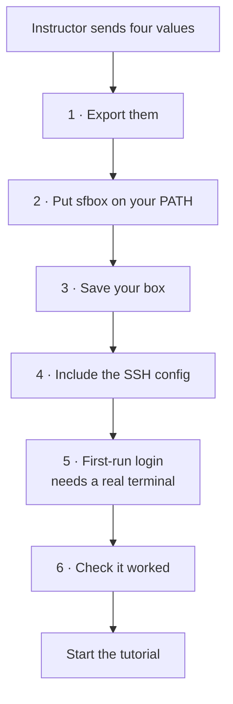

# Getting onto your cloud box

A step-by-step for a participant with an SSH key and no AWS account. Your instructor sends you four values, you paste them in once, and everything after that is copy-paste.

Running the two days on your own laptop instead? You don't need this page. Go straight to [`progression/00.0-preflight.md`](./progression/00.0-preflight.md).

**Step 5 needs a real terminal window.** It opens Claude Code's full-screen interface and asks you questions, so a web IDE, a notebook, or a chat tool can't drive it. Have Terminal, iTerm, or your editor's built-in terminal open before you start. It's the step that trips people up, and finding that out now is a good deal cheaper than finding it out live at step 5 with the rest of the room already moving on.

## Contents

- [What your instructor sends you](#what-your-instructor-sends-you)
- [How the setup runs](#how-the-setup-runs)
- [Step 1: set your four values](#step-1-set-your-four-values)
- [Step 2: put sfbox on your PATH](#step-2-put-sfbox-on-your-path)
- [Step 3: save your box](#step-3-save-your-box)
- [Step 4: one line in your SSH config](#step-4-one-line-in-your-ssh-config)
- [Step 5: the first-run login](#step-5-the-first-run-login)
- [Step 6: check it worked](#step-6-check-it-worked)
- [When something looks wrong](#when-something-looks-wrong)
- [The commands you will use](#the-commands-you-will-use)

## What your instructor sends you

| What | Example | Notes |
|---|---|---|
| Box id | `alice-test` | A short name. Yours alone. |
| Host | `203.0.113.10` | The box's public address. |
| Host-key fingerprint | `SHA256:B35vGh...` | Proves you're connecting to the right machine. |
| Private key file | `alice-test.pem` | A **file**, sent separately. Never paste it into chat. |

## How the setup runs



Five of those six steps are copy-paste. Step 5 isn't, and it's where the time goes, so read it before you get there rather than when you're already in it.

## Step 1: set your four values

Paste this into your terminal, using the values your instructor gave you. Everything below reads them, so you won't need to edit anything further down.

**Copy and paste**

```bash
export SFI_BOX="alice-test"
export SFI_HOST="203.0.113.10"
export SFI_FINGERPRINT="SHA256:replace-me"
export SFI_KEY="$HOME/Downloads/alice-test.pem"
```

Lock the key down. SSH won't touch a key other people could read.

```bash
chmod 600 "$SFI_KEY"
```

Keep this terminal open. Start a new one later and you'll need all four exports again, so it's worth dropping them into your shell profile while you're here.

## Step 2: put sfbox on your PATH

`sfbox` is one bash script, and it ships in this repo under `participant-box-cli/`. There's nothing to build, and nothing to install past what you've already got: bash, ssh, and curl.

Clone the repo if you haven't already.

```bash
git clone https://github.com/actual-software/sf-tutorial.git
```

Now put `sfbox` on your `PATH`, from the directory holding your clone.

**Copy and paste**

```bash
export PATH="$PWD/sf-tutorial/participant-box-cli:$PATH"
sfbox --help
```

If `sfbox --help` prints usage, you're set. If you get `command not found`, that export didn't take in this terminal. Run it again in the terminal you're actually working in, and add it to your shell profile so a restart doesn't undo it.

## Step 3: save your box

**Copy and paste**

```bash
sfbox save-credential \
  --box "$SFI_BOX" --host "$SFI_HOST" \
  --key "$SFI_KEY" --fingerprint "$SFI_FINGERPRINT" --label test
```

Two things get checked here. It fetches the key your box is actually offering and refuses to save anything that doesn't match your fingerprint, so your very first connection is authenticated rather than trusted blindly. It then makes one test connection to confirm the `.pem` you passed is the one that opens that box. If you were sent keys for more than one box, this is where you find out you're holding the wrong one, rather than three steps further on.

If it reports a fingerprint mismatch, stop and tell your instructor. Don't work around it. If it reports a wrong key, check which `.pem` belongs to `$SFI_BOX` and re-run with that file.

Saving a credential also makes that box current, so if you've only got the one box then that's box selection dealt with for the rest of the two days and you can forget the flag exists.

## Step 4: one line in your SSH config

`sfbox` writes its own SSH config and never edits yours. Add this at the **top** of `~/.ssh/config`:

```
Include ~/.gascity/ssh_config
```

`sfbox` works without it. What the Include buys you is everything else: plain `ssh`, `scp`, `rsync` and port-forwards addressed to your box by its id, which is a habit that carries over to real hosts long after the two days are over.

## Step 5: the first-run login

**This one needs a real terminal window.** Terminal, iTerm, your editor's terminal, anything interactive. It can't run from a script, a notebook, or a chat tool, because it opens Claude Code's full-screen interface and asks you questions.

The GitHub half asks which credential you want to give the box: a browser grant against your whole account, or a token you mint yourself and paste. A bare Enter takes the browser grant. If you'd rather not grant the CLI that much, mint the token before you start this step, and see [the preflight page](./progression/00.0-preflight.md#signing-the-box-in-with-a-token) for what to scope it for.

**Copy and paste**

```bash
ssh -t -F ~/.gascity/ssh_config "$SFI_BOX" sudo gas-city-login
```

You'll be walked through two sign-ins:

1. **GitHub**, either a one-time code you approve in your browser or a token you paste. It asks which you want, and Enter takes the code.
2. **Claude**, inside Claude Code. Pick a theme if asked, run `/login`, finish the browser sign-in, accept the trust prompt for the directory, then `/exit`.

Your box's factory doesn't start until this finishes. That's deliberate. Nothing else can answer a browser sign-in and a trust prompt on your behalf, so the box waits for you to do it rather than coming up half-configured and failing later.

## Step 6: check it worked

**Copy and paste**

```bash
sfbox get-box --box "$SFI_BOX"
```

**Expected output**

```text
=== service ===
active
```

`active` is the whole test. `get-box` prints your box details, your sessions and a tail of the log around that section, so scroll to `=== service ===` and read the line under it. Your factory is running, and you can start the tutorial from [`progression/00.0-preflight.md`](./progression/00.0-preflight.md).

## When something looks wrong

- **`command not found: sfbox`.** The `PATH` export from step 2 didn't take in this terminal. Run it again here, then add it to your shell profile.
- **`Host key verification failed`.** You're bypassing the config `sfbox` wrote. Use `-F ~/.gascity/ssh_config` as shown, or add the `Include` line from step 4. Don't pass the `.pem` directly with `-i`.
- **`save-credential` reports a fingerprint mismatch.** Stop and tell your instructor. If your box was genuinely rebuilt, they'll give you the new fingerprint to pass with `--rotate`.
- **`Permission denied (publickey)`.** Your box is right and reachable, and it's refusing the key you're offering. That almost always means you're holding a `.pem` for a different box. Re-run `sfbox save-credential` with the key you believe belongs to `$SFI_BOX`; it makes a test connection before saving and will say plainly whether that key opens the box. To settle it against the instructor's copy, run `ssh-keygen -lf "$SFI_KEY"` and send them the `SHA256:` line, which they can compare against the box's key pair. Don't ask for the box to be rebuilt over this — the box is fine, and rebuilding would destroy a working one.
- **`gas-city-login needs an interactive terminal`.** You're running it somewhere without a real terminal. Its suggestion to use `aws ssm start-session` doesn't apply to you, since you have no AWS account. Open a terminal window and run it there.
- **The service says it's waiting on first-run login.** Expected if you haven't finished step 5. `sfbox preflight` says so in as many words and names `sudo gas-city-login`.
- **Anything else.** Run `sfbox preflight --box "$SFI_BOX"`. It checks SSH, then `gc`, then the service, stopping at the first thing that fails, so it tells you which layer to look at instead of leaving you guessing.

## The commands you will use

Every command acts on your current box. Switch which one that is with `sfbox box use <boxId>`, or override a single command with `--box <boxId>`.

| Command | What it does | When you reach for it |
|---|---|---|
| `sfbox save-credential` | Saves a box's key and pins its host key | Once per box, at setup |
| `sfbox box list` | Shows your boxes and marks the current one with `*` | You've got more than one and forgot which is active |
| `sfbox box use <boxId>` | Makes a box the default for later commands | Switching between your boxes |
| `sfbox box current` | Prints the current box | A one-line check before you change something |
| `sfbox box forget <boxId>` | Drops a box locally, leaving the box itself untouched | After the event, or when a box is reassigned |
| `sfbox preflight` | Checks ssh, then `gc`, then the service, stopping at the first failure | First thing to run whenever anything looks wrong |
| `sfbox get-box` | Service state, running sessions, and recent log | Seeing what the box is actually doing |
| `sfbox start-session` | Opens a shell on the box | Running something on the box by hand |
| `sfbox dashboard` | Tunnels the dashboard to `http://127.0.0.1:8372` | Watching your factory work in a browser |
| `sfbox deploy-factory <url>` | Installs a pack as the top-level factory and restarts | Putting your own factory on the box |
| `sfbox restart-factory` | Restarts the Gas City service | After a config change, or when the service is stopped |

`sfbox` keeps its state in `~/.gascity`, which it owns: your boxes, your keys at mode 0600, the host keys it pinned, and the SSH config you included in step 4.

There's also an `instructor` group of commands. It needs AWS credentials you deliberately don't have, and nothing in the two days asks you to run one.

For what `deploy-factory` does under the hood, why a deploy can be refused, and how the dashboard tunnel works, see [`participant-box-cli/README.md`](./participant-box-cli/README.md).
