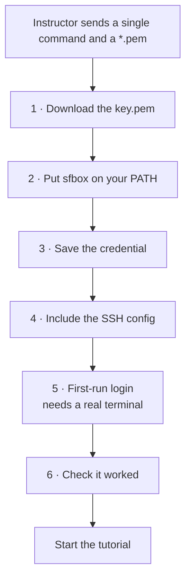

# Getting onto your cloud box

A step-by-step for a participant with an SSH key and no AWS account. Your instructor gives you a single command for your box, you paste it in once, and everything after that is copy-paste.

Running the two days on your own laptop instead? You don't need this page. Go straight to [W2 Cloud Box and Preflight](./progression/W2-cloud-box-and-preflight.md), whose appendix covers the local path.

## Contents

- [How the setup runs](#how-the-setup-runs)
- [Step 1: download the key.pem](#step-1-download-the-key-pem)
- [Step 2: put sfbox on your PATH](#step-2-put-sfbox-on-your-path)
- [Step 3: save your box](#step-3-save-your-box)
- [Step 4: one line in your SSH config](#step-4-one-line-in-your-ssh-config)
- [Step 5: the first-run login](#step-5-the-first-run-login)
- [Step 6: check it worked](#step-6-check-it-worked)
- [When something looks wrong](#when-something-looks-wrong)
- [The commands you will use](#the-commands-you-will-use)

## How the setup runs



Five of those six steps are copy-paste. Step 5 isn't, and it's where the time goes, so read it before you get there rather than when you're already in it.

## Step 1: download the key.pem

Download the `key.pem` file the instructor gave you. Store it in `$HOME/Downloads` or somewhere else you can access it quickly. Export this as `$SFI_KEY`:

```bash
export SFI_KEY=$HOME/Downloads/key.pem
```

NOw lock the key down, since SSH won't touch a key other people could read.

```bash
chmod 600 "$SFI_KEY"
```

## Step 2: put sfbox on your PATH

`sfbox` is one bash script, and it ships in this repo under `participant-box-cli/`. There's nothing to build, and nothing to install past what you've already got: bash, ssh, and curl.

Put `sfbox` on your `PATH`, from the directory holding your clone.

**Copy and paste**

```bash
cd $HOME && mkdir software-factory-intensive
cd software-factory-intensive
export SFI_PATH="$(pwd)"
git clone https://github.com/actual-software/sf-tutorial.git

export PATH="$SFI_PATH/sf-tutorial/participant-box-cli:$PATH"
sfbox --help
```

Add both of these environment variables to your shell for future use:

**Copy and paste** (macOS / zsh)

```bash
cat <<EOF >> ~/.zshrc
export SFI_KEY=$HOME/Downloads/key.pem
export SFI_PATH="$(pwd)"
export PATH="$PWD/sf-tutorial/participant-box-cli:$PATH"
EOF
```

**Copy and paste** (Linux / bash)

```bash
cat <<EOF >> ~/.bashrc
export SFI_KEY=$HOME/Downloads/key.pem
export SFI_PATH="$(pwd)"
export PATH="$PWD/sf-tutorial/participant-box-cli:$PATH"
EOF
```

If `sfbox --help` prints usage, you're set. If you get `command not found`, that export didn't take in this terminal. Run it again in the terminal you're actually working in, and add it to your shell profile so a restart doesn't undo it.

## Step 3: save your box

You will be given a command that looks like the following. Run it to save the credential to your box for future use:

**Copy and paste**

```bash
sfbox save-credential --box <box id> --host <host ip> --key "$SFI_KEY" --fingerprint <fingerprint sha> --label test
```

Two things get checked here. It fetches the key your box is actually offering and refuses to save anything that doesn't match your fingerprint, so your very first connection is authenticated rather than trusted blindly. It then makes one test connection to confirm the `.pem` you passed is the one that opens that box. If you were sent keys for more than one box, this is where you find out you're holding the wrong one, rather than three steps further on.

If it reports a fingerprint mismatch, stop and tell your instructor. Don't work around it. If it reports a wrong key, check which `.pem` belongs to the right box ID and re-run with that file.

Saving a credential also makes that box current, so if you've only got the one box then that's box selection dealt with for the rest of the two days and you can forget the flag exists.

## Step 4: one line in your SSH config

`sfbox` writes its own SSH config and never edits yours. Add this at the **top** of `~/.ssh/config`:

```
Include ~/.gascity/ssh_config
```

`sfbox` works without it, but the Include helps with a few quality-of-life operations: plain `ssh`, `scp`, `rsync` and port-forwards addressed to your box by its ID.

## Step 5: the first-run login

**Copy and paste**

```bash
sfbox start-session
sudo gas-city-login
```

You'll be walked through GitHub sign-in, which asks which credential you want to give the box: a browser grant against your whole account, or a token you mint yourself and paste. A bare Enter takes the browser grant. If you'd rather not grant the CLI that much, mint the token before you start this step, and see [the preflight page](./progression/W2-cloud-box-and-preflight.md#signing-the-box-in-with-a-token) for what to scope it for.

Then, you may choose to configure Claude Code (`claude`), Codex (`codex`), or Gemini CLI (`gemini`) by running the respective command. Note that the curriculum assumes Claude Code, so you will need to replace a provider string `claude` to your alternative choice when configuring the software factory. See an instructor for help if needed.

**Your box has no custom factory on it when this finishes, and that is deliberate.** It arrives with the environment and nothing more: the `gc`, `bd` and `dolt` toolchain, your GitHub credential, and the Claude, Codex and Gemini CLIs. There is a `factory-packs` directory that clones this `sf-tutorial` repository but we will use your custom `sf-tutorial` branches instead.

## Step 6: check it worked

**Copy and paste**

```bash
exit # exit out of the cloud session
sfbox preflight
```

**Expected output**

```text
==> Checking 'alice-test' (ubuntu@203.0.113.10) ...
==>   ssh            reachable
==>   gc             installed
==>   gas-city.service  inactive — no city on this box yet
==>   Nothing is broken. This box supplies the environment and you build the
==>   city yourself, so the service stays down until there is one to run.
```

Head back to the tutorial from [W2 Cloud Box and Preflight](./progression/W2-cloud-box-and-preflight.md) once this is complete.

## When something looks wrong

- **`command not found: sfbox`.** The `PATH` export from step 2 didn't take in this terminal. Run it again here, then add it to your shell profile.
- **`Host key verification failed`.** You're bypassing the config `sfbox` wrote. Use `-F ~/.gascity/ssh_config` as shown, or add the `Include` line from step 4. Don't pass the `.pem` directly with `-i`.
- **`save-credential` reports a fingerprint mismatch.** Stop and tell your instructor. If your box was genuinely rebuilt, they'll give you the new fingerprint to pass with `--rotate`.
- **`Permission denied (publickey)`.** Your box is right and reachable, and it's refusing the key you're offering. That almost always means you're holding a `.pem` for a different box. Re-run `sfbox save-credential` with the key you believe belongs to `$SFI_BOX`; it makes a test connection before saving and will say plainly whether that key opens the box. To settle it against the instructor's copy, run `ssh-keygen -lf "$SFI_KEY"` and send them the `SHA256:` line, which they can compare against the box's key pair. Don't ask for the box to be rebuilt over this — the box is fine, and rebuilding would destroy a working one.
- **`gas-city-login needs an interactive terminal`.** You're running it somewhere without a real terminal.
- **The service says it's waiting on first-run login.** Expected if you haven't finished step 5. `sfbox preflight` says so in as many words and names `sudo gas-city-login`.
- **The service says there's no city on the box yet.** Also expected, and not something to fix. Your box ships the environment and leaves the factory to you; the service starts once you have built one for it to supervise.
- **Anything else.** Run `sfbox preflight --box "$SFI_BOX"`. It checks SSH, then `gc`, then the service, stopping at the first thing that fails, so it tells you which layer to look at instead of leaving you guessing.

## The commands you will use

Every command acts on your current box. Switch which one that is with `sfbox box use <boxId>`, or override a single command with `--box <boxId>`.

| Command | What it does | When you reach for it |
|---|---|---|
| `sfbox save-credential` | Saves a box's key and pins its host key | Once per box, at setup |
| `sfbox box list` | Shows your boxes and marks the current one with `*` | You've got more than one and forgot which is active |
| `sfbox box use <boxId>` | Makes a box the default for later commands | Switching between your boxes |
| `sfbox box current` | Prints the current box | A one-line check before you change something |
| `sfbox box forget <boxId>` | Drops a box locally, leaving the box itself untouched | After the event, or when a box is reassigned |
| `sfbox preflight` | Checks ssh, then `gc`, then the service, stopping at the first failure | First thing to run whenever anything looks wrong |
| `sfbox get-box` | Service state, running sessions, and recent log (this will take a minute to run) | Seeing what the box is actually doing |
| `sfbox start-session` | Opens a shell on the box | Running something on the box by hand |
| `sfbox dashboard` | Tunnels the dashboard to `http://127.0.0.1:8372` | Watching your factory work in a browser |
| `sfbox exec <command>` | Runs one command on the box and hands back its exit status | Restarting the service, or anything without a command of its own |
| `sfbox gc <args>` | Runs a `gc` command inside the box's city | Importing a pack, listing sessions, reloading config |

The last two are the ones you reach for most after setup, because between them they cover everything the list above doesn't:

```bash
sfbox exec sudo systemctl restart gas-city.service
sfbox gc import add https://github.com/<org>/<repo>/tree/<ref>/<subdir> --rig <rig>
```

Your arguments arrive the way you typed them, so quotes and spaces survive. To pipe or redirect, ask for a shell: `sfbox exec bash -lc 'gc session list | wc -l'`. Nothing is checked on your behalf, and nothing is rolled back if it goes wrong: what you type is what runs.

For more details about the `sfbox` CLI tool, see [`participant-box-cli/README.md`](./participant-box-cli/README.md).
