<h1></h1>

<p>
  Event by <a href="https://aitinkerers.org/"></a>
  &nbsp;|&nbsp;
  Hosted by <a href="https://www.actual.ai/"></a>
</p>

This is a multi-step software factory intensive, built on [Gas City](https://github.com/gastownhall/gascity) to:

1. Provide a fast path to the simplest possible factory.
1. Demonstrate key components of a software factory.
1. Teach you how to customize those components so that you can create the agents and workflows you need to power your own software factory.

You'll start with out-of-the-box examples that ships with Gas City and two reference implementation agents from Gas Town, `mol-polecat-work` and `mol-refinery-patrol`. And you'll evolve a multi-agent workflow. You'll start with a simple **implement -> review** workflow. Then as the tutorials progress you'll layer on:

- GitHub pull requests
- Opinionated quality gates
- Specialize reviewer agents
- An architecture-best-practices loop
- A multi-model `code-review-loop`
- Etc.

## Community & Support

Stuck on a step, want to share what you've built, or looking to collaborate with other participants? Join the [Actual AI User Community Slack](https://join.slack.com/t/actualaiusercommunity/shared_invite/zt-3vibgzapf-ywx0Db29mZ4lhtQJGzZfGQ)! Here you can share what you've built, ask questions, and get help from other members of the community.

## What you'll build

By the end of the Progression, you'll have:

- A Gas City factory named `factory1`
- An example project or "rig" named `ascii-art` pushed to your own GitHub repo
- Gas City **packs** with **formulas** and **agents** that wire the `ascii-art` project to your workflows

## Factory1

**Factory1** is totally decoupled from the ASCII Art example project. If you're happy with its functionality at the end of these tutorials, you can start using it with your own projects immediately. If not, you'll have what you need to customize it further, and then you can start using it. You don't need to create a different factory to get started with Gas City.  

## ASCII Art

The example project is intentionally simple. The point is to learn the workflows.

Even though you're learning how to build a software factory, our examples simply generate text files, specifically ASCII Art ([like this](https://www.asciiart.eu/gallery)) for letters A-Z and numbers 1-100, along with little rhymes in each. 

All the same principles and processes apply. In your projects, your technical requirements will be related to your technologies stack rather than how many characters are allowed in each file, and your design system will focus on your brand and user experience rather than styling of markdown files. These details are project- or rig- specific. They do not live in the factory.    

## Prerequisites

Tools and versions:

- `gc` 1.0+
- `bd` 1.0+
- `gh` 2.x (authenticated: `gh auth status`)
- `git`
- macOS or Linux with `tmux` available

GitHub:

- One **fresh GitHub repo** for the rig — your own org or a sandbox account. The rig will push to this repo and branch protection will be applied to it.

## Tutorial structure

Three ways through this repo. The pages are the same; what differs is the order and the pacing.

### Two-day intensive (start here if you are at the event)

This is the taught path: thirteen blocks across two days, each owning one discrete time window, each ending in something you can point at.

It is an order, not a layer of extra reading. Every block's content lives on the [progression](#basic-progression-sequential-do-these-in-order) and [hardening](#hardening-exercises-optional-layer-on-as-you-like) pages listed below, so a block is one page to open rather than an intermediary that points at another. What the schedule adds is the order, the time windows, and the answer to "which page do I open at 10:00 on Wednesday".

Those pages still work on their own. Each one is self-contained, and the two lists below give both tracks in their own numbered order. What changed for a reader outside the two days is the « previous | next » footer at the bottom of every page: it now runs this taught order, so it threads [`hardening/01`](./hardening/01-bead-creation-formula-extensions.md) into the middle of the progression and routes around [`05.2`](./progression/05.2-bead-gate-checks.md). Read from those lists instead, and treat the footers as the event's running order.

#### How a block is written

Every block is typed, and the type tells you what the room looks like.

- A **Workshop (`W-`)** is instructor-led and deterministic. Everyone runs the same commands against the same shared example and arrives at the same place.
- A **Lab (`L-`)** is participant-led and open-ended. You run it against your own project while the instructor circulates.

Wednesday is workshop-heavy and runs on one shared factory. Thursday is lab-heavy and runs on yours. That split is deliberate: the concepts are new on day one, so the commands stay identical, and by day two the interesting part is your repo rather than ours.

Open a block and the first thing on the page is its framing: the objective, the time window, what you leave with, how the minutes are meant to run, and what to do if you fall behind. The walkthrough follows directly underneath. A block that spans several pages carries that framing on its first page and names the others, so you still only open one link to start.

```mermaid
flowchart LR
  subgraph WED["Wednesday · one shared example"]
    A[W-1 Preflight] --> B[W-2 What is a Software Factory?]
    B --> C[W-3 Run a Software Factory]
    C --> D[W-4 Review Loops]
    D --> E[W-5 Requirement Gates]
    E --> F[W-6 Coordination Channels]
    F --> G[L-1 Plan Your Factory]
  end
  subgraph THU["Thursday · your own project"]
    H[W-7 The Mayor and Workflows] --> I[L-2 Retargeting the Rig]
    I --> J[L-3 Hardening]
    J --> K[L-4 Self-improvement Loop]
    K --> L[L-5 Implement a Feature]
    L --> M[W-8 Sharing Your Factory]
  end
  G -.->|capability map| L
  G --> H
```



The dotted line is the one thread that crosses the two days. L-1 on Wednesday afternoon produces a written **capability map** of the changes you want to make to your own factory, and L-5 on Thursday afternoon is where you implement from it. Wednesday's planning block is the input to Thursday's biggest block, not a warm-up for it.

#### Wednesday: build the foundation

One shared factory, one shared example. Six workshops and one lab, 330 minutes of teaching. W-1 runs over breakfast and is staffed rather than taught, which is why it sits outside that total.

| Block | Type | Time | Title | You leave with | Pages in the block |
| --- | --- | --- | --- | --- | --- |
| W-1 | Workshop | 8:00–9:00 | [Preflight Setup](./progression/00.0-preflight.md) | One pass-or-fail line, and a paired partner if it read fail | [`00.0`](./progression/00.0-preflight.md), wrapping [`bootstrap/deps.sh`](./bootstrap/deps.sh) |
| W-2 | Workshop | 9:00–9:45 | [What is a Software Factory?](./progression/00.05-what-is-a-software-factory.md) | The vocabulary, and the mapping from the demo repo you ran in pre-work | [`00.05`](./progression/00.05-what-is-a-software-factory.md), prose only |
| W-3 | Workshop | 10:00–11:00 | [Run a Software Factory](./progression/00.1-setup-foundation.md) | `factory1` up, the `ascii-art` rig registered, one bead merged | [`00.1`](./progression/00.1-setup-foundation.md), [`00.2`](./progression/00.2-setup-foundation.md), [`00.3`](./progression/00.3-setup-foundation.md), [`01`](./progression/01-basic-flow.md) |
| W-4 | Workshop | 11:00–12:00 | [Review Loops](./progression/02-first-review-loop.md) | A required review round, human-only merge, an architecture reviewer | [`02`](./progression/02-first-review-loop.md), [`03`](./progression/03-branch-protection.md), [`04`](./progression/04-adr-reviewer.md) |
| W-5 | Workshop | 2:00–3:00 | [Requirement Gates](./progression/05.1-bead-gate-checks.md) | A front gate that rejects underspecified work, plus a test-generation check | [`05.1`](./progression/05.1-bead-gate-checks.md), [`hardening/01`](./hardening/01-bead-creation-formula-extensions.md) |
| W-6 | Workshop | 3:00–3:45 | [Coordination Channels](./progression/06-coordination-channels.md) | A channel inventory, with a fallback named for every handoff | [`06`](./progression/06-coordination-channels.md) |
| L-1 | Lab | 4:00–5:00 | [Plan Your Factory](./progression/07-plan-your-factory.md) | Your own rig registered, a project manifest, and a **capability map** | [`07`](./progression/07-plan-your-factory.md), generalised off [`00.2`](./progression/00.2-setup-foundation.md) |

#### Thursday: go deep

Your factory, your project. Two workshops and four labs, 330 minutes of teaching, 255 of them hands-on.

| Block | Type | Time | Title | You leave with | Pages in the block |
| --- | --- | --- | --- | --- | --- |
| W-7 | Workshop | 9:00–9:45 | [The Mayor and Workflows](./progression/08-mayor-and-workflows.md) | One workflow walked end to end, and the vocabulary for the rest | [`08`](./progression/08-mayor-and-workflows.md) |
| L-2 | Lab | 10:00–10:45 | [Retargeting the Rig](./hardening/02-specialize-reviewers-per-domain.md) | Yesterday's gates running on your rig, reviewers split by domain | [`hardening/02`](./hardening/02-specialize-reviewers-per-domain.md), retargeted |
| L-3 | Lab | 10:45–12:00 | [Hardening](./hardening/03-architecture-best-practices-loop.md) | One of two: per-principle scoring, or multi-vendor review | [`hardening/03`](./hardening/03-architecture-best-practices-loop.md) or [`hardening/04`](./hardening/04-strengthen-review-system.md) |
| L-4 | Lab | 2:00–2:45 | [Self-improvement Loop](./hardening/05-self-improvement-loop.md) | Your factory proposing its own config change, behind a gate | [`hardening/05`](./hardening/05-self-improvement-loop.md), reusing [`hardening/03`](./hardening/03-architecture-best-practices-loop.md)'s scoring |
| L-5 | Lab | 3:00–4:30 | [Implement a Feature](./progression/09-implement-a-feature.md) | The changes from your capability map, actually built | [`09`](./progression/09-implement-a-feature.md) |
| W-8 | Workshop | 4:30–5:00 | [Sharing Your Factory](./progression/10-sharing-your-factory.md) | A decision about what you publish and what gets scrubbed first | [`10`](./progression/10-sharing-your-factory.md), prose only |

Three published windows carry no block, and nothing above is scheduled into them: lunch on both days, the GasCity team's keynote on Wednesday afternoon, and the Thursday early-afternoon demo window.

#### If you fall behind

Run one command over a break and rejoin at the top of the next block:

```bash
cd path/to/sf-tutorial/bootstrap
./bootstrap.sh <step>
```

`./bootstrap.sh <step>` answers "make my factory look like I just finished `<step>`", not "make my factory ready for me to start `<step>`". The step argument is the progression filename stem, so `./bootstrap.sh 02-first-review-loop` puts you at the end of W-4's first page. Every block page names the argument that gets you to its starting line.

This is the reason the blocks can afford fixed boundaries. A setup problem stalls one person for one break instead of stalling the room for an hour. Read [the bootstrap README](./bootstrap/README.md) once before you need it — the script is destructive by design, and you want to have read that sentence in advance.

#### Floor and ceiling

Every block has a floor and a ceiling. The floor is the copy-paste path that produces the deliverable, and finishing it means you are not behind. The ceiling is one open-ended extension for whoever gets there early, and skipping it costs you nothing on the next block.

If you are already running multi-agent workflows day to day, work the ceilings. If this is your first factory, work the floors and pair with someone on the ceilings. The room is deliberately mixed.

#### What is not in the taught path

[`progression/05.2-bead-gate-checks.md`](./progression/05.2-bead-gate-checks.md) is not taught here. It is a good page and it still runs; W-5 spends its hour on the front gate and the test-generation check instead. Come back to it on your own if bead refinement at the source is a problem you have.

Wednesday starts at [W-1 Preflight Setup](./progression/00.0-preflight.md).

### Basic Progression (sequential, do these in order)

Each step unlocks the next. Every page is self-contained: prereqs, walkthrough with copy-pasteable commands, verification block, and troubleshooting. Work from the list below rather than the « previous | next » footer at the bottom of each page, which runs the two-day event order instead.

1. [Preflight: check your toolchain](./progression/00.0-preflight.md) — `deps.sh` plus a single pass-or-fail line before you build anything, on your laptop or a cloud box
2. [What is a software factory?](./progression/00.05-what-is-a-software-factory.md) — the vocabulary, and how it maps onto the demo repo; prose only, nothing to install
3. [Setup: Create a Gas City named factory1](./progression/00.1-setup-foundation.md) — `gc init`, import a setup pack (based on the `gastown` reference pack), configure `city.toml`
4. [Setup: Add ASCII Art rig](./progression/00.2-setup-foundation.md) — `gc rig add`, push to GitHub, create 138 beads
5. [Setup: env vars](./progression/00.3-setup-foundation.md) — handy variables for easier copy-and-paste-ing
6. [Basic flow (OOTB)](./progression/01-basic-flow.md) — one agent claims a bead and implements (`mol-polecat-work`) + another reviews (`mol-refinery-patrol`) with no extras
7. [First review loop](./progression/02-first-review-loop.md) — extend the refinery patrol with a required round of feedback before any bead becomes a PR
8. [Branch protection](./progression/03-branch-protection.md) — only approved humans merge to `main`
9. [Architect agent](./progression/04-adr-reviewer.md) — add an architecture-aware reviewer between the polecat and the refinery
10. [Bead gate checks](./progression/05.1-bead-gate-checks.md) — add a project-manager agent at the front of the factory
11. [Bead gate checks — Grill Me](./progression/05.2-bead-gate-checks.md) — refine beads at the source with a local Grill-Me skill
12. [Coordination channels](./progression/06-coordination-channels.md) — mail, wakes, nudges and attach, plus a fallback for every handoff
13. [Plan your factory](./progression/07-plan-your-factory.md) — register your own rig, write a project manifest, and produce a capability map
14. [The mayor and workflows](./progression/08-mayor-and-workflows.md) — formulas and orders, and one workflow walked end to end
15. [Implement a feature](./progression/09-implement-a-feature.md) — a directed build against the capability map from the planning page
16. [Sharing your factory](./progression/10-sharing-your-factory.md) — what you publish, what stays private, and what gets scrubbed first

### Hardening Exercises (optional, layer on as you like)

These are independent follow-ons. Pick the ones that interest you; they don't have to be done in order. Open them from this list rather than by footer, which sends you from the first exercise back into the progression, where the two-day schedule teaches it.

1. [Bead-creation formula extensions](./hardening/01-bead-creation-formula-extensions.md) — auto-link/create design, testing, and documentation references
2. [Specialize reviewers per domain](./hardening/02-specialize-reviewers-per-domain.md) — split the single reviewer into ADR, design, testing, and docs reviewers
3. [Architecture best practices loop](./hardening/03-architecture-best-practices-loop.md) — per-principle scoring with an append-only audit trail
4. [Strengthen review system](./hardening/04-strengthen-review-system.md) — multi-vendor reviewers, a synthesizer, and an iterate loop
5. [Self-improvement loop](./hardening/05-self-improvement-loop.md) — the factory proposes a change to its own configuration, behind a gate

### Running on a cloud box

Doing the intensive on instructor-provided cloud boxes instead of your own laptop? [`participant-box-cli/`](./participant-box-cli/README.md) is the CLI and agent skill for driving them over SSH. You save a box credential once, then deploy a factory pack, restart the service, read box state, and tunnel the dashboard to your browser. No AWS account needed.

## How to use this repo

1. Clone this repo and `cd` into it.
2. Read this README end to end (you're nearly done).
3. Run [`progression/00.0-preflight.md`](./progression/00.0-preflight.md) and get a `PREFLIGHT: PASS`.
4. Open [`progression/00.1-setup-foundation.md`](./progression/00.1-setup-foundation.md) and work through it.
5. Come back to this README for the next step. Pages also end with a « previous | next » footer, but that one runs the two-day event order.
6. After the **Basic Progression**, browse the **Hardening Exercises** and pick what's useful.

At the two-day intensive, follow the [taught path](#two-day-intensive-start-here-if-you-are-at-the-event) above instead — it routes through these same pages in the order the schedule uses.

Every page is designed to be copy-paste-runnable. Commands are exact. When a page introduces a new artifact (a formula, an agent definition, a script), the artifact lives under [`artifacts/`](./artifacts/) and the page tells you exactly where to put it.

---

Ready? Head to [progression/00.0-preflight.md](./progression/00.0-preflight.md).
