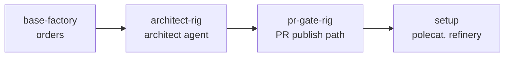

# base-factory

The factory you start from. One import brings up a working multi-agent factory with an example of every Gas City primitive already running inside it, so W3 ends with a factory you can read rather than a checklist you have half finished.

```bash
gc import add --rig <rig-name> artifacts/packs/base-factory
gc import add artifacts/packs/pr-gate-city
```

The first command is the base factory. The second is the mayor's half of the PR gate, which has to be a separate import because the mayor is city-scoped and a pack composes at one scope. Everything the five primitives need is in the first command; the second is what teaches the mayor to dispatch through the gate.

## What one import brings

Packs import transitively, so the single `[imports.architect-rig]` stanza in `pack.toml` pulls the whole chain behind it.



`setup` carries the polecat and refinery agents and the two reference formulas. `pr-gate-rig` turns the merge path into a pull request and inserts an approval step ahead of it. `architect-rig` adds the architect agent, which reads each branch against the rig's decision records and writes its verdict back onto the bead. This pack adds the orders.

## The five primitives, and where to read each one

| Primitive | Where it lives in the installed factory |
|---|---|
| Formula | `setup/formulas/mol-polecat-work.toml`, plus the patrol formulas in `pr-gate-rig` and `architect-rig`. Steps carry no assignee, so the pool is resolved per step at dispatch. |
| Agent persona | `architect-rig/agents/architect` — its own prompt, its own pool bounds, and a verdict it writes back onto the bead. |
| Order | This pack's `orders/` directory. Two of them, one on a schedule and one on an event. |
| Rig | The ASCII-art rig you add in W3, which everything above is scoped to. |
| Mail | Used by the polecat and refinery in `setup`, and again in the `pr-gate-rig` and `architect-rig` refinery prompts. |

## The two orders

Both write to `FACTORY_LOG.md` in the rig root, on purpose. By the afternoon that one file carries lines from both, and the interleaving is the shortest demonstration that a clock and an event are different mechanisms driving the same kind of action.

`factory-pulse` runs on cron, hourly on the hour, and appends the current bead counts. Hourly rather than daily so that a participant sees it fire during the day; change it to `0 9 * * *` once the factory is yours.

`bead-closed-log` runs on the `bead.closed` event and appends each newly closed bead. Every agent in the base chain closes beads, so it fires for real within minutes of your first sling.

Read the two `.toml` files side by side. The trigger is the only thing that differs between them, and each file's comment explains what its trigger reads and what it ignores.

To watch either one without waiting:

```bash
gc order list                    # both orders, with their triggers
gc order check                   # which are due, and why the others are not
gc order run factory-pulse       # fire it now
gc order history                 # what has fired
```

## Turning the orders off

Removing the pack removes the orders:

```bash
gc import remove --rig <rig-name> base-factory
```

There is no environment switch on these two. They append to a file nobody reads, so the cost of leaving them on is a few lines a day. A pack whose orders do something with a real cost should gate on the city's `.env` instead — an order's shell line does not load `.env` itself, so that gate has to be a script the check calls.

## Extending it

The hardening options each import `architect-rig` directly rather than importing each other, so any option composes on top of this pack alone and you can take them in any order. Add one with `gc import add --rig <rig-name> artifacts/packs/<option-pack>`; the option page names its pack.
