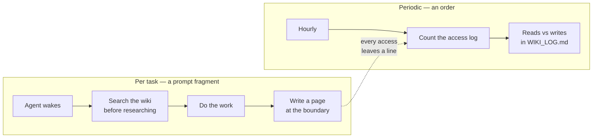

# internal-wiki

Shared team memory, so your factory stops re-deriving what it already learned.

Almost every agent you run is ephemeral: it spawns, does one thing, and exits with everything it discovered. That is the right design for work and the wrong one for knowledge, and [W6](../../../progression/W6-advanced-concepts.md) names the two mechanics that fix it. This pack ships both, sized for a lab block rather than for a production factory.

## Install

```bash
cd "$FACTORY_PATH"
gc import add --rig <rig-name> $SFI_PATH/artifacts/packs/internal-wiki
gc reload
```

Rig scope, because the pack patches the rig's own agents. It imports `architect-rig` the way the other option packs do, so it'll compose on top of [the base factory](../base-factory/README.md) alone and you can take the options in any order.

Nothing else to configure. The wiki is created on first use at `team-wiki` inside the city, which is enough to watch the whole loop work before you've got a shared repository to point it at.

## The two halves



Reading is per task, so it belongs in a prompt. The fragment in `template-fragments/` carries the two habits, and the patches in `pack.toml` append it to the polecat and the refinery. This is the first fragment in any of the tutorial's packs, and W4 called it: the moment two agents mustn't contradict each other on a rule, that rule wants to be a fragment rather than a paragraph copied into both prompts.

Counting is periodic. Nothing asks for the read-to-write balance and no bead's ever going to carry it, which is what makes `orders/wiki-balance.toml` an order rather than work.

## Why one helper instead of grep

A wiki is a directory, and `grep` reads a directory perfectly well. What `grep` can't do is tell you afterwards whether anybody read it.

So every access goes through `assets/scripts/wiki.sh`, which appends one line to an access log before it returns. That turns "is the team actually using the wiki" from a question you argue about into a file you can count, and counting it is the order's whole job. The log write is best-effort on purpose: if it fails, the read still returns its content, because an agent that can't log is still an agent that needs the page.

## Try it

Two agents, one finding. Play both parts yourself and it's about a minute's work.

```bash
cd "$FACTORY_PATH"
../sf-tutorial/artifacts/packs/internal-wiki/assets/scripts/wiki.sh setup

# The first agent hits something surprising and writes it down.
./wiki.sh write operations/worktree-stale-lock.md <<'PAGE'
# A stale lock file survives a crashed worktree setup

Expected the next run to clean up after itself. It did not: the lock file
outlives the process that wrote it, so every later run fails the same way.
Delete the lock before re-running, and check for one first when setup hangs.
PAGE

# The second agent is about to research the same thing, and checks first.
./wiki.sh search "stale lock"
./wiki.sh read operations/worktree-stale-lock.md

# What the factory now knows about its own reading and writing.
gc order run wiki-balance
```

The first line is the only one that spells out the pack path. `setup` leaves the symlink behind, so everything after it reaches the helper as `./wiki.sh`.

That last line prints the balance and appends it to `WIKI_LOG.md` in the city root. `gc order check` says when it's next due, and it fires by itself hourly.

The half you can't see in a minute is the agents doing it unprompted. Sling any bead after installing this and read the polecat's prompt with `gc prime`: the fragment is on the end of it, and `wiki-access.jsonl` starts filling with lines whose agent isn't you.

## The helper

```bash
./wiki.sh setup [<city-root>]   # create the wiki, and link the helper into the city root
./wiki.sh search <pattern>      # grep the wiki; exits 1 on no match, like grep
./wiki.sh read <path>           # print one page
./wiki.sh write <path>          # write a page, body on stdin, committed for you
./wiki.sh list [<path>]         # what pages exist
./wiki.sh log                   # the raw access log
```

`setup` runs from the patched agents' `pre_start` as well as by hand, and it's written so it can't fail: an agent that couldn't get a wiki should still start. The symlink it leaves at `<city>/wiki.sh` is what lets the prompt fragment name one path that works, since a prompt template can resolve the city root but can't reach the pack directory the real script lives in. `ls -l` on it shows where that is.

## Variables

| Variable | Default | What it does |
|---|---|---|
| `TEAM_WIKI_PATH` | `team-wiki` inside the city | Where the wiki lives. Point it at a shared repository once you have one. |
| `WIKI_ACCESS_LOG` | `wiki-access.jsonl` in the city root | Where accesses are recorded. |

Set both in your shell for the commands you run by hand. The order needs its own copy, because an exec order doesn't load the city's `.env`; uncomment `[order.env]` at the bottom of `orders/wiki-balance.toml` and put the path there.

## Pointing it at a real repository

The default wiki is a git repo with no remote, which is private note-taking with extra steps. The point is the shared read, so once the pack has earned its place, give it somewhere everyone can reach:

```bash
git -C "$FACTORY_PATH/team-wiki" remote add origin <your-wiki-repo-url>
git -C "$FACTORY_PATH/team-wiki" push -u origin main
```

`wiki.sh` commits and doesn't push, so pushing stays a thing a person decides to do. That's the same line the self-improvement option draws: the factory may write a proposal, and a human decides what leaves the machine.

## Turning it off

```bash
gc import remove --rig <rig-name> internal-wiki
gc reload
```

That takes the order and the prompt fragment with it. The wiki, the access log and `WIKI_LOG.md` are yours and stay where they are; delete them by hand if you'd rather they were gone.
