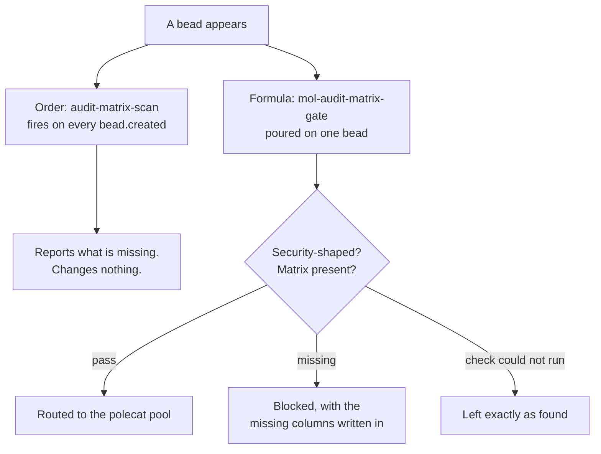

# security-audit-matrix

An optional pack that holds security work at the door until somebody has written down which resources it touches and what covers each of them. Install it on top of a working base factory:

```bash
gc import add --rig <rig-name> $SFI_PATH/artifacts/packs/security-audit-matrix
```

That is the whole install. The pack imports `architect-rig`, the base factory's top node, so it composes on a `base-factory` install with nothing else added and in any order relative to the other options.

## What it demonstrates

A bead's description is where a change gets decided, and a description can read as complete while leaving out the thing that matters most about security work: the list of resources involved. Nobody notices, because the sentence "add row-level security to the reports table" sounds like a full instruction. The gaps surface later, in the review thread, one round-trip each, with the code already written against the incomplete version.

An audit matrix is the fix, and it is just a table in the description:

| Resource | Rule | Threat | Covered |
| --- | --- | --- | --- |
| reports | tenant_id policy | cross-tenant read | yes |
| exports | none yet | cross-tenant read | no — follow-up bead |

The second row is the one to look at. A resource recorded as uncovered is a decision somebody made and can be argued with. A resource left out of the table is indistinguishable from one nobody thought of, and that is the state this pack exists to make visible.

So the pack ships two halves that ask the same question in different ways:



The formula is the enforcing half and it only runs on beads you aim it at. The order is the observing half and it sees everything, which is what covers the beads nobody remembered to aim it at. A gate you have to remember to invoke gets skipped on the busy day.

## The workflow to run

Make a bead that describes security work and leaves the table out:

```bash
bd create "Add row-level security to the reports table" \
  -d "Scope every read of the reports table to the caller's tenant."
```

Pour the gate on it. The architect is the agent that pours it, because this pack ships no agent of its own and the architect is the base factory's reader-and-judge:

```bash
gc sling <rig-name>/architect-rig.architect <bead-id> --on mol-audit-matrix-gate
```

The bead comes back `blocked`, carrying `audit_matrix_feedback` that names the four columns. Now add the table to the description, set the bead back to `open`, and pour the formula again. It routes to the polecat pool, and the polecat picks the work up as usual.

To watch the observing half instead, without waiting for a bead to be created:

```bash
gc order run audit-matrix-scan     # fire it now, against your current board
gc order history                   # what it reported
```

## Running the check on its own

The whole mechanism is one script, and it needs nothing from the rest of the pack:

```bash
assets/scripts/audit_matrix_check.py check <bead-id>    # one bead
assets/scripts/audit_matrix_check.py scan               # the whole open board
assets/scripts/audit_matrix_check.py --self-test        # prove the detector
```

`check` exits 0 when the bead may proceed, 1 when it is security-shaped and has no matrix, and 2 when the check could not run at all. Keep 1 and 2 apart in anything you build on this. A gate that reads "bd was unreachable" as "this bead needs a matrix" blocks work for a reason that is not true, and sends whoever reads the message looking for a security question that was never in their bead.

Run `--self-test` after editing either vocabulary list at the top of the script. Your board is not a test corpus for the detector: a board with no security-shaped beads on it exercises none of the interesting paths, so a broken detector and a quiet board produce the same clean output. The planted cases cover the shapes you are unlikely to have lying around, including the two near-misses that matter — the four column names appearing in a paragraph that describes a matrix rather than being one, and an unrelated table standing in for the real one.

## What the two lists do

`SECURITY_PHRASES` matches as plain substrings. `SECURITY_ACRONYMS` matches on word boundaries. The split is not tidiness, and merging them brings back a real bug: the factory this pack was carved from matches everything as a substring, so its gate fires on any description containing the word `URLs`, because `URLs` contains `RLS`. Every false fire costs a round-trip for a matrix nothing in the bead needed. Add an acronym to the acronym list.

Bare common words are missing from both on purpose. "security", "token", "isolation" and "authorization" all turn up in routine work, and a gate that fires on everything is a gate people learn to wave through.

## What the simplification cost

The factory this is modeled on runs the same two questions inside its planner and builder roles rather than as a pack. The matrix gets negotiated with the operator during planning, the builder refuses to start without one, and the table is copied into the pull request so the reviewer's attention lands on it before the diff. Here it is one script and one formula you pour by hand.

The detection is the same question, and it is the part worth taking with you. The conversation that fills the rows in is yours to have.

## Turning it off

```bash
gc import remove --rig <rig-name> security-audit-matrix
```

That removes the order and the formula together. Beads already carrying `audit_matrix_checked` keep it; nothing reads the field once the pack is gone.
