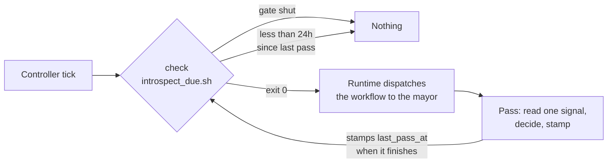

# self-improvement

An optional Day 2 pack. Once a day the factory reads one of the signals it's already writing, and it may propose at most three fixes for what it finds. Everything it proposes still goes past a person.

This is the scheduled form of the loop you build by hand in [the Self-Improvement Loop lab](../../../hardening/05-self-improvement-loop.md), and it's a simplified version of the one the authors run on their own factory. That one walks six audit categories and carries several hundred lines of Python. This one reads a single signal, and its check is 62 lines of shell you'll get through in a sitting.

## What it demonstrates

Two primitives the [base factory](../base-factory/README.md) installs but doesn't show you, plus one idea that's the reason the pack exists at all.

| | base-factory shows | this pack adds |
|---|---|---|
| Action | `exec`, a shell one-liner | `formula`, dispatching a workflow to an agent |
| Trigger | `cron` and `event` | `condition`, a shell check that owns two gates at once |

The idea is the third answer in `assets/workflows/daily-introspect/decide-and-gate.md`. A factory that can change itself needs somewhere to put the finding that deserves no change, and most days that's where every finding goes. Report something every day and you'll stop reading it.



The arrow back to the check is the part worth copying. The window opens relative to the last *completed pass*, not the last time the order fired, so a pass that never happened doesn't advance the clock. Wire it the other way and the two drift apart in silence: the schedule keeps its rhythm while the work quietly stops, and nothing reports an error because from the order's point of view every tick went fine.

## Adding it to your base factory

You need a factory from [W3](../../../progression/W3-run-your-factory.md), which is the base-factory install. Nothing else, and no changes to what you already have.

```bash
cd "$FACTORY_PATH"
gc import add $SFI_PATH/sf-tutorial/artifacts/packs/self-improvement
gc reload
```

City scope, so no `--rig` flag, because the pass reads the whole factory rather than one rig. The pack imports nothing and patches no agent, so it'll compose on top of whatever you installed earlier and come back out cleanly.

Confirm the runtime sees it:

```bash
gc order list          # daily-introspect, type formula, trigger condition, target mayor
gc formula list        # daily-introspect
```

## Seeing it work without waiting a day

The pass is on a 24-hour cadence, which is the right cadence and the wrong one when you're sitting in a lab block. Run it by hand instead:

```bash
gc order run daily-introspect
```

`gc order run` bypasses the trigger entirely, so neither the environment gate nor the cadence gets a say. The order's action is a formula, so this instantiates the three-step workflow and routes it to the mayor. You'll watch the pass happen from there:

```bash
gc order history                  # that the order fired
bd list --status open             # the workflow's steps, and any fix the pass proposed
```

Expect the pass to find nothing on a factory that is a few hours old, and expect it to say so. That is the pack working rather than the pack failing. To give it something to find, block a couple of beads with the same reason first and run it again:

```bash
bd update <some-bead> --status blocked --set-metadata blocker_reason="waiting on the same thing"
```

To see the trigger side rather than the action side, ask the runtime whether the pass is due:

```bash
gc order check
```

Right after a pass it will tell you the pass is not due, which is the cadence reading the timestamp the pass just wrote. The reason it prints alongside that stays generic, because the runtime discards whatever a check writes to its own output. Run `assets/scripts/introspect_due.sh` from the pack directory when you want the script's account of which half said no.

## Settings

| Where | Setting | Default | What it does |
|---|---|---|---|
| `$FACTORY_ROOT/.env` | `DAILY_INTROSPECT` | on | Set it to `false` to turn the pass off. Anything else, including unset, leaves it running. |
| `orders/daily-introspect.toml` | `pool` | `mayor` | The agent the workflow is dispatched to. |
| `orders/daily-introspect.toml` | check argument | `24` | Hours between passes. A condition order has no `interval` field, so the cadence lives on the check line. |

The environment gate is a script rather than an inline shell test for a reason worth knowing before you write your own. The controller runs a check line with its own environment, and your city's `.env` is never loaded into it, so `test "$DAILY_INTROSPECT" != false` reads an unset variable on every tick and the on-by-default branch always wins. The knob appears to work in the one direction that needs no knob, and the failure surfaces the first time somebody tries to turn it off.

## Turning it off

Either the knob or the removal, and they differ in what they leave behind:

```bash
echo 'DAILY_INTROSPECT=false' >> "$FACTORY_ROOT/.env"     # keep the pack, stop the pass
gc import remove self-improvement && gc reload            # take the pack back out
```

The state bead the pass keeps is metadata rather than work, so it stays open across passes. Leaving it there costs nothing and makes turning the pass back on free.

