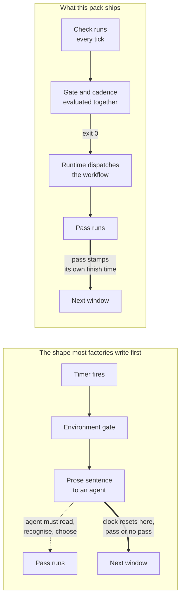

# self-improvement

A factory that audits itself once a day and is allowed to mint at most three fixes for what it finds.

This is the scheduled form of the loop you build by hand in [L-4 Self-Improvement Loop](../../../hardening/05-self-improvement-loop.md). The lab has you read a signal your factory already emits, ask an agent for the pattern, and put a gate in front of the proposal. This pack automates the reading and the proposing, keeps the gate, and adds bounds so a daily schedule cannot turn into a daily backlog.

## Install

```bash
cd "$FACTORY_PATH"
gc import add ../sf-tutorial/artifacts/packs/self-improvement
```

City scope, no `--rig` flag, because the pass audits the whole factory rather than one rig.

Then add one line to the prompt of whichever agent the order dispatches to (the `pool` field in `orders/daily-introspect.toml`, `mayor` by default):

> When you are dispatched into the `daily-introspect` workflow, follow its steps and stay inside its bounds; a pass that finds nothing correctly produces no output at all.

That's the whole prompt-side contribution. Everything else the pass needs travels in the workflow steps, which load when the workflow runs rather than sitting in the agent's prompt on every wake.

## How the trigger is wired, and why it is worth copying



An order pairs a trigger with either a formula or a shell command. Reach for the shell command and the natural thing to write is a nudge, which makes the pass conditional on an agent reading a sentence and deciding to act. Worse, the order's clock resets on dispatch, so a tick that produced no pass still advances the schedule. Those two drift apart quietly: the factory this pack was carved from reached a state where its most recent firing hadn't produced a pass and its most recent pass had no firing behind it, five and a half hours apart, with nothing reporting an error.

The formula action removes the interpretation step. The cadence check removes the drift by reading the timestamp the pass writes when it finishes, so a pass that doesn't happen doesn't advance the clock.

One constraint shapes the result, and it'll bite you if you write your own. Trigger evaluation is a switch on trigger type, so exactly one branch runs: a `cooldown` order never consults `check`, and a `condition` order never consults `interval`. You can't compose an interval with an environment gate by declaring both. A condition check is a shell command, though, so it can own both concerns at once, which is what the `check` line does.

## Variables

All of these live in `$FACTORY_ROOT/.env`, and the pack imports and runs fine if you don't set a single one of them.

| Variable | Default | What it does |
|---|---|---|
| `DAILY_INTROSPECT` | on | Set it to `false` to turn the pass off. Anything else, including unset, and it's still running. |
| `SELF_IMPROVEMENT_DELIVERABLE_ROOT` | unset | The repo or directory holding your factory's configuration, cited in structural-fix beads so the next builder doesn't have to guess where the change lands. |
| `SELF_IMPROVEMENT_DIGEST_CHANNEL` | unset | Where the digest goes. If you haven't set it, the pass files the digest with `bd human` instead. |
| `SELF_IMPROVEMENT_DIGEST_CLOSER` | unset | A closing line on the digest. Leave it unset and there isn't one. |

Two more settings live in `orders/daily-introspect.toml` rather than the environment, because they change how the order itself is wired: `pool` names the agent that runs the pass, and `--interval` on the check line sets the cadence. A condition order hasn't got an `interval` field, so that argument is the only place the cadence lives.

## Optional dependencies

Three steps want tooling a stock city doesn't have. None of them is required, and each says what it does without it.

| Step | Wants | Without it |
|---|---|---|
| Store and transport health | A chat-transport status helper | It's `bd stats` alone, compared against yesterday's snapshot, and that's still worth walking. |
| Insight-capture rate | A shared knowledge repo you can query | The probe ships commented out, since it can't know your repo name. Uncomment and fill it in, or skip the bullet. |
| The digest | A chat channel | Falls back to `bd human`, which is stock, so the digest still reaches a person even if you haven't wired up chat. |

Everything else the pass uses is stock, so you won't need to install anything: `bd` for the queue and state queries, `bd stats` for the store snapshot, `bd human` for operator-decision items, and `gc session list` for spotting an assignee whose session is gone.

## What a pass actually turns up

From the factory this was carved from, on one day: three findings against an otherwise clean queue-health sweep. A watcher was filtering for open work only, so it couldn't see the in-progress owner it was meant to deduplicate against. The same watcher wasn't re-appending its status line on the state change but on every tick, and that one got folded into the first fix instead of minted separately, so two builders wouldn't end up in one file. Then the third, which is the shape worth showing: a free-text field carried six different spellings of one cause across fourteen work items, while an agent elsewhere branched on that exact string.

You can't see that third one in any single work item, and it's obvious in aggregate. That gap is the reason to run the pass at all.

## On the lab's ceiling

The lab tells you to automate the observation half and stop before automating the proposal half, because "a factory that proposes on a schedule generates a queue of proposals nobody reads, which is worse than none". That warning's correct, and this pack crosses the line it draws, so it ought to say how it answers it.

Three ways. The three-bead cap means a pass can't generate a queue. The still-healthy disposition is a real outcome rather than a fallback, so on most days the pass ends in silence. And the third disposition routes anything needing a judgement call to a person, instead of minting a fix that presupposes their answer.

None of that changes the part the lab is actually protecting: a proposal may become a pull request automatically, and it may not become a merge automatically. This pack mints work items and dispatches builders. Whatever gate stands between a builder's branch and your default branch is still what keeps the loop safe, and it's still yours.

---
> Generated by the operator's software factory.
> • City: `city` · Agent: `local-core.builder-2`
> • On behalf of: @austinborn
