# Modules: the two-day intensive

This is the taught path. Thirteen blocks across two days, each owning one discrete time window, each ending in something you can point at.

The [Basic Progression](../README.md#basic-progression-sequential-do-these-in-order) and the [Hardening Exercises](../README.md#hardening-exercises-optional-layer-on-as-you-like) are still there and still work on their own. This directory does not replace them. It sequences them, adds the sessions they never covered, and tells you which page to open at 10:00 on Wednesday.

## How a block is written

Every block is typed, and the type tells you what the room looks like.

- A **Workshop (`W-`)** is instructor-led and deterministic. Everyone runs the same commands against the same shared example and arrives at the same place.
- A **Lab (`L-`)** is participant-led and open-ended. You run it against your own project while the instructor circulates.

Wednesday is workshop-heavy and runs on one shared factory. Thursday is lab-heavy and runs on yours. That split is deliberate: the concepts are new on day one, so the commands stay identical, and by day two the interesting part is your repo rather than ours.

Each block page carries an objective, its time window, the deliverable you leave with, and either the full walkthrough or a framed route through the progression pages that already cover it.

```mermaid
flowchart LR
  subgraph WED["Wednesday · one shared example"]
    A[W-1 Preflight] --> B[W-2 What is a Software Factory?]
    B --> C[W-3 Run a Software Factory]
    C --> D[W-4 Review Loops]
    D --> E[W-5 Requirement Gates]
    E --> F[W-6 Coordination Channels]
    F --> G[L-1 Plan Your Factory]
  end
  subgraph THU["Thursday · your own project"]
    H[W-7 The Mayor and Workflows] --> I[L-2 Retargeting the Rig]
    I --> J[L-3 Hardening]
    J --> K[L-4 Self-improvement Loop]
    K --> L[L-5 Implement a Feature]
    L --> M[W-8 Sharing Your Factory]
  end
  G -.->|capability map| L
  G --> H
```



The dotted line is the one thread that crosses the two days. L-1 on Wednesday afternoon produces a written **capability map** of the changes you want to make to your own factory, and L-5 on Thursday afternoon is where you implement from it. Wednesday's planning block is the input to Thursday's biggest block, not a warm-up for it.

## Wednesday: build the foundation

One shared factory, one shared example. Six workshops and one lab, 330 minutes of teaching. W-1 runs over breakfast and is staffed rather than taught, which is why it sits outside that total.

| Block | Type | Time | Title | You leave with | Where the mechanics live |
| --- | --- | --- | --- | --- | --- |
| W-1 | Workshop | 8:00–9:00 | [Preflight Setup](../progression/00.0-preflight.md) | One pass-or-fail line, and a paired partner if it read fail | New page wrapping [`bootstrap/deps.sh`](../bootstrap/deps.sh) |
| W-2 | Workshop | 9:00–9:45 | [What is a Software Factory?](./W-2-what-is-a-software-factory.md) | The vocabulary, and the mapping from the demo repo you ran in pre-work | New page, prose only |
| W-3 | Workshop | 10:00–11:00 | [Run a Software Factory](./W-3-run-a-software-factory.md) | `factory1` up, the `ascii-art` rig registered, one bead merged | [`00.1`](../progression/00.1-setup-foundation.md), [`00.2`](../progression/00.2-setup-foundation.md), [`00.3`](../progression/00.3-setup-foundation.md), [`01`](../progression/01-basic-flow.md) |
| W-4 | Workshop | 11:00–12:00 | [Review Loops](./W-4-review-loops.md) | A required review round, human-only merge, an architecture reviewer | [`02`](../progression/02-first-review-loop.md), [`03`](../progression/03-branch-protection.md), [`04`](../progression/04-adr-reviewer.md) |
| W-5 | Workshop | 2:00–3:00 | [Requirement Gates](./W-5-requirement-gates.md) | A front gate that rejects underspecified work, plus a test-generation check | [`05.1`](../progression/05.1-bead-gate-checks.md), [`hardening/01`](../hardening/01-bead-creation-formula-extensions.md) |
| W-6 | Workshop | 3:00–3:45 | [Coordination Channels](./W-6-coordination-channels.md) | A channel inventory, with a fallback named for every handoff | New page |
| L-1 | Lab | 4:00–5:00 | [Plan Your Factory](./L-1-plan-your-factory.md) | Your own rig registered, a project manifest, and a **capability map** | New page, generalised off [`00.2`](../progression/00.2-setup-foundation.md) |

## Thursday: go deep

Your factory, your project. Two workshops and four labs, 330 minutes of teaching, 255 of them hands-on.

| Block | Type | Time | Title | You leave with | Where the mechanics live |
| --- | --- | --- | --- | --- | --- |
| W-7 | Workshop | 9:00–9:45 | [The Mayor and Workflows](./W-7-mayor-and-workflows.md) | One workflow walked end to end, and the vocabulary for the rest | New page |
| L-2 | Lab | 10:00–10:45 | [Retargeting the Rig](./L-2-retargeting-the-rig.md) | Yesterday's gates running on your rig, reviewers split by domain | [`hardening/02`](../hardening/02-specialize-reviewers-per-domain.md), retargeted |
| L-3 | Lab | 10:45–12:00 | [Hardening](./L-3-hardening.md) | One of two: per-principle scoring, or multi-vendor review | [`hardening/03`](../hardening/03-architecture-best-practices-loop.md) or [`hardening/04`](../hardening/04-strengthen-review-system.md) |
| L-4 | Lab | 2:00–2:45 | [Self-improvement Loop](./L-4-self-improvement-loop.md) | Your factory proposing its own config change, behind a gate | New framing over [`hardening/03`](../hardening/03-architecture-best-practices-loop.md)'s scoring |
| L-5 | Lab | 3:00–4:30 | [Implement a Feature](./L-5-implement-a-feature.md) | The changes from your capability map, actually built | New page |
| W-8 | Workshop | 4:30–5:00 | [Sharing Your Factory](./W-8-sharing-your-factory.md) | A decision about what you publish and what gets scrubbed first | New page, prose only |

Three published windows carry no block, and nothing above is scheduled into them: lunch on both days, the GasCity team's keynote on Wednesday afternoon, and the Thursday early-afternoon demo window.

## If you fall behind

Run one command over a break and rejoin at the top of the next block:

```bash
cd path/to/sf-tutorial/bootstrap
./bootstrap.sh <step>
```

`./bootstrap.sh <step>` answers "make my factory look like I just finished `<step>`", not "make my factory ready for me to start `<step>`". The step argument is the progression filename stem, so `./bootstrap.sh 02-first-review-loop` puts you at the end of W-4's first page. Every block page names the argument that gets you to its starting line.

This is the reason the blocks can afford fixed boundaries. A setup problem stalls one person for one break instead of stalling the room for an hour. Read [the bootstrap README](../bootstrap/README.md) once before you need it — the script is destructive by design, and you want to have read that sentence in advance.

## Floor and ceiling

Every block has a floor and a ceiling. The floor is the copy-paste path that produces the deliverable, and finishing it means you are not behind. The ceiling is one open-ended extension for whoever gets there early, and skipping it costs you nothing on the next block.

If you are already running multi-agent workflows day to day, work the ceilings. If this is your first factory, work the floors and pair with someone on the ceilings. The room is deliberately mixed.

## What is not in the taught path

[`progression/05.2-bead-gate-checks.md`](../progression/05.2-bead-gate-checks.md) is not taught here. It is a good page and it still runs; W-5 spends its hour on the front gate and the test-generation check instead. Come back to it on your own if bead refinement at the source is a problem you have.

---

Wednesday starts at [W-1 Preflight Setup](../progression/00.0-preflight.md).
