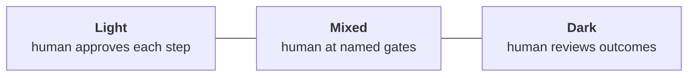

# W-2 · What is a Software Factory?

« [previous: W-1 Preflight Setup](../progression/00.0-preflight.md) | [next: W-3 Run a Software Factory](./W-3-run-a-software-factory.md) »

**Workshop · Wednesday 9:00–9:45 · 45 minutes · no install**

## Contents

- [Objective](#objective)
- [Prereqs](#prereqs)
- [Four primitives that survive a change of framework](#four-primitives-that-survive-a-change-of-framework)
- [Dark and light factories](#dark-and-light-factories)
- [The vocabulary handoff](#the-vocabulary-handoff)
- [What the next two days build](#what-the-next-two-days-build)
- [Deliverable](#deliverable)
- [What's next](#whats-next)

## Objective

Leave with four words that mean the same thing in any framework, a position on where humans belong in the loop, and a translation table between the repo you ran in pre-work and the one you are about to drive.

## Prereqs

- [W-1 Preflight Setup](../progression/00.0-preflight.md) green.
- Ideally, the pre-work: a run through [`actual-factory-demo`](https://github.com/actual-software/actual-factory-demo). If you did not get to it, this session is where you catch up on the vocabulary, and you will be fine.

Nothing to install. Close the laptop if you like.

## Four primitives that survive a change of framework

"Software factory" is on a lot of slides right now and means very little on most of them. Here is a definition narrow enough to argue with:

> A software factory is a system where **roles**, **handoffs**, and **gates** are written down as configuration rather than negotiated in a conversation, so the **loop** can run without a person dispatching each step.

Four words, and the useful thing about them is that they are not Gas City words. Every one of them has an equivalent in whatever you end up using next year.

**Roles.** A named unit of behaviour with a scope and a lifecycle. Not "the AI", but "the thing that reviews architecture, reads these documents, and cannot merge". In Gas City a role is an agent with a prompt template and a config file. Elsewhere it is a persona, a chain, a subagent, a job definition. What matters is that it is named, scoped, and written down.

**Handoffs.** How work moves from one role to the next. The question that separates a factory from a script: *does the next step start because someone told it to, or because the state changed?* A factory is the second. You will see five distinct mechanisms for this in [W-6](./W-6-coordination-channels.md), and picking the right one per handoff is most of what factory design is.

**Gates.** A point where work can be stopped, by a rule or by a person. A gate that can be routed around is not a gate, it is advice. The interesting design question is never "should there be review" — it is *what specifically cannot proceed, and who is accountable when it does.*

**The loop.** Work enters, moves through roles across handoffs, hits gates, and lands. Then the factory does it again without being re-assembled. If a human has to dispatch each step, you have a very good assistant rather than a factory. That distinction is the whole point.

A useful test to carry home: pick any AI coding setup, including your own, and try to name its four. Most setups have roles and a loop, weak handoffs, and no gates at all. That is the gap these two days are about.

## Dark and light factories

Manufacturing has a term for a plant that runs with the lights off, because nobody is on the floor. It is the honest name for what a lot of people mean when they say they want autonomy, and it is worth putting on an axis rather than treating it as a yes or no.

Wednesday builds toward the middle of that axis deliberately. By the end of today merging is human-only, and that is a choice rather than a limitation: it is the position where you can still describe, to someone who has to sign off on it, exactly which decisions a model was allowed to make.

Two things are worth saying plainly about the dark end, because both come up.

Going darker is not primarily a model-capability question. It is a question of whether your gates produce **evidence**. A reviewer that says "looks good" cannot be trusted with more autonomy no matter how good the model is, because there is nothing to audit. A reviewer that cites the document it checked against can. That is why [W-4](./W-4-review-loops.md) and [W-5](./W-5-requirement-gates.md) come before anything ambitious.

And the axis is per-decision, not per-factory. Nobody runs everything dark. The realistic target is a factory where routine changes flow and consequential ones stop, with the line drawn somewhere you can defend.

## The vocabulary handoff

You were asked to run [`actual-factory-demo`](https://github.com/actual-software/actual-factory-demo) before today. It teaches the same ideas with different words, and if nobody names the mapping out loud you will spend the morning quietly translating.

Here it is. The demo's five agents map onto this tutorial's, with one structural difference that matters more than any of the names.

| `actual-factory-demo` | This tutorial | What changed |
| --- | --- | --- |
| `planner` | `project-manager` | The demo's planner *writes* acceptance criteria. Here the project-manager *gates* on them, blocking work whose acceptance is missing or unverifiable. Same concern, opposite side of the door. |
| `builder` | `polecat` | The implementer. Same job, different name. |
| `architect` | `architect` | Unchanged. Reads the decision records, blocks on violations. |
| `reviewer` | `refinery` | The demo's reviewer checks acceptance. The refinery also rebases, runs checks and publishes the pull request, so it carries more. |
| `manager` | `mayor` | The demo's manager reports and closes. The mayor is always-on and conversational, and you can attach to it and talk. [W-7](./W-7-mayor-and-workflows.md) is about that difference. |
| the repo **is** the rig | the rig is **separate** from the city | The biggest one. The demo forks one repo and the factory lives inside it. Here `factory1` is a city and `ascii-art` is a rig registered with it, which is what lets one factory work on several projects — including yours, tomorrow. |

Two things carry over unchanged and are worth noticing, because they are why the pre-work was worth doing. Both systems queue work as **beads**, and both end at a **pull request you merge**. The middle differs; the ends do not.

Both also happen to generate ASCII art. That is not a coincidence, it is the same deliberate choice: a domain simple enough that when something goes wrong you know it was the factory and not the problem.

## What the next two days build

Today is one shared factory on one shared example, so that the commands are identical for everyone while the concepts are new. You will stand a factory up, make review mandatory, make merge human-only, add an architecture reviewer, put a gate at the front that rejects unverifiable work, and exercise all five coordination channels by hand.

Tomorrow is your factory on your project. The hinge is this afternoon: [L-1](./L-1-plan-your-factory.md) is where you point a factory at your own repository and write down what you want it to do differently, and everything on Thursday afternoon builds from that document.

The room is deliberately mixed. If you already run multi-agent workflows daily, the ceilings on each page are for you. If this is your first factory, the floors are, and pairing across that gap is the plan rather than an accident.

## Deliverable

No artifact for this block. Two things in your notes, which you will want at 4:00:

1. Which of the four primitives your current setup is weakest on.
2. One decision you would *not* be willing to let a model make unsupervised, and what evidence would change your mind.

The second one is the seed of your capability map in [L-1](./L-1-plan-your-factory.md).

## What's next

Enough framing. [W-3 Run a Software Factory](./W-3-run-a-software-factory.md) stands one up.

« [previous: W-1 Preflight Setup](../progression/00.0-preflight.md) | [next: W-3 Run a Software Factory](./W-3-run-a-software-factory.md) »
