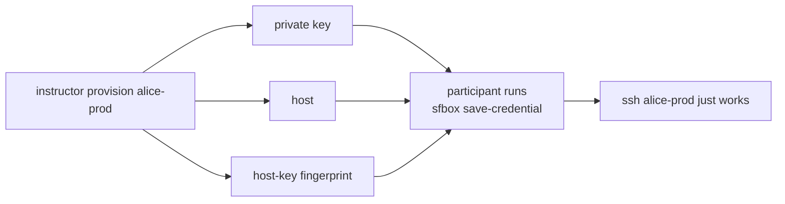
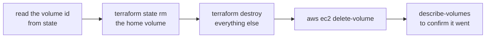

# sfbox — drive your workshop boxes from your laptop

You'll get two cloud boxes for the intensive, Prod and Test. That's so you can try a change on one and compare it against the other, rather than mutating a single environment and hoping for the best. Your instructor owns the AWS account and hands you an SSH key. Everything after that, you do from here.

`sfbox` is one bash script. It saves your box credentials, deploys a factory pack, restarts the service, tunnels the dashboard to your browser, and tells you what the box is up to.

## Install

Setup lives on one page. [`CLOUD_BOX_GUIDE.md`](../CLOUD_BOX_GUIDE.md) takes you from the four values your instructor sends you to a running factory, including putting `sfbox` on your `PATH` and saving your first box, so those steps aren't repeated here. There's nothing to build, and nothing to install past what you've already got: bash, ssh, and curl.

The skill sits next to it, and it's optional. If you'd like your coding agent to drive `sfbox` for you, copy it in:

```bash
mkdir -p ~/.claude/skills/sfbox
cp sf-tutorial/participant-box-cli/SKILL.md ~/.claude/skills/sfbox/SKILL.md
```

It's plain markdown with no harness-specific syntax, so Codex CLI, Gemini CLI, or anything else that reads free-form skill files will happily take it too.

## Why the fingerprint isn't optional

The box guide has the `save-credential` line itself. The reason it insists on a fingerprint is worth knowing, and it lives here.

`sfbox` fetches the key your box is actually offering and checks it against the one you were handed, so your very first connection is authenticated instead of trusted on sight. Later, when your instructor rebuilds a box, you'll just get a clear "this box was replaced" rather than a scary warning that reads like an attack. For a genuine rebuild, get the new fingerprint from your instructor and pass that, adding `--rotate` to say the change was expected. `--rotate` on its own won't get you past a mismatch, and that's deliberate.

Run `save-credential` once per box. Then look at both:

```bash
sfbox box list
```

### The one manual step

`sfbox` writes its own SSH config and never touches yours. The box guide has you add one line at the **top** of `~/.ssh/config`, and this is what it buys: plain `ssh`, `scp`, `rsync` and port-forwards working with your box ids.

`sfbox` itself works fine without it. The Include is what makes everything *else* work, and it means the habits you're building this week will carry over to real hosts afterwards.

## Everyday commands

The participant command list, with a line each on what it does and when you'd reach for it, is at the bottom of the [box guide](../CLOUD_BOX_GUIDE.md#the-commands-you-will-use). The rest of this page goes deeper on the few that have something worth explaining.

When something's wrong, start with `sfbox preflight`. It'll tell "my factory is broken" apart from "my ssh is broken", and honestly those two get mistaken for each other constantly.

## Running commands on the box

Two commands hand the box your own command instead of running a recipe for you. `exec` runs anything; `gc` runs a `gc` command inside the city, so you don't have to know where the city lives.

```bash
sfbox exec sudo systemctl restart gas-city.service
sfbox gc import add https://github.com/<org>/<repo>/tree/<ref>/<subdir> --rig <rig>
sfbox gc import install
sfbox gc reload
```

Your arguments arrive the way you typed them, quotes and spaces included, so `sfbox exec cat 'my notes.txt'` reads one file rather than two. Shell metacharacters are therefore yours to ask for: pipe or redirect by requesting a shell, as in `sfbox exec bash -lc 'gc session list | wc -l'`. Options go before the command and anything after it belongs to the command, with `--` to force the split when your command itself starts with a dash.

The box's exit status comes back to you, so these compose in a script the way a local command would.

Nothing is checked on your behalf. There is no dry run, no snapshot of your imports and no rollback: what you type is what runs on the box.

## The dashboard

```bash
sfbox dashboard
```

The dashboard's built into the `gc` binary and served by the supervisor, so there's nothing to deploy or start. `sfbox` forwards it over SSH and prints you a local URL. Leave the command running; Ctrl-C closes the tunnel.

If the default port is already busy on your laptop, `sfbox` moves the tunnel to the next free one and tells you which it picked, so the URL it prints is always the one to open. Pass `--port <local-port>` to choose for yourself. A port you named is never moved: if it's taken the command stops and names a free one to try, because choosing a port usually means something else of yours expects the dashboard there.

Tunnelling is the whole point. Your security group opens `:22` and nothing else, and because you're reaching the dashboard same-origin through the tunnel, it stays fully read-write. Bind it to a public interface instead and you'd leave reads open to anyone who found the address, plus the API would drop to read-only unless you'd explicitly switched mutations on.

## Where your state lives

```
~/.gascity/
  boxes.toml          your boxes, and which one is current
  keys/<boxId>.pem    private keys, mode 0600
  known_hosts         host keys, pinned when you saved each box
  ssh_config          generated; the file you Include
```

`sfbox` owns that directory. Drop a box with `sfbox box forget <boxId>`, which clears the local credential and leaves the box itself completely untouched.

## For instructors

Everything above is yours as a participant. This section isn't: it needs AWS credentials, and you don't have any, on purpose. If you run one of these by accident, `sfbox` will tell you plainly that you're not missing anything.

Three commands run the cohort:

```bash
sfbox instructor list                  # every live box, and which ids are taken
sfbox instructor provision alice-prod  # build one, print its handoff
sfbox instructor remove alice-prod     # destroy one, and everything it created
```

They drive Terraform over [`modules/gas-city-instance`](https://github.com/actual-software/actualclaw/tree/main/modules/gas-city-instance), so point them at the workspace you copied from that module's `example/` and filled in for your cohort:

```bash
export SFBOX_TF_ROOT=~/workspaces/sfi-cohort   # or pass --tf-root
```

Each box gets its own Terraform workspace named after its boxId. That's what keeps provisioning the second box from tearing down the first, since one shared state file would otherwise treat every apply as a change to the same instance.

### The handoff

`provision` exists to produce exactly the three things `save-credential` consumes, so the two halves of the workshop meet cleanly:



It prints a ready-made `save-credential` line at the end. Send that and the key file, and there's nothing left to explain.

### Allocating box ids

You pick the ids, so `list` is how you find out one's already gone. `provision` refuses a taken id rather than applying over somebody else's box, and a terminated instance doesn't hold its id, so you can reuse it once the box is really gone.

If that lookup can't be completed, both commands stop and say so. Neither one shows you an empty list, because an id missing from a half-answered list looks exactly like a free one, and provisioning over an allocated box takes it from whoever already has it. A role without `ec2:DescribeInstances`, a throttled call, and a `--region` pointing somewhere your boxes aren't all land here.

`list` filters on a workshop tag, `Workshop=sfi` by default. The module tags an instance with its `Name` alone, so that tag comes from your root. One line on the provider puts it on everything:

```hcl
provider "aws" { default_tags { tags = { Workshop = "sfi" } } }
```

Already using a different tag? Pass `--tag-key` and `--tag-value`.

### Why remove destroys rather than terminates

`remove` runs `terraform destroy`. Terminating the instance by hand is faster and it's the wrong move: it strands the home volume and the address, both still billing, and it leaves Terraform's state claiming a box that no longer exists. Across a cohort that adds up quietly. Destroy takes the dependent graph with it and keeps state honest.

It's not reversible, and the home volume holds that participant's city, their Dolt databases and their Claude credentials. So `remove` asks you to type the boxId back before it does anything.

### The home volume takes three steps, in one order

A plain `terraform destroy` of a participant box refuses. The home volume carries `prevent_destroy = true`, Terraform accepts only a literal there, and no variable can turn that guard off for one box. It exists to protect a long-lived factory, and a workshop box inherits it anyway.

So `remove` does what the module's README prescribes, and what the openclaw decommission runbook already does for the shared module:



The order is the point, and each step is load-bearing:

- **Read the id first.** Once the volume leaves state, Terraform has forgotten it. An id you didn't capture is an id no tooling can hand back, and a 128 GB gp3 volume nobody can name goes on billing. If `remove` can't read it, it stops before dropping anything and exits 9.
- **Delete last.** This is the step that actually stops the billing, which is why it isn't first and isn't skippable. A `remove` that drops the volume from state and destroys around it but never deletes it leaves an orphan that's now invisible to Terraform too, which is worse than where you started.
- **Confirm the delete.** `delete-volume` returns as soon as AWS accepts the request, so its exit status says the call was taken, not that the volume is gone. A volume still there afterwards exits 9 and prints the two commands that finish the job. Nothing else is watching it by then, so a quiet failure here is one nobody would catch.

If the destroy fails after the volume has already left state, `remove` says so and names the volume, because a retry won't collect it either.

### The key pair belongs to Terraform

`provision` doesn't mint a key pair. The module does, in participant access mode, and hands the private half back as the `participant_private_key` output; `provision` writes that to `--key-out` at 0600 and hands the file to you.

That's why there's no `--keypair` flag on either command. It used to mint its own with `aws ec2 create-key-pair`, which put two owners on one concept: the module rejects a caller-supplied `keypair_name` in this mode, and a pair created outside Terraform survives the destroy that `remove` runs. Re-provisioning a reused boxId then landed on an existing key whose private half was gone, and you got a warning instead of a handoff.

### Choosing the toolchain pin

`--factory-packs-ref` overrides the packs ref the module pins. You need it whenever the default ref pins a `gc` whose `gc init` doesn't accept every flag the boot script passes, because the apply then aborts part-way through and the box never finishes becoming a factory:

```bash
sfbox instructor provision alice-prod --factory-packs-ref deps-gc-v1.3.5-bd-1.1.0-pins
```

### Your root has to offer participant access mode

`provision` applies with `participant_access = true`. That's the module setting that moves the box into the public subnet, gives it an address, opens `:22`, and mints the key pair. The default is the other model: a private subnet reached only through SSM, which works fine for a factory administered by somebody holding AWS credentials and is the one route a participant can't take.

Your root needs three things: a `participant_access` variable, a pass-through to the module, and re-exported `public_ip` and `participant_private_key` outputs. The module's `example/` has all three. Copy from it and you're done.

If it isn't right, `provision` applies successfully and then stops rather than handing back something unusable, naming whichever output came back null. Both cases exit 7. Nothing is destroyed, and the box is still there to remove or fix.

## Running the tests

```bash
./tests/run-tests.sh
```

These cover what runs on your laptop: local state, URL parsing, SSH config generation, and the decision half of the size guardrail. Anything that needs a live box isn't covered here.

The instructor commands are covered too, and none of it touches AWS. They reach `aws`, `terraform` and `ssh-keyscan` through a few one-line wrapper functions, and the tests replace those, so the suite exercises the plumbing without running an apply, a destroy, or anything else billable.
