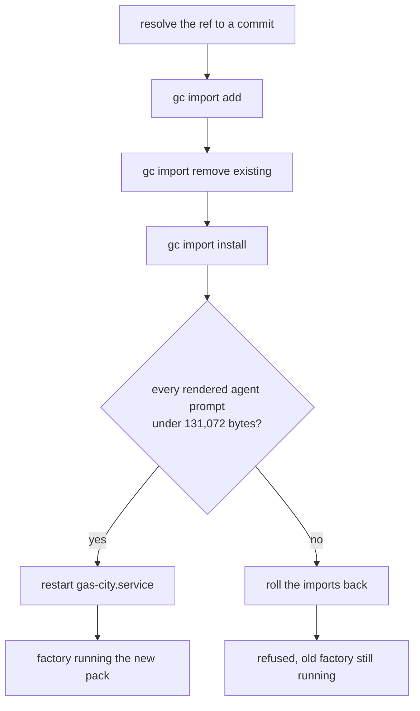
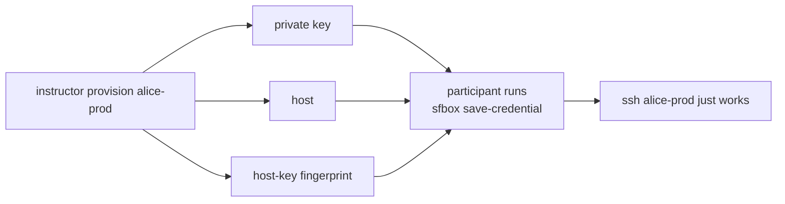

# sfbox — drive your workshop boxes from your laptop

You'll get two cloud boxes for the intensive, Prod and Test. That's so you can try a change on one and compare it against the other, rather than mutating a single environment and hoping for the best. Your instructor owns the AWS account and hands you an SSH key. Everything after that, you do from here.

`sfbox` is one bash script. It saves your box credentials, deploys a factory pack, restarts the service, tunnels the dashboard to your browser, and tells you what the box is up to.

## Install

```bash
git clone https://github.com/actual-software/sf-tutorial.git
export PATH="$PWD/sf-tutorial/participant-box-cli:$PATH"
sfbox --help
```

Put that `PATH` line in your shell profile to make it stick. There's nothing to build, and nothing to install past what you've already got: bash, ssh, and curl.

The skill sits next to it, and it's optional. If you'd like your coding agent to drive `sfbox` for you, copy it in:

```bash
mkdir -p ~/.claude/skills/sfbox
cp sf-tutorial/participant-box-cli/SKILL.md ~/.claude/skills/sfbox/SKILL.md
```

It's plain markdown with no harness-specific syntax, so Codex CLI, Gemini CLI, or anything else that reads free-form skill files will happily take it too.

## Save your first box

Your instructor gives you three things: a hostname, a private key, and a host-key fingerprint.

```bash
sfbox save-credential \
  --box alice-prod \
  --host 203.0.113.10 \
  --key ~/Downloads/alice.pem \
  --fingerprint SHA256:AbCdEf... \
  --label prod
```

That fingerprint isn't optional, and the reason's worth knowing. `sfbox` fetches the key your box is actually offering and checks it against the one you were handed, so your very first connection is authenticated instead of trusted on sight. Later, when your instructor rebuilds a box, you'll just get a clear "this box was replaced" rather than a scary warning that reads like an attack. For a genuine rebuild, get the new fingerprint from your instructor and pass that, adding `--rotate` to say the change was expected. `--rotate` on its own won't get you past a mismatch, and that's deliberate.

Run it again for your second box. Then look at both:

```bash
sfbox box list
```

### The one manual step

`sfbox` writes its own SSH config and never touches yours. To get plain `ssh`, `scp`, `rsync` and port-forwards working with your box ids, add one line at the **top** of `~/.ssh/config`:

```
Include ~/.gascity/ssh_config
```

`sfbox` itself works fine without it. The Include is what makes everything *else* work, and it means the habits you're building this week will carry over to real hosts afterwards.

## Everyday commands

Commands act on your current box. Switch it with `sfbox box use <boxId>`, or override just the one command using `--box <boxId>`.

| Command | What it does |
|---|---|
| `sfbox preflight` | Checks ssh, then `gc`, then the service |
| `sfbox get-box` | Service state, running sessions, recent log |
| `sfbox start-session` | Opens a shell on the box |
| `sfbox deploy-factory <url>` | Makes a pack the top-level factory and restarts |
| `sfbox restart-factory` | Restarts the Gas City service |
| `sfbox dashboard` | Tunnels the dashboard to `http://127.0.0.1:8372` |

When something's wrong, start with `sfbox preflight`. It'll tell "my factory is broken" apart from "my ssh is broken", and honestly those two get mistaken for each other constantly.

## Deploying a factory

Point it at any public GitHub path:

```bash
sfbox deploy-factory https://github.com/actual-software/actual-factory-demo/tree/main/factory
```

Your pack becomes the top-level factory, so whatever imports you've already got on the box are replaced, with the single exception of Gas City's own `core` and `bd` imports, which get left alone because pulling those would break the city rather than swap the factory. You'll see the whole plan first. Nothing changes until you confirm it.



That size check is the step worth understanding, and it's the reason the restart is deliberately the very last thing to happen: everything before it can be undone, so the one irreversible step waits until the check has already passed.

## Why a deploy can be refused

Gas City hands an agent's whole rendered prompt over as a single command-line argument. Linux caps one argument at 131,072 bytes, counting the terminator. So a pack whose rendered prompt crosses that line can't start. Not sometimes. Never.

Here's why the guardrail earns its keep. The platform reports this failure as a session dying during startup, which points straight at the session layer and sends you hunting around in completely the wrong place, when what's really happening is just the kernel refusing to exec.

So `sfbox` renders every agent on the box and measures it before restarting anything. If a prompt's too big, the deploy stops, the import gets rolled back, and **your box keeps running the factory it already had**. A refused deploy costs you nothing.

Fixing an oversized pack means shrinking the prompt as *rendered*, not as written. Quite a lot of the size usually shows up at render time, so trimming prose out of the template often barely moves the number at all. Measure it directly as you iterate:

```bash
sfbox start-session
cd <your-city> && gc prime <agent> --strict --json | head -c 512 | sed 's/"content":.*//' | grep -o '"bytes":[0-9]*'
```

That prints the `bytes` field on its own, which is the number to watch. It's the exact length of the string Gas City puts on the command line, the same thing the kernel measures when it refuses.

Keep the trimming. `--json` prints the whole rendered prompt alongside the size, so running it bare buries the number under a few hundred kilobytes of output, and it does that worst on exactly the oversized packs you'd be here to debug.

Do pass `--strict` as well. Without it, `gc prime` quietly falls back to a short default prompt for any agent it can't resolve, so an oversized pack measures small and looks perfectly healthy.

## The dashboard

```bash
sfbox dashboard
```

The dashboard's built into the `gc` binary and served by the supervisor, so there's nothing to deploy or start. `sfbox` forwards it over SSH and prints you a local URL. Leave the command running; Ctrl-C closes the tunnel.

Tunnelling is the whole point. Your security group opens `:22` and nothing else, and because you're reaching the dashboard same-origin through the tunnel, it stays fully read-write. Bind it to a public interface instead and you'd leave reads open to anyone who found the address, plus the API would drop to read-only unless you'd explicitly switched mutations on.

## Where your state lives

```
~/.gascity/
  boxes.toml          your boxes, and which one is current
  keys/<boxId>.pem    private keys, mode 0600
  known_hosts         host keys, pinned when you saved each box
  ssh_config          generated; the file you Include
```

`sfbox` owns that directory. Drop a box with `sfbox box forget <boxId>`, which clears the local credential and leaves the box itself completely untouched.

## For instructors

Everything above is yours as a participant. This section isn't: it needs AWS credentials, and you don't have any, on purpose. If you run one of these by accident, `sfbox` will tell you plainly that you're not missing anything.

Three commands run the cohort:

```bash
sfbox instructor list                  # every live box, and which ids are taken
sfbox instructor provision alice-prod  # build one, print its handoff
sfbox instructor remove alice-prod     # destroy one, and everything it created
```

They drive Terraform over [`modules/gas-city-instance`](https://github.com/actual-software/actualclaw/tree/main/modules/gas-city-instance), so point them at the workspace you copied from that module's `example/` and filled in for your cohort:

```bash
export SFBOX_TF_ROOT=~/workspaces/sfi-cohort   # or pass --tf-root
```

Each box gets its own Terraform workspace named after its boxId. That's what keeps provisioning the second box from tearing down the first, since one shared state file would otherwise treat every apply as a change to the same instance.

### The handoff

`provision` exists to produce exactly the three things `save-credential` consumes, so the two halves of the workshop meet cleanly:



It prints a ready-made `save-credential` line at the end. Send that and the key file, and there's nothing left to explain.

### Allocating box ids

You pick the ids, so `list` is how you find out one's already gone. `provision` refuses a taken id rather than applying over somebody else's box, and a terminated instance doesn't hold its id, so you can reuse it once the box is really gone.

`list` filters on a workshop tag, `Workshop=sfi` by default. The module tags an instance with its `Name` alone, so that tag comes from your root. One line on the provider puts it on everything:

```hcl
provider "aws" { default_tags { tags = { Workshop = "sfi" } } }
```

Already using a different tag? Pass `--tag-key` and `--tag-value`.

### Why remove destroys rather than terminates

`remove` runs `terraform destroy`. Terminating the instance by hand is faster and it's the wrong move: it strands the home volume and the address, both still billing, and it leaves Terraform's state claiming a box that no longer exists. Across a cohort that adds up quietly. Destroy takes the dependent graph with it and keeps state honest.

It's not reversible, and the home volume holds that participant's city, their Dolt databases and their Claude credentials. So `remove` asks you to type the boxId back before it does anything.

### Choosing the toolchain pin

`--factory-packs-ref` overrides the packs ref the module pins. You need it whenever the default ref pins a `gc` whose `gc init` doesn't accept every flag the boot script passes, because the apply then aborts part-way through and the box never finishes becoming a factory:

```bash
sfbox instructor provision alice-prod --factory-packs-ref deps-gc-v1.3.5-bd-1.1.0-pins
```

### A gap worth knowing about

As merged, the module puts the instance in a private subnet with `associate_public_ip_address = false`, and exposes neither a public IP nor a host-key fingerprint as an output. Its documented way in is SSM, which participants can't use because they hold no AWS credentials.

So until your root gives the box a public address and exposes it as a `public_ip` output, `provision` will apply successfully and then stop, telling you it has no address a participant could reach. It won't hand back a private IP dressed up as a host. Nothing is destroyed when that happens, and the box is still there to remove or fix.

## Running the tests

```bash
./tests/run-tests.sh
```

These cover what runs on your laptop: local state, URL parsing, SSH config generation, and the decision half of the size guardrail. Anything that needs a live box isn't covered here.

The instructor commands are covered too, and none of it touches AWS. They reach `aws`, `terraform` and `ssh-keyscan` through a few one-line wrapper functions, and the tests replace those, so the suite exercises the plumbing without running an apply, a destroy, or anything else billable.
