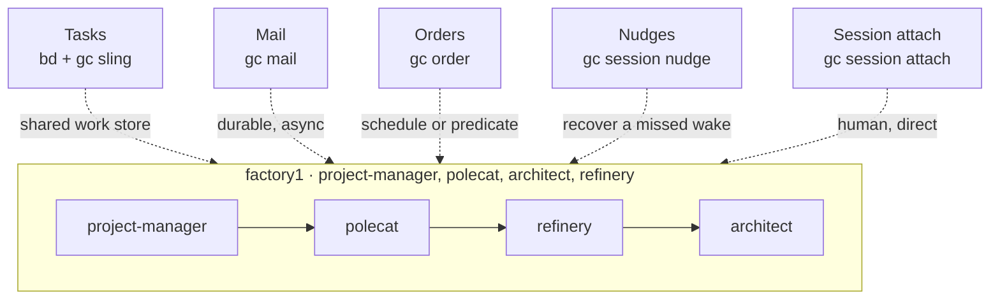

# Coordination Channels

## Contents

- [Objective](#objective)
- [Prereqs](#prereqs)
- [Context](#context)
  - [The five channels](#the-five-channels)
  - [Why five and not one](#why-five-and-not-one)
- [Setup](#setup)
  - [Bootstrap Factory1 with Script](#bootstrap-factory1-with-script)
  - [Confirm every channel answers](#confirm-every-channel-answers)
- [Try It](#try-it)
  - [1. Tasks: the shared work store](#1-tasks-the-shared-work-store)
  - [2. Mail: durable and asynchronous](#2-mail-durable-and-asynchronous)
  - [3. Orders: scheduled and event-driven wakes](#3-orders-scheduled-and-event-driven-wakes)
  - [4. Nudges: recovering a missed wake](#4-nudges-recovering-a-missed-wake)
  - [5. Session attach: a human steering one agent](#5-session-attach-a-human-steering-one-agent)
  - [6. Write the channel document](#6-write-the-channel-document)
  - [7. Reflect](#7-reflect)
- [Verification](#verification)
- [Troubleshooting](#troubleshooting)
- [What's next](#whats-next)

## Objective

By the end of this exercise you will have exercised all five coordination channels by hand against `factory1`, and written `docs/coordination-channels.md` into the `ascii-art` rig naming a primary channel and a fallback for every handoff in your pipeline.

## Prereqs

- [W-5](./05.1-bead-gate-checks.md) complete: `factory1` running with the bead gate at the front, the review loop, branch protection and the architect reviewer all in place.
- The four env vars from [`00.3`](../progression/00.3-setup-foundation.md) exported in your current shell.
- `jq` installed.

## Context

Everything you have built so far moves work one way: a bead changes status, and the next agent picks it up. That is one coordination channel, and it is the right one most of the time. It is not the only one, and a factory that only has it stalls in ways that are hard to see.

Four situations break the status-transition model:

- No work unit exists yet, and something needs to wake anyway. Nothing to transition.
- The recipient is mid-turn and should not be interrupted, but the message must not be lost.
- An agent slept through its cue, and the factory needs a way to catch that.
- A human needs to talk to one specific agent right now.

Gas City exposes each as a named primitive. This block is where you use all five by hand and then decide, in writing, which one carries which handoff in your factory.

### The five channels



| Channel | Primitive | When it is the right tool |
| --- | --- | --- |
| **Tasks** | `bd create`, `bd update`, `gc sling` | A unit of work exists and ownership moves as its status advances. The status change *is* the handoff. |
| **Mail** | `gc mail send`, `gc mail inbox`, `gc mail check` | A durable message that survives a crash, keeps its subject and body, and is read on the recipient's own cadence. |
| **Orders** | `gc order list / show / check / run / history` | Waking something on a schedule (`cooldown`, `cron`) or on a predicate (`condition`, `event`), including when no bead exists yet. |
| **Nudges** | `gc session nudge`, `gc nudge status` | Recovery. An agent slept through its wake, or a deferred signal still needs delivering. |
| **Session attach** | `gc session attach`, `gc session peek`, `gc session logs` | A human steering one agent's live session. Highest bandwidth, least auditable, does not scale. |

### Why five and not one

The five are not redundant. They sit at different points in a three-way trade-off, and picking the wrong one is how a factory stalls silently.

**Persistence.** Does the signal survive a restart? Mail and tasks do. A nudge to a session that dies is gone.

**Timing.** Does it fire now, on the recipient's next turn, or on a clock? A condition order can fire the instant a predicate becomes true. Mail waits for a turn boundary.

**Addressing.** Is it aimed at a pool, at one named agent, or visible to everyone? Tasks broadcast to whoever is eligible. An attach reaches exactly one session.

The thing to hold on to is that a mail nobody reads and a status nobody polls look identical from the outside. Both are silence. The difference is which primitive you chose, and therefore where you look when the factory goes quiet. Writing the choice down is what makes the silence diagnosable.

One rule of thumb survives contact with real factories: **tasks are the default and everything else is the exception.** When a handoff seems to want mail instead of a bead, ask first whether a bead would carry the same intent more durably.

## Setup

No new pack. All five channels ship with Gas City and your factory already has them.

### Bootstrap Factory1 with Script

If you are catching up, this block starts from the end of W-5:

```bash
cd path/to/sf-tutorial/bootstrap
./bootstrap.sh 05.1-bead-gate-checks
```

### Confirm every channel answers

**Copy and paste**

```bash
cd "$FACTORY_PATH"
bd list --status open --limit 3     # tasks
gc mail inbox                       # mail
gc order list                       # orders
gc session list                     # nudges and attach both address sessions
```

**Expected output**

```text
a few open beads; an inbox (empty is fine); a table of orders; a table of sessions
```

If any of the four errors out rather than returning empty, fix it before continuing. An empty result is fine; an error means the channel is not wired.

## Try It

Each step exercises one channel and ends with what the demonstration is supposed to teach you. Keep a scratch file open — you will turn your notes into the deliverable in step 6.

### 1. Tasks: the shared work store

**Copy and paste**

```bash
cd "$ASCII_ART_PATH"
bd list --status open --limit 5
BEAD=$(bd list --status open --limit 1 --json | jq -r '.[0].id')
echo "using $BEAD"
bd show "$BEAD"
cd "$FACTORY_PATH"
gc sling project-manager "$BEAD"
```

Then watch the handoff happen without anyone dispatching it:

```bash
bd show "$BEAD" --json | jq '.[0] | {status, assignee, metadata}'
```

**What to notice.** No command named the polecat. The project-manager passed the bead, the status changed, and the polecat pool picked it up because the bead became eligible. The status transition is the entire handoff, and it leaves an audit trail on the bead itself. This is the backbone; the next four channels exist to cover what it cannot do.

### 2. Mail: durable and asynchronous

**Copy and paste**

```bash
cd "$FACTORY_PATH"
gc mail send mayor -s "Priority note" -m "Prefer beads from the letters-a-m epic for the rest of the afternoon."
gc mail inbox mayor
```

Now send to an agent that is mid-turn, and watch that it is not interrupted:

```bash
gc session list
gc session peek <a-running-session-id> --lines 8
gc mail send <a-running-session-id> -s "Heads up" -m "Re-read the ADR before you push."
gc session peek <a-running-session-id> --lines 8
```

**What to notice.** The second peek shows the same turn still running. Mail lands in an inbox and waits for a turn boundary; it does not preempt. That is the right behaviour for a message with no implied deadline, and the wrong behaviour when you need action now. Add `--notify` when you *do* want the recipient woken, and notice that this makes it two signals rather than one: the durable message, plus a nudge.

### 3. Orders: scheduled and event-driven wakes

**Copy and paste**

```bash
gc order list
gc order show <an-order-name>
gc order check
gc order history <an-order-name>
```

**What to notice.** Read the `TRIGGER` column in `gc order list` first. Four trigger types exist and they split cleanly in two:

| Trigger | Fires when | Use it for |
| --- | --- | --- |
| `cooldown` | A fixed interval has elapsed | Proactive sweeps. Health checks, backups, compaction. |
| `cron` | A schedule matches | Anything with a wall-clock time. A nightly digest. |
| `condition` | A shell predicate returns true | Reactive work. "A bead is waiting with no assignee." |
| `event` | A named event is emitted | Reacting to something the factory itself announced. |

The `TARGET` column matters just as much. An order with a target is a **formula order**: it instantiates a formula and routes it to a pool. An order with `-` is an **exec order**: it runs a script on the controller and creates no work unit at all.

That distinction is the reason orders are their own channel. `condition` plus a pool target is how a factory reacts with no dispatcher. `cooldown` plus an exec script is how it takes care of itself when there is no work to react to.

`gc order run <name>` fires one by hand, bypassing its trigger. Try it on a harmless exec order and read `gc order history` afterwards.

### 4. Nudges: recovering a missed wake

**Copy and paste**

```bash
gc session list
gc session nudge <a-running-session-id> "Check your inbox before your next action."
gc session peek <a-running-session-id> --lines 10
gc nudge status <a-running-session-id>
```

**What to notice.** `gc session nudge` puts text straight into a running session without the cost of an attach. `gc nudge status` shows what the supervisor is holding for a session that was asleep or not yet at a safe boundary — queued nudges, and dead-lettered ones that never landed.

Both are recovery tools. Seeing either in a routine handoff is a smell: it means some other channel is not doing its job and a nudge is papering over it. The one legitimate routine use is the `--notify` flag on mail, where the nudge is explicitly the wake half of a two-part signal.

### 5. Session attach: a human steering one agent

**Copy and paste**

```bash
gc session peek <a-running-session-id> --lines 20
gc session logs <a-running-session-id>
```

Then attach, look, and detach with `Ctrl-b d`:

```bash
gc session attach <a-running-session-id>
```

**What to notice.** Detach with `Ctrl-b d`, not `Ctrl-c`. This is the only channel where a human talks directly to one agent, and it is the only one that leaves no artifact anyone else can read. A task update, a mail, an order history row: all of those are evidence. An attached session leaves a tmux log and your memory.

Reach for `peek` before `attach`. It answers most questions and it cannot accidentally type into a running agent.

### 6. Write the channel document

Copy the template into the rig and fill it in:

**Copy and paste**

```bash
cp "$ARTIFACTS_PATH/docs/coordination-channels.template.md" "$ASCII_ART_PATH/docs/current/coordination-channels.md"
$EDITOR "$ASCII_ART_PATH/docs/current/coordination-channels.md"
```

Fill in the second table. Every handoff in your pipeline gets a primary channel and a fallback:

| Handoff | Primary | Fallback |
| --- | --- | --- |
| Human → project-manager | Tasks | — |
| project-manager → polecat | Tasks | Nudge |
| polecat → refinery | Tasks | Nudge |
| refinery → architect | Tasks | Nudge |
| architect → refinery | Tasks | Nudge |
| refinery → polecat (bounce) | Tasks | Mail |
| refinery → human (merge) | Tasks | Mail |
| Any agent → human (blocked) | Mail | Session attach |
| Nothing → factory (sweeps) | Orders | — |

Those are defaults rather than answers. Change at least one and be able to say why. Then commit it:

```bash
cd "$ASCII_ART_PATH"
git add docs/current/coordination-channels.md
git commit -m "Record coordination channel preferences"
```

### 7. Reflect

Five channels, one page, and a rule for each handoff. The rule is worth more than the exercise.

The reason to write it down is diagnostic rather than bureaucratic. When the factory goes quiet at 2am, "which channel was supposed to carry this?" is the first question, and a factory with no answer is one where you read every log. The document is also an input to tomorrow: [L-2](../hardening/02-specialize-reviewers-per-domain.md) moves your gates onto your own rig, and the handoffs move with them.

## Verification

**Copy and paste**

```bash
test -f "$ASCII_ART_PATH/docs/current/coordination-channels.md" && echo "channel doc: present"
grep -c '|' "$ASCII_ART_PATH/docs/current/coordination-channels.md"
gc order history --limit 5
gc mail inbox mayor
```

**Expected output**

```text
channel doc: present
a table row count in the double digits
at least one order-run row from step 3
at least the message you sent in step 2
```

## Troubleshooting

- **`gc order run` reports the order is not found.** Order names are scoped, and two rigs can carry the same name. Pass `--rig <rig>` to disambiguate, or copy the exact name out of `gc order list`.
- **`gc mail inbox` is empty right after you sent something.** You are reading your own inbox rather than the recipient's. `gc mail inbox` defaults to the caller; pass the alias explicitly, as in `gc mail inbox mayor`.
- **`gc session nudge` says the session is not running.** The pool session exited between your `gc session list` and your nudge. That is normal for ephemeral agents. Re-list and pick a live one, or sling a bead to spawn one.
- **`gc nudge` on its own prints help rather than a sweep.** In this version the deferred-nudge surface is `gc nudge status <session>`. There is no bare sweep command.
- **Attaching leaves you stuck in tmux.** `Ctrl-b d` detaches. `Ctrl-c` interrupts the agent's current turn, which is not what you want.

## What's next

You have the channels and a written rule for each handoff. [L-1 Plan Your Factory](./07-plan-your-factory.md) is where you point a factory at your own repo and write down what you want it to do.

« [previous: H1 Bead-creation formula extensions](../hardening/01-bead-creation-formula-extensions.md) | [next: L-1 Plan Your Factory](./07-plan-your-factory.md) »
