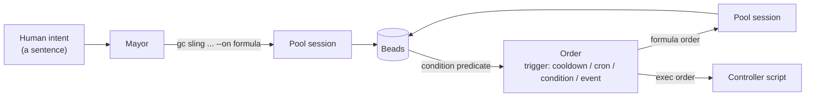

# The Mayor and Workflows

## Contents

- [Objective](#objective)
- [Prereqs](#prereqs)
- [Context](#context)
  - [The mayor is a coordination layer, not another worker](#the-mayor-is-a-coordination-layer-not-another-worker)
  - [Formulas are the method; orders are the trigger](#formulas-are-the-method-orders-are-the-trigger)
- [Setup](#setup)
- [Try It](#try-it)
  - [1. Ask the mayor what it sees](#1-ask-the-mayor-what-it-sees)
  - [2. Find where the mayor learned the PR flow](#2-find-where-the-mayor-learned-the-pr-flow)
  - [3. Read a formula as a method](#3-read-a-formula-as-a-method)
  - [4. Read an order as a trigger](#4-read-an-order-as-a-trigger)
  - [5. Walk one workflow end to end](#5-walk-one-workflow-end-to-end)
  - [6. Reflect](#6-reflect)
- [Verification](#verification)
- [Troubleshooting](#troubleshooting)
- [What's next](#whats-next)

## Objective

By the end of this exercise you will be able to say what the mayor is for, read a formula and an order well enough to change one, and you will have walked a single workflow from a human sentence to a merged pull request without dispatching anything by hand.

## Prereqs

- Wednesday complete, or `factory1` at the end of W-5 via the [catch-up script](#setup).
- The four env vars from [`00.3`](../progression/00.3-setup-foundation.md) exported.
- Yesterday's [coordination-channels document](./06-coordination-channels.md) to hand. This block is largely about the orders channel.

## Context

You have met the mayor once, in [`00.1`](../progression/00.1-setup-foundation.md), where it was introduced as the agent to ask when you are not sure what is going on. That undersells it, and the undersell is why this block exists. The mayor is the only always-on agent in your factory, and the only one you can talk to in sentences.

### The mayor is a coordination layer, not another worker

Every other agent you have built is ephemeral and single-purpose. A polecat spawns, claims one bead, implements it, and exits. A refinery patrols, reviews, publishes, and exits. Their prompts are about *doing one thing well*, and their lifecycle ends when that thing is done.

The mayor is the opposite on all three counts. It is declared as an always-on named session:

```toml
[[named_session]]
template = "mayor"
mode = "always"
```

It survives across beads, it holds the state that no single bead carries, and it is where human intent enters the factory. When you attach to the mayor and say "the letters epic matters more than the numbers epic this afternoon", nothing about that is a unit of work. There is no bead for it. It is coordination, and coordination is what the mayor is.

The distinction worth taking home: **workers optimise for finishing; the coordinator optimises for what should happen next.** A factory with only workers can execute a backlog and cannot reprioritise one.

The mayor is also, in practice, the answer to "how do I steer this without editing YAML at 2am". It is a fallback in your channel document, and it should be.

### Formulas are the method; orders are the trigger

Two pieces of machinery turn "the mayor decided" into "the factory ran". They are easy to confuse and they do different jobs.

A **formula** is a reusable method: how a multi-step job should be done. It is a TOML file with an id, an optional `extends`, and a list of steps with dependencies between them. It does not say *when*. You have already used several without reading one — `mol-polecat-work`, `mol-refinery-pr-patrol`, `mol-polecat-pr`.

An **order** is a trigger paired with an action. It says *when*, and it points at either a formula (routing work to a pool) or a shell script (running on the controller). It does not say *how*.



The loop on the right is the part people miss. A `condition` order reads the bead store, and the bead store is what the workers write to. That is how the factory reacts to itself with nobody dispatching: work becomes eligible, a predicate notices, a pool wakes.

Read the two together and the split is clean. Change a formula to change *what an agent does*. Change an order to change *when it happens*. Most "the factory did the wrong thing" problems are formula problems; most "the factory did nothing" problems are order problems.

## Setup

No new pack. If you are catching up from Wednesday:

```bash
cd path/to/sf-tutorial/bootstrap
./bootstrap.sh 05.1-bead-gate-checks
```

## Try It

The first twenty minutes are a demo you follow along with. Steps 5 and 6 are yours.

### 1. Ask the mayor what it sees

**Copy and paste**

```bash
cd "$FACTORY_PATH"
gc session attach mayor
```

Ask it three things, in your own words: what the factory's current state is, which agents are available, and what it would work on next if you left it alone. Then detach with `Ctrl-b` then `d`.

> **Detach with `Ctrl-b` then `d`.** `Ctrl-c` kills the mayor's session.

**What to notice.** You asked in sentences and got answers about a system, not about a bead. Nothing you said created work. That is the coordination layer doing its job.

### 2. Find where the mayor learned the PR flow

The mayor did not always know about pull requests. Page [`01`](../progression/01-basic-flow.md) taught it, and it did that by patching the prompt rather than by editing an agent.

**Copy and paste**

```bash
cat "$ARTIFACTS_PATH/packs/pr-gate-city/pack.toml"
sed -n '1,60p' "$ARTIFACTS_PATH/packs/pr-gate-city/agents/mayor/prompt.template.md"
```

**What to notice.** `pr-gate-city` exists as a separate pack from `pr-gate-rig` for one reason: the mayor is city-scoped and the refinery is rig-scoped, and a patch can only target agents in the same composition pass. That is a small detail with a large consequence. **The mayor's behaviour is configuration that packs contribute to**, which means a capability you install can teach the coordinator about itself.

Read the "Dispatch Liberally, Fix When Fast" section in that prompt. It is a policy, written in prose, that a human can argue with. Compare that to how you would encode the same policy in a formula.

### 3. Read a formula as a method

**Copy and paste**

```bash
gc formula list
gc formula show mol-polecat-pr
cat "$ARTIFACTS_PATH/packs/pr-gate-rig/formulas/mol-polecat-pr.formula.toml"
```

**What to notice.** Three things in that file are the whole idea.

`extends = ["mol-polecat-work"]` means this formula is a diff against another one. It replaces exactly one step and inherits the rest, which is why the file is short and why the base formula stays the single source of truth.

`[[steps]]` with `id` and `needs` is a dependency graph, not a script. Steps declare what they need rather than an order to run in.

The step `description` is a prompt. The step body is instructions an agent reads, not commands a runner executes. That is why the file reads like documentation with commands in it, and it is the thing that surprises people coming from CI YAML.

### 4. Read an order as a trigger

**Copy and paste**

```bash
gc order list
gc order show <an-exec-order-from-the-list>
gc order check
```

**What to notice.** The `TARGET` column splits the list in two. A row with a target is a formula order and routes work to a pool. A row with `-` is an exec order and runs a script on the controller, creating no work unit.

`gc order check` answers "what would fire right now", which is the single most useful command in this block when a factory has gone quiet.

### 5. Walk one workflow end to end

Now put the three together on a real bead, without dispatching anything by hand after the first command.

**Copy and paste**

```bash
cd "$ASCII_ART_PATH"
BEAD=$(bd list --status open --limit 1 --json | jq -r '.[0].id')
cd "$FACTORY_PATH"
gc sling project-manager "$BEAD"
```

Then watch, without intervening:

```bash
watch -n 5 'bd show '"$BEAD"' --json | jq -r ".[0] | \"\(.status)  \(.assignee)\""'
```

Let it run. Ctrl-C the watch when the bead reaches the refinery.

While it runs, in a second terminal:

```bash
gc session list
gc order history --limit 10
```

**What to notice.** You issued one command. Everything after it was a formula deciding what an agent does and a status transition making the next agent eligible. `gc order history` shows what fired on its own while you were watching.

Now find the seam. Pick any handoff you just watched and answer two questions: which formula step performed it, and what made the next agent wake. If you can answer both for one handoff, you can debug this factory.

### 6. Reflect

The mayor holds intent, formulas hold method, orders hold timing. Almost every change you will want to make to a factory is a change to exactly one of those three, and naming which one first is most of the work.

Write one sentence in your capability map from [L-1](./07-plan-your-factory.md): the thing your factory should do on a schedule that it does not do today. That is an order, and [L-5](./09-implement-a-feature.md) this afternoon is where you can build it.

## Verification

**Copy and paste**

```bash
gc session list | grep -i mayor
gc formula show mol-polecat-pr | head -5
gc order check
bd show "$BEAD" --json | jq -r '.[0].status'
```

**Expected output**

```text
a live mayor session
the formula's description, not an error
a list of eligible orders (empty is a valid answer)
a status past open — the bead moved without you dispatching it
```

## Troubleshooting

- **`gc session attach mayor` says there is no such session.** The mayor is declared by the `pr-gate-city` pack's `[[named_session]]`. Confirm the pack is imported with `gc import list`, then `gc reload`.
- **`gc formula show` reports the formula is unknown.** `gc formula list` shows only what the current city resolves. A rig-scoped formula needs the rig context; run the command from inside the rig, or check the pack is imported at the right scope.
- **The bead never leaves `open`.** No pool is eligible. Check the bead's `gc.routed_to` metadata against the pool you expected, and check `gc order check` for the condition order that should have fired.
- **You attached to the mayor and now everything is frozen.** You are inside tmux. `Ctrl-b` then `d`.

## What's next

You have seen the coordination layer and the machinery under it. The rest of Thursday is your factory: [L-2 Retargeting the Rig](../hardening/02-specialize-reviewers-per-domain.md) moves yesterday's gates onto your own repo.

« [previous: L-1 Plan Your Factory](./07-plan-your-factory.md) | [next: L-2 Retargeting the Rig](../hardening/02-specialize-reviewers-per-domain.md) »
