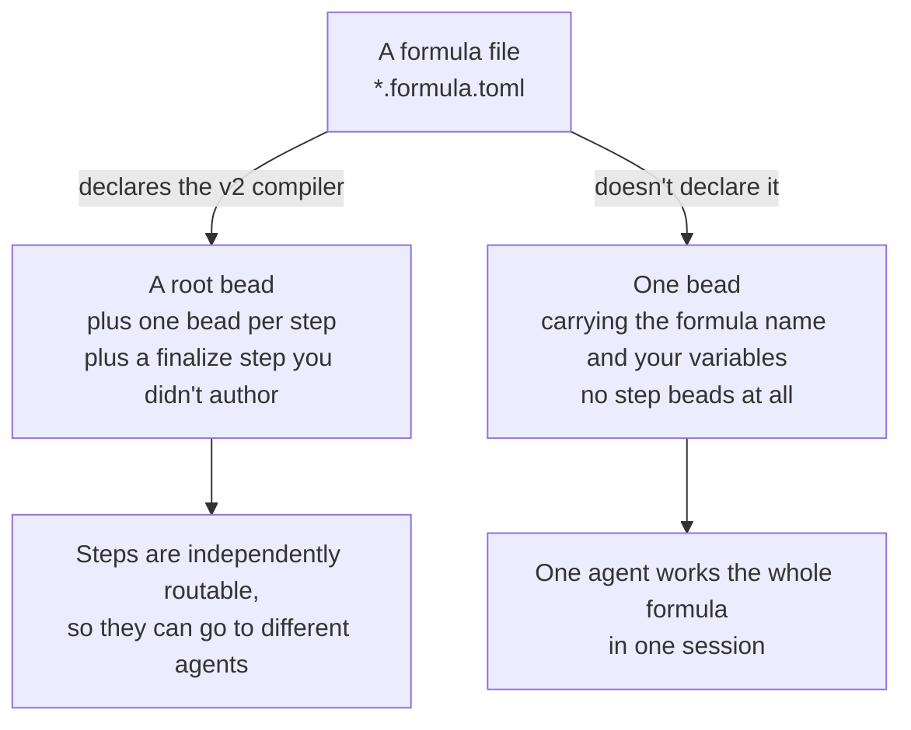

# L3, L4 and L5 · Feature Labs

**Three labs · 45 to 60 minutes each · Day 2**

## Contents

- [Objective](#objective)
- [Prereqs](#prereqs)
- [The three slots, and what each allows](#the-three-slots-and-what-each-allows)
- [The six options](#the-six-options)
- [How each lab runs](#how-each-lab-runs)
- [Paths this page uses](#paths-this-page-uses)
- [Try It](#try-it)
  - [1. Pick from the map](#1-pick-from-the-map)
  - [2. Build it](#2-build-it)
  - [3. Prove it worked](#3-prove-it-worked)
  - [4. Put it behind a gate](#4-put-it-behind-a-gate)
  - [5. Reflect](#5-reflect)
- [Tinkering with formula configuration](#tinkering-with-formula-configuration)
- [Deliverable](#deliverable)
- [Verification](#verification)
- [Ceiling](#ceiling)
- [Troubleshooting](#troubleshooting)
- [What's next](#whats-next)

## Objective

Three slots, three changes to your own factory, each one verified. This page serves all three; what differs between them is what you are allowed to pick.

## Prereqs

- [L2](./L2-capability-map.md) complete: a ranked capability map committed to your own rig.
- Your own rig registered and carrying the base factory.

## The three slots, and what each allows

| Slot | You may build |
| --- | --- |
| **L3** | One of the six options below. |
| **L4** | An option you have not used yet, **or** a feature of your own from the map. |
| **L5** | Same as L4: an option you have not used yet, or a feature of your own. |

L3 is intended to give you a sense of the scope of possible features and changes you can introduce within a single pack, beyond the base factory. The two later slots allow you to explore other capabilities relevant to your capabilities map.

**Every option installs on the base factory alone.** None requires another, none has to be done in order, and you don't need to remove one to add the next. Pick on the basis of which problem you actually have.

## The six options

| Option | Solves | Pack |
| --- | --- | --- |
| [Bead gate checks](../hardening/06-bead-gate-checks.md) | Work reaches an implementer under-specified and it has to guess | `bead-gate-rig` |
| [Bead creation formula extensions](../hardening/01-bead-creation-formula-extensions.md) | Beads arrive with no design, test or docs thinking attached | `bead-builders-rig` |
| [Specialized domain reviewers](../hardening/02-specialize-reviewers-per-domain.md) | One reviewer judging everything reviews nothing well | `domain-reviewers-rig` |
| [Architecture best-practices loop](../hardening/03-architecture-best-practices-loop.md) | Reviews are opinions rather than scores against named principles | `principles-loop-rig` |
| [Strengthen the review system](../hardening/04-strengthen-review-system.md) | One model is one point of view, and it is confidently wrong sometimes | `multi-vendor-rig` |
| [Self-improvement loop](../hardening/05-self-improvement-loop.md) | The factory produces evidence about itself and nobody reads it | none — it is a loop, not a pack |

## How each lab runs

Participant-led, no shared end state. The instructor circulates; say which layer you are working in when they reach you, because the failure modes differ per layer and pairing works best within one.

## Paths this page uses

Every command below is written out from two variables:

| Variable | Points at | Set by |
| --- | --- | --- |
| `SFI_PATH` | your workspace directory | [W2](./W2-cloud-box-and-preflight.md) on your laptop, [W3 step 3](./W3-run-your-factory.md#3-open-a-shell-on-the-box) on the box. Both append it to a shell rc, so it survives |
| `MY_RIG_PATH` | your own rig's directory | [L1 step 1](./L1-plan-your-factory.md#1-register-your-repo-as-a-rig), which appends it to a shell rc too |

Your factory is `$SFI_PATH/factory1` and your own rig is `$MY_RIG_PATH`. Nothing on this page asks you to export either; both were set and persisted on the pages that created them.

**Copy and paste**

```bash
cd "$SFI_PATH/factory1" && gc rig list && ls "$MY_RIG_PATH"
```

**Expected output**

```text
your rig listed alongside ascii-art, with a path and a prefix
your rig's own files
```

If `gc rig list` comes back without your rig, or the `ls` cannot find the directory, you are on a box where [L1](./L1-plan-your-factory.md) has not run yet, and that is where to fix it rather than here.

## Try It

### 1. Pick from the map

**Copy and paste**

```bash
cd "$MY_RIG_PATH"
cat docs/current/capability-map.md
```

Commit to one row out loud, to yourself or to whoever you are pairing with, in this shape:

> I am changing the **\<pack | agent | formula | order\>** layer so that **\<the factory does X\>**, and I will know it worked when **\<the verification from the map's own column\>**.

If you cannot fill that sentence in, the row is not ready for you to pursue proper implementation.

### 2. Build it

#### Option A: Import from local path

**If you picked an option**, its page carries the install and the walkthrough. Every option is a single import onto the base factory, from the copy of this repo already on your box:

```bash
cd "$SFI_PATH/factory1"
gc import add --rig <your-rig-name> "$SFI_PATH/sf-tutorial/artifacts/packs/<the-option-pack>"
gc reload
gc import list --rig <your-rig-name>
```

#### Option B: Import from remote GitHub URL

**Or install the same pack straight from its repository.** `gc import add` takes a GitHub URL wherever it takes a directory, so a pack you have not cloned installs in one command. The options that ship as a pack are all published, so you can run this now against your own rig:

**Copy and paste**

```bash
cd "$SFI_PATH/factory1"
gc import add --rig <your-rig-name> https://github.com/actual-software/sf-tutorial/tree/main/artifacts/packs/domain-reviewers-rig
gc import install
gc reload
gc import list --rig <your-rig-name>
```

**Expected output**

```text
Added import "domain-reviewers-rig" from https://github.com/actual-software/sf-tutorial/tree/main/artifacts/packs/domain-reviewers-rig
a count of the remote imports fetched
your new import, its URL, and the same commit sha twice
```

Swap the last path segment for the pack named in [the six options](#the-six-options). Four things about that command are worth carrying home:

- **The URL is the one GitHub's address bar shows you.** Browse to the pack's directory in any repo and copy what you see: `https://github.com/<org>/<repo>/tree/<ref>/<path-to-the-pack>`. The `<ref>` is a branch, a tag or a commit.
- **`gc import install` is the extra step.** A directory import is read where it sits; a remote one has to be fetched first. Skipping it is the single most common way this path fails.
- **The import is pinned the moment you add it.** `gc import list` prints the resolved commit, and the pack stays on that commit until you move it, so a change upstream cannot rewrite your factory overnight. Pass `--version sha:<commit>` to pick a different one, or a constraint like `--version '^1.2.0'` on a repo that tags releases.
- **The binding name comes from the last path segment.** That is `domain-reviewers-rig` above, and it is the name `gc import list` and `gc import remove` want. Use `--name <name>` when two packs would otherwise collide.

**If you are building your own**, where you work depends on the layer, and each has a worked example in the repo to copy the shape from.

**Agent layer.** You are changing what an agent knows or how it judges. The files are a prompt template and an `agent.toml` under a pack's `agents/<name>/`. Most agent-layer changes are prompt edits, and the highest-value edit is almost always giving a reviewer a real document to cite rather than more adjectives.

**Formula layer.** You are changing what steps a job has. The files are `*.formula.toml` under a pack's `formulas/`. Copy [`mol-polecat-pr`](../artifacts/packs/pr-gate-rig/formulas/mol-polecat-pr.formula.toml) specifically, because it uses `extends` to replace exactly one step of a base formula and inherit the rest. Reach for `extends` before writing a formula from scratch: a short diff is easier to debug and it does not fork the base. Read [tinkering with formula configuration](#tinkering-with-formula-configuration) before you edit one, because a single line in the file decides whether your formula becomes one bead or a bead per step.

**Order layer.** You are changing when something happens. The file is an `order.toml` with one trigger. Use `condition` when the factory should react to its own bead store, `cron` or `cooldown` for a proactive sweep, `event` to react to something the factory announced. The two in [`base-factory/orders/`](../artifacts/packs/base-factory/orders/) are deliberately minimal and are the easiest shape to copy.

Whichever layer, reload and check before you test:

```bash
cd "$SFI_PATH/factory1"
gc reload
gc doctor
```

### 3. Prove it worked

Run the verification you wrote in the map's own column, not a different one that is easier to satisfy.

**Copy and paste**

```bash
cd "$MY_RIG_PATH"
bd create --title "<a bead that exercises the change>" --type task --priority 2
cd "$SFI_PATH/factory1"
gc sling --rig <your-rig-name> polecat <the-new-bead-id>
watch -n 5 'cd '"$MY_RIG_PATH"' && bd show <the-new-bead-id> --json | jq -r ".[0] | \"\(.status)  \(.assignee)\""'
```

The important part is the negative case. **A gate you have only seen pass is a gate you have not tested.** Construct the input that *should* be rejected and confirm it is:

```bash
cd "$MY_RIG_PATH"
bd create --title "<a bead your change should reject or catch>" --type task --priority 3
cd "$SFI_PATH/factory1"
gc sling --rig <your-rig-name> polecat <that-bead-id>
cd "$MY_RIG_PATH"
bd show <that-bead-id> --json | jq -r '.[0] | .status, (.metadata.blocker_reason // "no blocker recorded")'
```

If both cases behave, the row is done. Mark it in the map and move on.

### 4. Put it behind a gate

A capability that can be skipped is a suggestion. If your change is a check, make it block; if it is a step, make something depend on it.

Applied concretely: after your change there is an input for which the factory stops and says why. Confirm the failure is legible rather than merely present:

```bash
bd show <the-rejected-bead-id> --json | jq -r '.[0].metadata'
```

A blocked bead with no reason recorded is a stall rather than a gate. If the reason field is empty, that is your next edit.

### 5. Reflect

You have changed a factory on the basis of evidence it produced about itself. That loop, rather than any single change, is the thing worth taking home.

Two questions before the slot ends. Which layer did the change land in, and was that the layer you predicted in L2? And what did building it add to the map that was not there this morning?

Write the second answer into the map now. It is the first row of the next version of this exercise, and unlike today you will not have a room full of people to help you rediscover it.

## Tinkering with formula configuration

If you picked the formula layer, here's the shape of the thing you're editing. These notes come from cooking real formulas on a factory rather than from reading the spec, so they describe what a formula *becomes* when you instantiate it. How a run then behaves is a separate question, and a cook can't answer it.

### One line decides what a formula becomes

Look at the top of any `*.formula.toml` for this block:

```toml
[requires]
formula_compiler = ">=2.0.0"
```

That one declaration decides the shape you get, and the two shapes are further apart than the files look.



**With the declaration**, a three-step formula cooks into five beads: a root, the three steps you wrote, and a `workflow-finalize` step the compiler adds itself. Each one gets an independent id rather than a suffix of the root's, and that's what makes the steps separately routable.

**Without it**, there are no step beads. The whole formula lands as a single bead carrying `gc.formula_name` and your variables, and one agent works all of it in one session.

**Almost every formula in this repo is that second shape.** Check it in your own checkout rather than taking it from this page:

```bash
cd "$SFI_PATH/sf-tutorial" && grep -rl formula_compiler artifacts/packs/*/formulas/
```

One file comes back: `artifacts/packs/self-improvement/formulas/daily-introspect.toml`, which ships with the [self-improvement loop](../hardening/05-self-improvement-loop.md). Everything else you install is the one-bead shape, and that is what runs when you sling one. It matters before you go hunting, because anyone who reads about per-step routing first will go looking for step beads that were never created, find nothing, and reasonably conclude their factory is broken rather than differently shaped.

**Grep for `formula_compiler`, never for the string `v2`.** One file here would fool you. `artifacts/packs/setup/formulas/mol-refinery-patrol.toml` declares `contract = "graph.v2"` and requires no compiler version at all, and its own header says its steps are not materialised as child beads, which is the one-bead shape. Those are two different axes wearing similar names, so the `[requires]` line is the one that answers this question.

If you install that option, its formula is also the one to cook when you want to watch the five-bead shape appear, since it has exactly the three steps described above.

`gc formula show <name>` won't settle it either, because it prints the compiled recipe rather than the beads. The `[requires]` line answers the question. A cook proves it.

### Cook one to see it, without waking an agent

`gc formula cook` creates beads and routes nothing. Nothing's claimed, no agent wakes, and that's what makes it safe against your own live factory. Cook whichever formula you're about to edit, ideally, since that's the one whose shape you care about.

**Copy and paste**

```bash
cd "$SFI_PATH/factory1"
gc formula list
gc formula cook <a-formula-name> --rig <your-rig-name>
cd "$MY_RIG_PATH"
bd list --json | jq -r '.[] | "\(.id)  kind=\(.metadata."gc.kind" // "-")  routed=\(.metadata."gc.routed_to" // "-")  \(.title)"'
```

**Expected output**

```text
the formulas your factory has installed
the beads the cook created
one line per bead, with its kind and where it is routed
```

Read the kind column first. Step beads don't carry a kind at all, and that absence is exactly what makes them ordinary claimable work. The control beads the compiler owns (check, retry, fanout, drain, and the finalize step) are marked, and they come out routed to `core.control-dispatcher` rather than to any agent pool, because the orchestrator runs them itself, outside any agent session. They don't wake anybody.

Then put things back:

```bash
bd delete <the-ids-the-cook-created> --force
```

Run the same `bd list` again and confirm the count returns to where it started. If you'd rather look before you delete, swap `--dry-run` for `--force`.

### Which agent a step goes to

On a formula that declares the v2 compiler, the target is resolved per step, and the resolver takes the first of three answers it finds.

1. **`assignee` on the step**, after your `{{var}}` substitutions. It has to name a concrete session. When it doesn't, the sling fails outright with `step <step-id>: assignee target "<x>" did not resolve to a concrete session; use gc.run_target for config routing`, which is the first wall most people hit here.
2. **`gc.run_target` in the step's `metadata` table.** This one resolves against your city config, so it's the knob that can name a pool.
3. **The sling target**, inherited by every step that asked for nothing.

The difference between the first two is worth keeping. `assignee` says "this named session". `gc.run_target` says "this pool, you choose": naming a pool binds by metadata only, stamping `gc.routed_to` and leaving the runtime to pick which instance wakes, while naming a single-session agent gets that session looked up and bound at sling time. Either way `gc.routed_to` is the routing key that persists, so that's the field to read when you want to know where a step went.

### Steps pointed at the same pool are worked by the same agent

This one's deliberate and it catches people out. Point two steps at the same pool and they don't scatter across that pool's instances. The first agent to claim either one takes both.

The mechanism sits on the beads, so a cook shows it to you. Every pool-routed step carries `gc.continuation_group = "pool-workflow"` and `gc.root_bead_id`. When an agent claims one, it lists the siblings sharing that root and group and assigns them to itself, skipping any that are already claimed, no longer open, or routed somewhere it doesn't match. So the first claimer takes the whole group, and the later steps never reach the pool as free work.

That last filter is the useful half. It's why pointing a step at a *different* pool works: the route doesn't match, the step is skipped, and it stays available for the pool you actually named.

One trap on the way past. `gc.session_affinity = "require"` sits on those same steps and reads like the routing mechanism. It isn't, and no routing path reads it. It's checked alongside the continuation group elsewhere, where its job is keeping the holding session alive long enough to finish the group. When you're chasing where a step went, `gc.routed_to` is the field that answers.

## Deliverable

Per slot: one capability-map row built, verified on both the positive and the negative case, and committed to your rig.

Across the three slots: at least one shipped option installed and working in your own rig, and at least one change nobody handed you.

## Verification

```bash
cd "$SFI_PATH/factory1"
gc import list --rig <your-rig-name>
gc doctor
cd "$MY_RIG_PATH"
git log --oneline -3
bd list --status blocked
```

**Expected output**

```text
the option you installed among the rig's imports
no errors from doctor
your commits from this slot
the bead you deliberately made fail, still blocked with a reason
```

## Troubleshooting

- **The option's page refers to agents you do not have.** Each option page assumes the base factory plus that option. If it names an agent from a different option, you found a bug worth reporting; the options are meant to be independent.
- **`gc import add` succeeds and the new agent never appears.** Check the scope. Options install at rig scope with `--rig`; installing at city scope puts the agent somewhere the rig cannot see.
- **You installed from a URL and the agent never appears.** Run `gc import install`. A remote import is recorded by `gc import add` and fetched by `gc import install`, and until the fetch happens there is nothing on disk for `gc reload` to read.
- **A command runs somewhere unexpected, or `ls` reports `cannot access '': No such file or directory`.** `$SFI_PATH` or `$MY_RIG_PATH` is unset in this shell. `cd ""` exits 0 in both bash and zsh, so an unset variable leaves you where you were rather than reporting an error. `echo "$SFI_PATH" "$MY_RIG_PATH"` settles it; [W2](./W2-cloud-box-and-preflight.md) and [W3](./W3-run-your-factory.md) append the first to a shell rc and [L1 step 1](./L1-plan-your-factory.md#1-register-your-repo-as-a-rig) appends the second, so a Day 2 shell missing either never ran that step.
- **Your change works on `ascii-art` and not on your rig.** Your rig needs the base factory imported too — L1 step 1. `gc import list --rig <your-rig-name>` settles it.
- **The negative case passes when it should fail.** Either the input was better-formed than you thought, or the check is not on the path the bead took. Both are worth a map row.

## What's next

After L3 comes [W6](./W6-advanced-concepts.md); after L4 comes [W7](./W7-sharing-your-factory.md); after L5 comes the wrap-up.

« [previous: L2 Capability Map](./L2-capability-map.md) | [next: W6 Advanced Concepts](./W6-advanced-concepts.md) »
