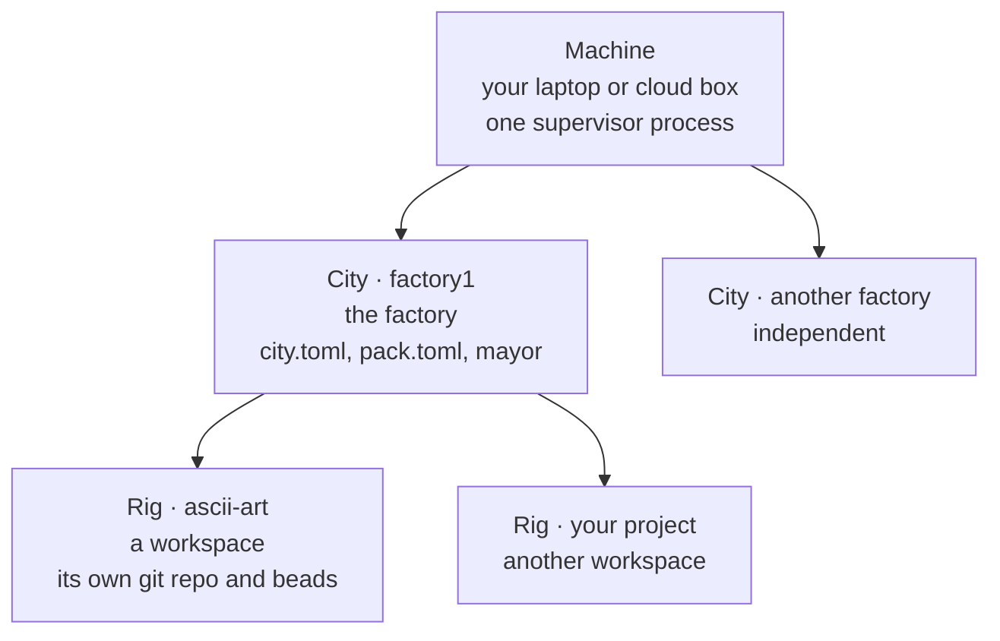
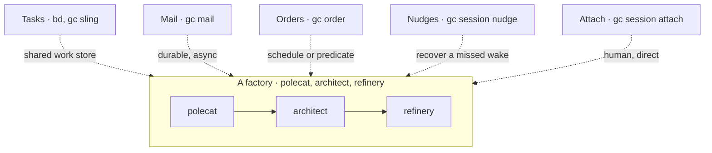

# W1 · Vocabulary and Concepts

**Workshop · 30 minutes · Day 1**

## Contents

- [Objective](#objective)
- [Prereqs](#prereqs)
- [What a software factory is](#what-a-software-factory-is)
- [Machine to City to Rig](#machine-to-city-to-rig)
- [The vocabulary](#the-vocabulary)
  - [Where work lives](#where-work-lives)
  - [Who does the work](#who-does-the-work)
  - [How work is described and dispatched](#how-work-is-described-and-dispatched)
- [How agents coordinate](#how-agents-coordinate)
  - [The five channels](#the-five-channels)
  - [Why five and not one](#why-five-and-not-one)
- [What you are about to build](#what-you-are-about-to-build)
- [Check yourself](#check-yourself)
- [What's next](#whats-next)

## Objective

This session is talking rather than typing. By the end of it you can name every Gas City primitive you are about to use, say what a rig is and how it differs from a city, and explain why a factory has five ways for agents to talk to each other rather than one.

Nothing here needs a terminal. The next session sets your machine up, and the one after that builds the factory these words describe.

## Prereqs

None. If you have run the [Actual Factory Demo](https://github.com/actual-software/actual-factory-demo) some of this will be familiar.

## What a software factory is

A coding agent is one worker. You give it a task, it works, you read the result. Scaling that up means running more of them, in parallel, with the ability to coordinate work between each other. The moment you do this, the interesting problems stop being about the agent and start being about everything around it. Who decides what gets worked on? What happens when two agents want the same file? How does a review happen when the reviewer is also an agent? What wakes an agent up when there is something to react to?

A software factory is the layer that answers those. It is the infrastructure above individual coding agents: the queue, the roles, the review gates, the schedules, and the record of what happened. Gas City is one implementation of that layer, and its bet is that these concerns are general. Once the primitives exist, a code-review pipeline, a research pipeline and an ops-automation pipeline are the same machinery with different agents plugged in.

The practical consequence for the next two days: you are not going to write agents. You are going to configure a factory, and the agents are simply one element of that configuration.

## Machine to City to Rig

**Machine.** The host. One supervisor process runs on it and manages every city registered there. This is why `gc init` warns you when a second city appears: the supervisor reconciles, and it is a machine-wide thing rather than a per-city one.

**City.** One factory. It holds the configuration (`city.toml`, `pack.toml`), the always-on `mayor`, the agent pools, the orders, and the Dolt database behind `bd`. When someone says "my factory", they mean a city. A machine can run several, and they do not share state.

**Rig.** One workspace the factory does work in. In practice a rig is a git repository plus its own beads queue. The city is where the *machinery* is configured; the rig is where the *work* is. A city with no rig has agents and nothing for them to do.

The distinction that trips people up: **agents are configured at city scope or rig scope, and it changes what they can see.** The mayor is city-scoped, because it coordinates across everything. A polecat is rig-scoped, because it works in one repository. When you install a pack you choose the scope, and choosing wrong is the usual reason an agent "does not appear".

## The vocabulary

Gas City has its own words for things you probably already have words for. The mapping is mostly one-to-one, and the [Gas City glossary](https://github.com/gastownhall/gascity/blob/main/engdocs/architecture/glossary.md) is authoritative when this table is not enough.

| Gas City term | Analogous term |
| --- | --- |
| bead | Issue / ticket / task |
| convoy | Epic / batch |
| dog | Daemon / cron worker |
| formula | Workflow / pipeline / recipe |
| mail | Message / inbox item |
| order | Cron job / scheduled task |
| pack | Plugin / module / package |
| rig | Workspace / repository |
| sling | Job dispatch / enqueue |

Grouped by what they are for:

### Where work lives

**Bead.** One unit of work, with a status, an assignee, a description, and arbitrary metadata. Beads are the backbone: most coordination in a factory is a bead changing status and someone else noticing. `bd` is the CLI.

**Convoy.** A group of beads that travel together, the way an epic groups issues.

### Who does the work

**Agent.** A configured role: a prompt template, a provider, pool bounds, and a work query telling it what to pick up. `polecat` (worker), `refinery` (reviewer), `architect` (design reviewer) and `mayor` (coordinator) are the ones you meet first. An agent is a *definition*; the running instance is a session.

**Session.** One live agent process, usually inside `tmux`. Some are always-on, like the mayor. Most are **ephemeral**: they spawn when there is work, do one unit of it, and exit. A pool is the set of sessions of one agent, bounded by a minimum and a maximum.

**Dog.** A background daemon doing housekeeping rather than project work.

### How work is described and dispatched

**Pack.** A bundle of configuration: agents, formulas, orders, prompts, scripts. Packs import other packs, and a pack's import brings everything behind it. This is the unit you install, and it is how the base factory arrives as a single command.

**Formula.** A multi-step workflow. Steps carry no assignee, so each step is routed to a pool at dispatch time rather than pinned to an agent when it is written.

**Sling.** Dispatching work at an agent or a pool. `gc sling` is the verb.

**Order.** A trigger paired with an action. The trigger is a clock, an interval, a shell predicate or a named event; the action is a formula or a script. Orders are how a factory does something when no bead exists to react to.

**Route.** The rule that decides which pool a piece of work goes to.

## How agents coordinate

A factory has five ways to move a signal from one place to another. They are not redundant, and picking the wrong one is how a factory stalls in a way that is hard to see.

### The five channels

| Channel | When it is the right tool |
| --- | --- |
| **Tasks** | A unit of work exists and ownership moves as its status advances. The status change *is* the handoff. |
| **Mail** | A durable message that survives a crash, keeps its subject and body, and is read on the recipient's own cadence. |
| **Orders** | Waking something on a schedule or on a predicate, including when no bead exists yet. |
| **Nudges** | Recovery. An agent slept through its wake, or a deferred signal still needs delivering. |
| **Attach** | A human steering one agent's live session. Highest bandwidth, least auditable, does not scale. |

### Why five and not one

They sit at different points in a three-way trade-off.

**Persistence.** Does the signal survive a restart? Mail and tasks do. A nudge to a session that dies is gone.

**Timing.** Does it fire now, on the recipient's next turn, or on a clock? A condition order can fire the instant a predicate becomes true. Mail waits for a turn boundary.

**Addressing.** Is it aimed at a pool, at one named agent, or visible to everyone? Tasks broadcast to whoever is eligible. An attach reaches exactly one session.

One rule of thumb survives contact with real factories: **tasks are the default and everything else is the exception.** When a handoff seems to want mail instead of a bead, ask first whether a bead would carry the same intent more durably. You will use all five by hand in [W4](./W4-tour-the-factory.md) and write down which one carries which handoff in your own factory.

## What you are about to build

The factory you install in [W3](./W3-run-your-factory.md) has one worked example of each primitive in it:

- a **rig** with its own repository and its own beads
- **agents** with distinct personas, including an architect that reviews against your decision records
- **formulas** whose steps route to pools rather than to named agents
- **orders**, one on a clock and one on an event
- **mail**, sent between agents as they hand work along

Day 2 is spent extending that factory with options you choose, and pointing the same machinery at a project of your own.

## Check yourself

You are ready to move on if you can answer these without looking back:

1. Your laptop runs two cities. Where does the mayor live, and how many mayors are there?
  

    
Answer

    
    The mayor lives at the city level, so there are two mayors running on your laptop.
  

2. You install a pack at city scope, and the agent it defines never appears in your rig. What is the likely cause?
  

    
Answer

    The agent was never imported at the rig level, so is not visible within the rig scope.
  

3. A bead is sitting open and nothing has picked it up. Which coordination channel was supposed to move it, and which one would you reach for to recover?

  
Answer

  
  The `task` coordination channel is responsible for routing beads. You may wish to send `mail` to the mayor to explain that the task was not picked up as expected.

4. What is the difference between an agent and a session?

  
Answer

  
  An agent is the definition of the provider, prompts and skills related to an agent profile, and a session is a running instance of an agent.

## What's next

[W2](./W2-cloud-box-and-preflight.md) gets the tools onto your machine and proves they work.

« [next: W2 Cloud Box and Preflight](./W2-cloud-box-and-preflight.md) »
