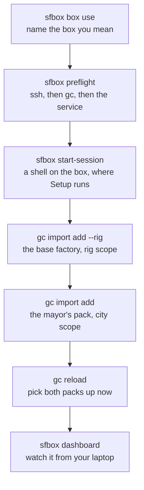
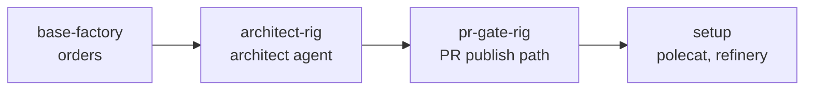

# W3 · Run Your Factory

**Workshop · 60 minutes · Day 1**

## Contents

- [Objective](#objective)
- [Prereqs](#prereqs)
- [Context](#context)
- [Run it on your cloud box](#run-it-on-your-cloud-box)
  - [1. Make your box the current one](#1-make-your-box-the-current-one)
  - [2. Preflight before you build anything](#2-preflight-before-you-build-anything)
  - [3. Open a shell on the box](#3-open-a-shell-on-the-box)
- [Running on your own machine instead](#running-on-your-own-machine-instead)
- [Setup](#setup)
  - [1. Create the city](#1-create-the-city)
  - [2. Read what `gc init` wrote](#2-read-what-gc-init-wrote)
  - [3. Confirm Dolt is supervisor-managed](#3-confirm-dolt-is-supervisor-managed)
  - [4. Register the ascii-art rig](#4-register-the-ascii-art-rig)
  - [5. Add the starting docs](#5-add-the-starting-docs)
  - [6. Put the rig on GitHub](#6-put-the-rig-on-github)
  - [7. Install the base factory](#7-install-the-base-factory)
  - [8. Run the factory checks](#8-run-the-factory-checks)
  - [9. Seed the beads queue](#9-seed-the-beads-queue)
  - [10. Make the env vars survive a new terminal](#10-make-the-env-vars-survive-a-new-terminal)
- [Try It](#try-it)
  - [1. Sling your first bead](#1-sling-your-first-bead)
  - [2. Attach to a session and watch it move](#2-attach-to-a-session-and-watch-it-move)
  - [3. Watch the orders fire](#3-watch-the-orders-fire)
  - [4. Watch it from your laptop](#4-watch-it-from-your-laptop)
  - [5. Reflect](#5-reflect)
- [Verification](#verification)
- [Troubleshooting](#troubleshooting)
- [What's next](#whats-next)

## Objective

By the end of this session you have a running software factory of your own, on your cloud box: a city called `factory1`, a rig called `ascii-art` pushed to GitHub, the base factory pack installed, a seeded queue of work, and your first bead moving through the pipeline while you watch it from a dashboard on your laptop.

This is the factory you build on for the rest of the curriculum. Everything from here either tours it, observes it, or extends it.

## Prereqs

- [W2](./W2-cloud-box-and-preflight.md) complete: `gc`, `bd` and `dolt` installed and preflight green, and `gh` signed in.
- A cloud box saved with `sfbox`, per [`CLOUD_BOX_GUIDE.md`](../CLOUD_BOX_GUIDE.md), and `sfbox preflight` reporting ssh reachable and `gc` installed. Working on your own machine instead? None of this page's `sfbox` steps apply, so [skip to the alternate path](#running-on-your-own-machine-instead).

## Context

You are not assembling a factory by hand today. The base factory arrives as one pack, and it already contains a worked example of every Gas City primitive, so the rest of Day 1 is spent reading a factory that runs rather than debugging one that half does. [W4](./W4-tour-the-factory.md) will walk through the pieces in more detail.

Your factory runs on the cloud box, and you drive it from your laptop. The laptop holds the SSH key and the box id and nothing else; the box holds the city, the rig, the Dolt database and every agent session. Building the whole thing on your own machine works too, and that path is [further down this page](#running-on-your-own-machine-instead). Don't do both.



**Directory tree**, on whichever machine you build the factory on

```text
~/
 └── software-factory-intensive/
     ├── sf-tutorial/
     ├── factory1/                    # gc init puts the city here.
     ├── ascii-art/                   # gc rig add puts the rig here.
     └── <your projects>              # Your own work can live here too.
```

## Run it on your cloud box

Your box arrives carrying the toolchain, your GitHub sign-in and the agent CLIs, and no factory at all. The factory is the part you build in this session. Three commands get you to a shell on the box where the rest of the page runs, and each answers a different question, so run them in order rather than jumping to the shell.

Not saved your box yet? [`CLOUD_BOX_GUIDE.md`](../CLOUD_BOX_GUIDE.md) takes you from the values your instructor sent to a box `sfbox` can reach, and [W2](./W2-cloud-box-and-preflight.md) is where that fits in the running order.

### 1. Make your box the current one

Every `sfbox` command acts on the current box. Most participants have two, so it is worth naming the one you mean before you start changing it.

**Copy and paste**

```bash
sfbox box list
sfbox box use <boxId>
sfbox box current
```

`box list` marks the current box with a `*`. Build today's factory on whichever box you are treating as Prod, and leave the other one alone: it is there for Day 2, when you will want to try a pack change somewhere you can afford to break it. To point a single command at the other box without switching, pass `--box <boxId>`.

### 2. Preflight before you build anything

**Copy and paste**

```bash
sfbox preflight
```

**Expected output**

```text
==> Checking 'alice-prod' (ubuntu@203.0.113.10) ...
==>   ssh            reachable
==>   gc             installed
==>   gas-city.service  inactive — no city on this box yet
==>   Nothing is broken. This box supplies the environment and you build the
==>   city yourself, so the service stays down until there is one to run.
```

Preflight checks SSH, then `gc`, then the service, and stops at the first thing that fails. That ordering is what makes it worth running first: it separates a broken factory from a broken connection, and those two get mistaken for each other constantly. Reach for it every time something on the box looks wrong, before you go looking at the factory itself.

An inactive service is the expected answer here rather than a fault. Building the city it is waiting for is the next step.

### 3. Open a shell on the box

**Copy and paste**

```bash
sfbox start-session
```

That is a shell on the box, and everything in [Setup](#setup) runs inside it. Set the workspace up once, the same shape W2 had you build on your laptop:

**Copy and paste** (on the box)

```bash
mkdir -p ~/software-factory-intensive
cd ~/software-factory-intensive
export SFI_PATH="$(pwd)"
cat <<EOF >> ~/.bashrc
export SFI_PATH="$SFI_PATH"
EOF
gh repo clone <your-github-handle>/sf-tutorial
```

No `deps.sh` step here. The box already carries `gc`, `bd` and `dolt` at the pinned versions, which is what preflight confirmed a moment ago, and it signed in to GitHub during your first-run login, so the rig push in [step 6](#6-put-the-rig-on-github) needs nothing further from you.

Leave that shell open. You come back to your laptop once, in [Try It](#4-watch-it-from-your-laptop), and it is marked where it happens.

You do not have to hold a shell open to reach the box, though, and after today you mostly will not. `sfbox exec <command>` runs one command there and hands you its exit status, and `sfbox gc <args>` runs a `gc` command inside the city without you naming the path. Either works from your laptop at any point in this page:

```bash
sfbox exec systemctl is-active gas-city.service
sfbox gc session list
```

## Running on your own machine instead

Everything in [Setup](#setup) runs the same way in a terminal on your own laptop, with no `sfbox` in the picture. You already have the toolchain and the workspace directory from [W2](./W2-cloud-box-and-preflight.md), so start at [step 1](#1-create-the-city) and read past the lines marked for the box. One place differs, and it names the alternate inline: the dashboard in [Try It](#4-watch-it-from-your-laptop) needs no tunnel, because the supervisor is already on your machine.

Pick one route and stay on it. Running half the session on each leaves you with a city on the box and a rig on your laptop, and nothing that can read both.

## Setup

These steps run wherever you decided the factory lives: the box shell from [step 3](#3-open-a-shell-on-the-box), or a terminal on your own machine. The commands are the same either way, and where they genuinely differ the step says so.

### 1. Create the city

Create the `factory1/` directory with an auto-generated `city.toml` and `pack.toml`.

**Copy and paste**

```bash
cd $SFI_PATH
gc init factory1
```

Follow the interactive prompt. Select:

- the **minimal** config template — *2*
- Claude Code (recommended) or whichever provider you are using (`claude`, `codex`, or `gemini`)

Around step 7 of 8 you may see a warning that registering `factory1` reconciles the supervisor already managing that other city, worded in terms of a kill-and-respawn that "cycles those cities' in-flight work", followed by:

```text
Continue? [y/N]
```

**Answer `y`.** The prompt reads more alarming than the reconcile turns out to be: in practice the supervisor keeps the same PID, both cities end up registered, and the pre-existing city stays healthy. Note the capital `N` — that is the default, so pressing Enter *declines*, and declining leaves `factory1` unregistered. If that happens, `gc status` will not find the city; re-run `gc init factory1` and answer `y`.

**Copy and paste**

```bash
cd factory1/
gc start
```

`gc start` registers `factory1` with the supervisor, installs the launchd or systemd service if needed, starts the supervisor process, and brings up the city's Dolt server and agents. **From here on the supervisor owns the Dolt server's lifecycle — do not run `bd dolt start` yourself.** See [Troubleshooting](#troubleshooting) if you hit Dolt errors.

**Copy and paste**

```bash
gc status
gc session list
```

**Expected output**

```text
gc status
factory1  <your-home>/software-factory-intensive/factory1
  Controller: supervisor-managed (PID 43909)
  Authority: supervisor process PID 43909
  Suspended:  no

Agents:
  dog                     scaled (min=0, max=3)
    dog-1                 stopped
    dog-2                 running
    dog-3                 running

2/3 agents running

Named sessions:
  mayor                   awake (always)

Sessions: 3 active, 0 suspended

gc session list
ID      TEMPLATE  STATE   REASON          TARGET  TITLE  AGE  LAST ACTIVE
fa-wfm  dog       active  session,config  dog-1   dog    2m   10s ago
fa-95b  dog       active  session,config  dog-3   dog    3m   0s ago
fa-a9u  mayor     active  session,config  mayor   mayor  3m   2m ago
```

### 2. Read what `gc init` wrote

**Copy and paste**

```bash
cat pack.toml
cat city.toml
```

`pack.toml` describes what your city imports and which sessions it runs:

```toml
[pack]
name = "factory1"
schema = 2

[imports]
[imports.bd]
source = "https://github.com/gastownhall/gascity.git//examples/bd"
version = "sha:f895c0ff47d6ee9334ed282a416387eb5b084d24"
[imports.core]
source = "https://github.com/gastownhall/gascity.git//internal/bootstrap/packs/core"
version = "sha:f895c0ff47d6ee9334ed282a416387eb5b084d24"

[[named_session]]
template = "mayor"
mode = "always"
```

The pinned `version` shas track the `gc` release you installed, so yours will differ. What matters is the shape:

- **`[imports]`** pins the two builtin packs every city gets: `bd` for the issue tracker and `core` for the base agent set. Imports are what make agents available to `factory1` and its rigs.
- **`[[named_session]]`** declares the always-on `mayor` you will talk to later in this session.
- **There is no `[[agent]]` table, and there should not be.** Agents are discovered from the packs you import, so a schema-2 pack declares imports rather than individual agents.

`city.toml` for the minimal template is just a few lines, and grows a `[[rigs]]` entry in step 4:

```toml
[workspace]
provider = "claude"

[providers]
[providers.claude]
base = "builtin:claude"
ready_delay_ms = 0
```

### 3. Confirm Dolt is supervisor-managed

`gc start` also started the city's Dolt server. Verify there is exactly one Dolt process for `factory1` and that `bd` can reach it.

**Copy and paste**

```bash
ps aux | grep "dolt sql-server" | grep factory1 | grep -v grep
bd list
```

You should see one `dolt sql-server` started with `--config .../factory1/.gc/runtime/packs/dolt/dolt-config.yaml`. `bd list` should return without error, most likely "No issues found." for a fresh city.

> **Do not run `bd dolt start` while the city is supervisor-managed.** It starts a second Dolt holding a write lock on the same data directory, and the next time the supervisor restarts the city it cannot bring up its own. The `dolt.auto-start` setting in `.beads/config.yaml` only matters for standalone `bd` use outside a running city, and the supervisor may rewrite it.

### 4. Register the ascii-art rig

Register the rig as a **sibling** of the city rather than a child. This is the project your factory works on.

**Copy and paste**

```bash
cd $SFI_PATH/factory1

mkdir ../ascii-art
gc rig add ../ascii-art ascii-art
```

`gc rig add` resolves the relative path to an absolute one, creates the directory if it does not exist, adds a `[[rigs]]` entry to `city.toml`, and writes the absolute path to `.gc/site.toml`.

**Copy and paste**

```bash
cat city.toml
gc rig list
```

**Expected output**

```text
[workspace]
provider = "claude"

[providers]
[providers.claude]
base = "builtin:claude"
ready_delay_ms = 0

Rigs in $SFI_PATH/factory1:

  factory1 (HQ):
    Prefix: fa
    Beads:  initialized

  ascii-art:
    Path:   $SFI_PATH/ascii-art
    Prefix: aa
    Beads:  initialized
```

### 5. Add the starting docs

**Copy and paste**

```bash
cd ../sf-tutorial
mkdir -p "$SFI_PATH/ascii-art/docs/future" \
         "$SFI_PATH/ascii-art/docs/current" \
         "$SFI_PATH/ascii-art/docs/decision-records"

cp "$SFI_PATH/sf-tutorial/artifacts/docs/decision-records/0001.ADR.ASCII.md" \
   "$SFI_PATH/ascii-art/docs/decision-records/"
cp "$SFI_PATH/sf-tutorial/artifacts/docs/future/0002.ADR.TESTING.md" \
   "$SFI_PATH/ascii-art/docs/future/"
```

Those two decision records are what the architect reviews against once the factory starts working. `docs/current/` stays empty for now.

### 6. Put the rig on GitHub

The base factory publishes its work as pull requests, so the rig needs an upstream `main`. Create an empty repository on GitHub using [this link](https://github.com/new?name=ascii-art&description=A%20reference%20project%20for%20a%20software%20factory%20to%20build.), then:

**Copy and paste**

```bash
cd "$SFI_PATH/ascii-art"
git init -b main
git commit --allow-empty -m 'first commit'
git add docs/ .gitignore
git commit -m "Add docs describing initial vision for ASCII Art project"
```

Replace `<your-github-handle>` with the org or user that owns the empty repo:

**Copy and paste**

```bash
git remote add origin https://github.com/<your-github-handle>/ascii-art.git
git push -u origin main
```

**Outcome:** `git status` reports a clean tree tracking `origin/main`.

### 7. Install the base factory

This is the step the whole session is built around. One import brings a complete factory, because packs import transitively and the base pack sits on top of a chain that already carries the rest.

**Copy and paste**

```bash
cd "$SFI_PATH/factory1"
gc import add --rig ascii-art "$SFI_PATH/sf-tutorial/artifacts/packs/base-factory"
```

That single command installs four packs:



One more import goes in at **city** scope rather than rig scope, because it supplies the mayor and the mayor belongs to the city:

**Copy and paste**

```bash
gc import add "$SFI_PATH/sf-tutorial/artifacts/packs/pr-gate-city"
```

That import makes the pack's mayor available. It does not yet run it, and this is the step that is easy to miss.

`gc init` gave the city a mayor of its own, in `agents/mayor/`, and the `[[named_session]]` block you read in step 2 is what runs it. The pack ships a mayor too. Leave both in place and the factory comes up with two: the stock one, and the one that knows about the PR gate.

Hand the role over. Delete the city's mayor, then point the always-on session at the pack's:

**Copy and paste**

```bash
cd "$SFI_PATH/factory1"
rm -rf agents/mayor

sed '/^\[\[named_session\]\]/,/^[[:space:]]*mode = /d' pack.toml > pack.toml.tmp
cat >> pack.toml.tmp <<'EOF'
[[named_session]]
name = "mayor"
template = "pr-gate-city.mayor"
mode = "always"
EOF
mv pack.toml.tmp pack.toml
```

Keeping `name = "mayor"` preserves the session's alias, so `gc session attach mayor` later on this page still works. The template has to name the binding, because a bare `mayor` stops resolving the moment the city's own agent directory is gone, and a named session whose template does not resolve is disabled quietly rather than reported as an error.

Confirm the city now has one mayor, and that it is the one carrying the gate:

**Copy and paste**

```bash
gc config show | grep -A1 '^\[\[agent\]\]' | grep -c '^name = "mayor"'
gc prime mayor | grep -q 'mol-polecat-pr' && echo "mayor knows the PR gate"
```

**Expected output**

```text
1
mayor knows the PR gate
```

Both lines matter. The first is the count, and `2` here is the two-mayor problem rather than a cosmetic duplicate. The second says the mayor you kept is the one that knows to dispatch with `--on mol-polecat-pr`, which a count on its own would not tell you.

Confirm both landed:

**Copy and paste**

```bash
gc import list --rig ascii-art
gc import list
```

**Expected output**

```text
base-factory  ...  (path)

pr-gate-city  ...  (path)
```

The supervisor picks the new packs up on its next reconcile tick. To take effect immediately:

**Copy and paste**

```bash
gc reload
```

> **If `gc reload` prints `Reload request could not be accepted because the controller is busy`,** that is normal right after `gc start` while the controller is still adopting sessions. The imports are already persisted, so wait for the next tick and move on rather than retrying.

Both imports and the reload run in the box shell you already have open. The same three commands work from your laptop if you would rather not hold a shell, as `sfbox gc import add ...`, `sfbox gc import list` and `sfbox gc reload`.

### 8. Run the factory checks

Four commands, one per thing that could be wrong. Run them in order and read each result before moving on.

**Copy and paste**

```bash
cd "$SFI_PATH/factory1"
gc doctor
```

`✓` is a pass, `⚠` a warning, `✗` an error. A freshly built factory usually shows a warning or two, such as `⚠ jsonl-archive — local-only mode`. Warnings are fine; errors are not.

**Copy and paste**

```bash
gc formula list
gc order list
gc rig list
```

`gc formula list` should include `mol-polecat-work`, `mol-refinery-patrol`, `mol-polecat-pr`, `mol-refinery-pr-patrol`, `mol-architect-review` and `mol-refinery-architect-patrol`. `gc order list` should show `factory-pulse` and `bead-closed-log`.

This is also the moment to see that the factory carries all five Gas City primitives, which is what makes it a base to build on rather than a demo:

| Primitive | Prove it |
| --- | --- |
| Formula | `gc formula list` shows six, and steps carry no assignee — the pool is resolved per step at dispatch |
| Agent persona | `gc agent list --rig ascii-art` shows `architect` alongside `polecat` and `refinery` |
| Order | `gc order list` shows one on a schedule and one on an event |
| Rig | `gc rig list` shows `ascii-art` with its own beads prefix |
| Mail | `gc mail inbox` — the polecat and refinery send it as they hand work along |

### 9. Seed the beads queue

`gc rig add` ran `bd init` for you. Confirm, then seed real work.

**Copy and paste**

```bash
cd $SFI_PATH/ascii-art
bd status
```

If that errors with `no beads database found`, run `bd init --prefix ascii-art` yourself. It should look like this:

```bash
📊 Issue Database Status

Summary:
  Total Issues:           0
  Open:                   0
  In Progress:            0
  Blocked:                0
  Closed:                 0
  Ready to Work:          0
```

**Copy and paste**

```bash
cp "$SFI_PATH/sf-tutorial/artifacts/beads/seed-epics.sh" ./seed-epics.sh
chmod +x ./seed-epics.sh
./seed-epics.sh
```

**Expected output**

```text
Seed complete.
  epics opened: 12
  tasks opened: 26
  total beads:  38
```

## Try It

### 1. Sling your first bead

To start work by hand you *sling* a bead at an agent. Two equivalent forms:

**Copy and paste**

```bash
cd $SFI_PATH/ascii-art
bd list --type=epic                 # find the epic for numbers 1-10
bd list --parent=<epic-id>          # find its child tasks

cd $SFI_PATH/factory1

# Name the rig and the agent. This form always works.
gc sling --rig ascii-art polecat <id-for-1>
```

There is a second, fully qualified form, `<rig>/<binding>.<agent>`. The binding is the name of the import the agent arrived through, and since the base factory brings the polecat in transitively rather than directly, do not guess it — read it:

**Copy and paste**

```bash
gc agent list --rig ascii-art
gc sling ascii-art/base-factory.polecat <id-for-2>
```

Worth doing once. The qualified form is what disambiguates two agents of the same name arriving from different packs, which is exactly the situation a Day 2 option can create.

You can also ask the mayor to sling in plain language, which is the next step.

### 2. Attach to a session and watch it move

The mayor is your factory's always-on assistant, running in a `tmux` session you can drop into.

**Copy and paste**

```bash
cd $SFI_PATH/factory1
gc session attach mayor
```

Ask it something: *What is the status of the factory?* or *Sling the bead for number 3 at the polecat.*

> **Detach with `Ctrl+b` then `d`.** Do **not** use `Ctrl+c` — that interrupts the agent, and exiting that way kills the session inside Gas City. `Ctrl+b` `d` returns you to your shell with the mayor still running.

To watch the ephemeral agents rather than the mayor, list what is live and attach to one:

**Copy and paste**

```bash
gc session list
gc session attach <alias-or-id>
```

A bead you slung a minute ago should be moving: a polecat claiming it, then a refinery or the architect picking it up. Watching a session mid-flight is the fastest way to understand what the formulas in [W4](./W4-tour-the-factory.md) actually do.

### 3. Watch the orders fire

The two orders in the base pack write to one file, so you can see both trigger styles side by side.

**Copy and paste**

```bash
gc order list
gc order check
gc order run factory-pulse
cat "$SFI_PATH/ascii-art/FACTORY_LOG.md"
```

`gc order check` prints which orders are due and, for the ones that are not, why not. `gc order run` fires one immediately instead of waiting for its trigger. Come back to that log later in the day: `pulse` lines arrive on the hour from a clock, and `closed` lines arrive whenever the factory closes a bead. Same file, two mechanisms.

### 4. Watch it from your laptop

The dashboard is embedded in the `gc` binary and served by the supervisor, so there is nothing to install and nothing to start. `sfbox` forwards it over SSH and prints you a local address.

**Copy and paste** (on your laptop)

```bash
sfbox dashboard
```

Open the `http://127.0.0.1:8372` URL it prints, and leave the command running: `Ctrl-C` closes the tunnel. On your own machine, run `gc dashboard` from inside `factory1` instead, which opens the same page with no tunnel in the way.

The tunnel is the design rather than an inconvenience. Your box opens port 22 and nothing else, and reaching the dashboard same-origin through the tunnel keeps it fully read-write. [W5](./W5-observability.md) is where you read the thing properly. For now, confirm it opens and that your beads are in it.

### 5. Reflect

You have a city, a rig on GitHub, a base factory carrying every primitive, 38 beads of real work, and at least one bead that moved through the pipeline while you watched. Nothing you build for the rest of the curriculum starts from scratch; it starts from here.

## Verification

**Copy and paste**

```bash
cd $SFI_PATH/factory1
gc cities
gc rig list
gc import list --rig ascii-art
gc order list
```

**Expected output**

```text
factory1 listed with its absolute path
ascii-art listed with its absolute path and beads prefix
base-factory among the rig's imports
factory-pulse and bead-closed-log among the orders
```

**Copy and paste**

```bash
cd $SFI_PATH/ascii-art
bd list --type=epic
git ls-remote --heads origin
```

**Expected output**

```text
2 rows: Letters a-m, Letters n-z
<sha>    refs/heads/main
```

## Troubleshooting

### `sfbox: command not found`

The `PATH` export from the box guide did not take in this terminal. Run it again here, then put it in your shell profile so a new terminal keeps it. [`CLOUD_BOX_GUIDE.md`](../CLOUD_BOX_GUIDE.md) has the line.

### `sfbox gc` says it could not find a Gas City directory on the box

It reads `gc cities` over SSH, and there is no city registered yet. Finish Setup steps 1 to 7 in the box shell first; `gc start` is what registers `factory1`. If the box carries more than one city, `sfbox` warns and takes the first it sees, so name the one you meant with `--city-path`.

### `sfbox exec` runs the wrong thing when your command has a pipe in it

Your arguments reach the box the way you typed them, which means `sfbox` never hands them to a shell unless you ask for one. Write `sfbox exec bash -lc 'gc session list | wc -l'` rather than quoting the pipeline on its own.

### `git push` on the box asks for a username

The box is signed in to GitHub, but nobody has told this shell's `git` to use that credential, which is a separate step from the sign-in and easy to miss. Run `gh auth setup-git` there, then push again.

### `gc status` shows `Controller: stopped` and `bd` reports Dolt unreachable

You ran `gc init` but not `gc start`. The files exist and nothing is running. Run `gc start` from inside `factory1/`. Do not run `bd dolt start` to "fix" this — it creates the next problem instead.

### `gc start` fails with `dolt server could not start via gc helper`

Open `.gc/runtime/packs/dolt/dolt.log`. The usual cause is another Dolt process holding the lock on `.beads/dolt/`, generally a leftover `bd dolt start`. Note that `bd dolt stop` does not always terminate it.

**Copy and paste**

```bash
# All running dolt sql-server processes
ps aux | grep "dolt sql-server" | grep -v grep

# For each PID that does NOT have --config .../.gc/runtime/...
# (that is, is not the supervisor's), check what data dir it holds:
lsof -p <PID> | grep cwd

# Kill any orphan whose cwd points at a .beads/dolt directory
# you are not actively using:
kill <PID>
```

Then re-run `gc start`, or wait about ten seconds for the supervisor's own retry.

### `bd` commands fail with `database "hq" not found on Dolt server`

The Dolt server is up but the `hq` database was not created in it. `bd bootstrap` sometimes reports success without creating it.

**Copy and paste**

```bash
gc stop
cd .beads/dolt && dolt sql -q "CREATE DATABASE IF NOT EXISTS hq;" && cd -
gc start
```

Any `bd` command after the restart will auto-create the schema tables inside `hq`.

### `gc import list` does not show the pack

Check the scope you asked about: `base-factory` is a rig import (`gc import list --rig ascii-art`) and `pr-gate-city` is a city import (`gc import list`). Looking at the wrong one reports an absent pack that is in fact installed.

### `bd list` returns "No issues found" right after `seed-epics.sh`

You ran the script outside the rig, so the beads went into a different database. Run `pwd`; if you are not at `$ASCII_ART_PATH`, `cd` there and re-run it.

### A fresh shell prints `FACTORY_PATH=` with nothing after it

Step 10's append ran from a shell where the four vars were empty, so it wrote four empty exports. Re-running it appends four more rather than fixing anything. Find the bad lines, delete them by hand, re-export, then re-run step 10:

```bash
grep -n 'export \(FACTORY\|ASCII_ART\|TUTORIAL\|ARTIFACTS\)_PATH=""' ~/.bashrc ~/.zshrc
```

### Recurring breakage after reinstalling `gc` or `bd`

Reinstalling the binaries does not kill running Dolt processes. Check for orphans with `ps aux | grep "dolt sql-server"` before retrying. Anything pointing at a project you are not using is safe to kill. Leave alone the supervisor-managed Dolt for cities you are using, and any standalone `~/.dolt-server` you set up deliberately.

## What's next

[W4](./W4-tour-the-factory.md) opens up the factory you just installed: what a pack is, what a formula does, how an agent gets its persona, and how orders and mail move work around without anyone asking.

« [previous: W2 Cloud Box and Preflight](./W2-cloud-box-and-preflight.md) | [next: W4 Tour the Factory](./W4-tour-the-factory.md) »
