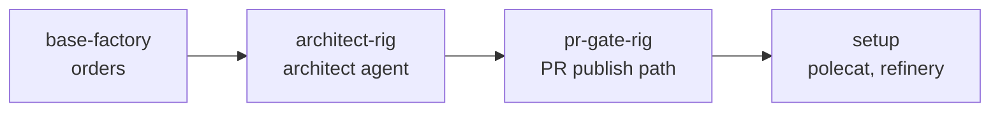

# W4 · Tour the Factory

**Workshop · 60 minutes · Day 1**

## Contents

- [Objective](#objective)
- [Prereqs](#prereqs)
- [Context](#context)
- [Try It](#try-it)
  - [1. Packs: what one import brought](#1-packs-what-one-import-brought)
  - [2. Agents: a persona is a prompt plus bounds](#2-agents-a-persona-is-a-prompt-plus-bounds)
  - [3. Prompt templates and fragments](#3-prompt-templates-and-fragments)
  - [4. Formulas: the method](#4-formulas-the-method)
  - [5. Orders: the trigger](#5-orders-the-trigger)
  - [6. Mail: durable and asynchronous](#6-mail-durable-and-asynchronous)
  - [7. Nudges and attach: the two recovery channels](#7-nudges-and-attach-the-two-recovery-channels)
  - [8. The mayor: where intent enters](#8-the-mayor-where-intent-enters)
  - [9. Write the channel document](#9-write-the-channel-document)
  - [10. Reflect](#10-reflect)
- [Verification](#verification)
- [Troubleshooting](#troubleshooting)
- [What's next](#whats-next)

## Objective

You installed a factory an hour ago with one command. This session opens it up. By the end you can read every kind of file it is made of, change the right one for a given problem, and you will have written down which coordination channel carries which handoff in your own factory.

## Prereqs

- [W3](./W3-run-your-factory.md) complete: `factory1` running, `ascii-art` rig registered and pushed, base factory installed, beads seeded.

## Context

A Gas City factory is configuration rather than code, and the configuration comes in five kinds of file. Almost every change you will want to make is a change to exactly one of them, so naming which one is most of the work.

| You want to change | Change |
| --- | --- |
| what capabilities exist at all | the **pack** you import |
| who does the work, and how many at once | the **agent** definition |
| what an agent is told, in prose | the **prompt template**, or a **fragment** it includes |
| what steps a job has, and in what order | the **formula** |
| when something happens with no bead behind it | the **order** |

Two failure shapes follow from that table and they are worth memorising now. *The factory did the wrong thing* is almost always a formula or a prompt. *The factory did nothing* is almost always an order, or an agent whose work query does not match.

## Try It

### 1. Packs: what one import brought

**Copy and paste**

```bash
cd "$SOFTWARE_FACTORY_INTENSIVE_PATH/factory1"
gc import list --rig ascii-art
gc import list
cat "$SOFTWARE_FACTORY_INTENSIVE_PATH/sf-tutorial/artifacts/packs/base-factory/pack.toml"
```

**What to notice.** Note that `[imports.architect-rig]` pulls its own chain behind it:



Two things about that are important for later. Each pack is a *layer* that adds or overrides one concern, so a Day 2 option is a pack you drop on top rather than an edit you make. And **scope is a property of the import, not the pack**: `base-factory` went in with `--rig` and `pr-gate-city` without it, because the mayor is city-scoped and the pack that supplies it has to compose at the same scope. Installing at the wrong scope is the usual reason an agent "does not appear" or otherwise "collides".

### 2. Agents: a persona is a prompt plus bounds

**Copy and paste**

```bash
gc agent list --rig ascii-art
cat "$SOFTWARE_FACTORY_INTENSIVE_PATH/sf-tutorial/artifacts/packs/architect-rig/agents/architect/agent.toml"
```

**What to notice.** An agent definition is short, and every field in it is a decision:

- `scope` puts the agent at city or rig level.
- `prompt_template` points at the prose that gives it a persona.
- `min_active_sessions` and `max_active_sessions` bound the pool. A maximum of two means at most two architects run at once, however much work arrives.
- `idle_timeout` is how long a session waits with nothing to do before exiting.

The architect is a persona rather than a script: it reads a diff against your decision records and writes a verdict onto the bead as metadata. Nothing about *how* it forms that opinion is in the TOML. That is all in the prompt.

### 3. Prompt templates and fragments

**Copy and paste**

```bash
sed -n '1,60p' "$SOFTWARE_FACTORY_INTENSIVE_PATH/sf-tutorial/artifacts/packs/architect-rig/agents/architect/prompt.template.md"
```

This is the whole persona: what the agent is, what it reads, what it writes, and when it stops. It is prose a human can argue with, which is the point.

Now look at how a pack changes an agent it did not define:

**Copy and paste**

```bash
grep -A4 'patches.agent' "$SOFTWARE_FACTORY_INTENSIVE_PATH/sf-tutorial/artifacts/packs/architect-rig/pack.toml"
sed -n '1,40p' "$SOFTWARE_FACTORY_INTENSIVE_PATH/sf-tutorial/artifacts/packs/architect-rig/prompts/refinery.template.md"
```

**What to notice.** `architect-rig` does not redefine the refinery. It **patches** it, replacing only the `prompt_template` and inheriting everything else. That is what lets a capability arrive as a layer instead of a fork.

**Fragments** are the same idea one level down. A prompt often needs a passage that several agents share, and copying it means it drifts. So a pack can put shared prose in a `template-fragments/` directory and an agent's prompt pulls it in by name:

```text
packs/<pack>/
  agents/<agent>/prompt.template.md      includes:  {{ template "safety-rules" . }}
  template-fragments/safety-rules.template.md
```

`template-fragments/` sits alongside `agents/`, `formulas/` and `orders/` and is discovered the same way, so a fragment needs no declaration. Edit the fragment and every agent including it changes on the next reload. The base factory's packs are small enough not to need one yet; the moment you have two agents that must not contradict each other on some rule, that rule wants to be a fragment. `gc lint` checks that every `{{ template ... }}` resolves, which is the failure you would otherwise find at wake time.

### 4. Formulas: the method

**Copy and paste**

```bash
gc formula list
gc formula show mol-polecat-pr --rig ascii-art
cat "$SOFTWARE_FACTORY_INTENSIVE_PATH/sf-tutorial/artifacts/packs/pr-gate-rig/formulas/mol-polecat-pr.formula.toml"
```

**What to notice.** Three things in that file are the whole idea.

`extends = ["mol-polecat-work"]` makes this formula a diff against another one. It replaces exactly one step and inherits the rest, which is why the file is short and why the base formula stays the single source of truth.

`[[steps]]` with `id` and `needs` is a dependency graph rather than a script. Steps declare what they need, not what order to run in. In this formula no step names an agent, but rather the pool is resolved per step at dispatch. That is what makes a formula reusable across factories with different agents in them.

The step body is a prompt. It is a set of instructions an agent reads, which is why the file reads like documentation with commands in it.

### 5. Orders: the trigger

Your factory has two, and they were chosen to differ in exactly one way.

**Copy and paste**

```bash
gc order list
cat "$SOFTWARE_FACTORY_INTENSIVE_PATH/sf-tutorial/artifacts/packs/base-factory/orders/factory-pulse.toml"
cat "$SOFTWARE_FACTORY_INTENSIVE_PATH/sf-tutorial/artifacts/packs/base-factory/orders/bead-closed-log.toml"
gc order check
```

**What to notice.** Read the two files side by side. Same shape, same action style, one difference: `factory-pulse` waits on a clock and `bead-closed-log` waits on something the factory did.

Five trigger types exist and they split cleanly in two:

| Trigger | Fires when | Use it for |
| --- | --- | --- |
| `cooldown` | a fixed interval has elapsed | proactive sweeps: health checks, backups, compaction |
| `cron` | a schedule matches | anything with a wall-clock time, such as a nightly digest |
| `condition` | a shell predicate returns true | reactive work: "a bead is waiting with no assignee" |
| `event` | a named event is emitted | reacting to something the factory announced about itself |
| `manual` | you run it | a procedure you want recorded, not automated |

Trigger evaluation is a switch, so exactly one branch runs and only the fields that branch reads matter. A `cron` order never consults `interval`; a `cooldown` order never consults `schedule`. Setting the wrong one is not an error, it is silence.

The other split is the action. An order runs **either** a formula, which routes work to a pool, **or** an exec script on the controller, which creates no work unit at all. Validation treats them as mutually exclusive.

`gc order check` answers "what would fire right now", and it is the single most useful command in this session when a factory has gone quiet.

**Copy and paste**

```bash
gc order run factory-pulse
gc order history
cat "$SOFTWARE_FACTORY_INTENSIVE_PATH/ascii-art/FACTORY_LOG.md"
```

Both orders write to that one file on purpose. By the end of the day it carries `pulse` lines from the clock and `closed` lines from the event, interleaved, which is the shortest demonstration that they are different mechanisms.

### 6. Mail: durable and asynchronous

**Copy and paste**

```bash
cd "$SOFTWARE_FACTORY_INTENSIVE_PATH/factory1"
gc mail send mayor -s "Priority note" -m "Prefer beads from the letters-a-m epic for the rest of the session."
gc mail inbox mayor
```

Now send to an agent that is mid-turn and watch that it is not interrupted:

```bash
gc session list
gc session peek <a-running-session-id> --lines 8
gc mail send <a-running-session-id> -s "Heads up" -m "Re-read the ADR before you push."
gc session peek <a-running-session-id> --lines 8
```

**What to notice.** The second peek shows the same turn still running. Mail lands in an inbox and waits for a turn boundary; it does not preempt. That is right for a message with no implied deadline and wrong when you need action now. Add `--notify` when you *do* want the recipient woken, and notice that this makes it two signals rather than one: the durable message, plus a nudge.

### 7. Nudges and attach: the two recovery channels

**Copy and paste**

```bash
gc session nudge <a-running-session-id> "Check your inbox before your next action."
gc session peek <a-running-session-id> --lines 10
gc nudge status <a-running-session-id>
gc session logs <a-running-session-id>
```

**What to notice.** A nudge puts text straight into a running session without the cost of an attach. `gc nudge status` shows what the supervisor is holding for a session that was asleep or not yet at a safe boundary, including nudges that were dead-lettered because they never landed.

Both of these are recovery tools, and seeing either in a routine handoff is a smell: some other channel is not doing its job. The one legitimate routine use is `--notify` on mail, where the nudge is explicitly the wake half of a two-part signal.

Attach is the fifth channel and the only one that leaves no artifact anyone else can read. A bead update, a mail, an order-history row: all evidence. An attached session leaves a tmux log and your memory. Reach for `peek` first — it answers most questions and cannot accidentally type into a running agent.

### 8. The mayor: where intent enters

**Copy and paste**

```bash
gc session attach mayor
```

Ask it three things in your own words: what the factory's state is, which agents are available, and what it would work on next if you left it alone. Then detach with `Ctrl-b` then `d`.

> **Detach with `Ctrl-b` then `d`.** `Ctrl-c` kills the mayor's session. If that happens, wait for the supervisor to start a new one, or restart the factory yourself from your laptop with `sfbox exec sudo systemctl restart gas-city.service`.

**What to notice.** You asked in sentences and got answers about a system rather than about a bead. Nothing you said created work.

Every other agent in your factory is ephemeral and single-purpose: spawn, do one thing, exit. Their prompts are about finishing. The mayor is always-on, survives across beads, and holds the state no single bead carries. **Workers optimise for finishing; the coordinator optimises for what should happen next.** A factory with only workers can execute a backlog and cannot reprioritise one.

Where did the mayor learn about pull requests? From a pack, not from an edit:

```bash
cat "$SOFTWARE_FACTORY_INTENSIVE_PATH/sf-tutorial/artifacts/packs/pr-gate-city/pack.toml"
sed -n '1,60p' "$SOFTWARE_FACTORY_INTENSIVE_PATH/sf-tutorial/artifacts/packs/pr-gate-city/agents/mayor/prompt.template.md"
```

The mayor's behavior is configuration that packs contribute to, which means a capability you install can teach the coordinator about itself.

### 9. Write the channel document

You have now used all five channels. Decide, in writing, which one carries which handoff in your factory.

**Copy and paste**

```bash
cp "$SOFTWARE_FACTORY_INTENSIVE_PATH/sf-tutorial/artifacts/docs/coordination-channels.template.md" "$SOFTWARE_FACTORY_INTENSIVE_PATH/ascii-art/docs/current/coordination-channels.md"
nano "$SOFTWARE_FACTORY_INTENSIVE_PATH/ascii-art/docs/current/coordination-channels.md"
```

`nano` ships with the box and is not modal: `Ctrl-O` then `Enter` saves, `Ctrl-X` exits. Use a different editor if you prefer one.

Fill in the handoff table. Every handoff gets a primary channel and a fallback:

| Handoff | Primary | Fallback |
| --- | --- | --- |
| Human → polecat | Tasks | — |
| polecat → architect | Tasks | Nudge |
| architect → refinery | Tasks | Nudge |
| refinery → polecat (bounce) | Tasks | Mail |
| refinery → human (merge) | Tasks | Mail |
| Any agent → human (blocked) | Mail | Attach |
| Nothing → factory (sweeps) | Orders | — |

Those are defaults rather than answers. Change at least one and be able to say why. Then commit it:

```bash
cd "$SOFTWARE_FACTORY_INTENSIVE_PATH/ascii-art"
git add docs/current/coordination-channels.md
git commit -m "Record coordination channel preferences"
```

### 10. Reflect

Packs hold capability, agents hold role, prompts hold judgement, formulas hold method, orders hold timing. Almost every change you will want to make is a change to exactly one of those five.

The channel document earns its place diagnostically rather than bureaucratically. When the factory goes quiet, "which channel was supposed to carry this?" is the first question, and a factory with no answer is one where you read every log.

Write one sentence somewhere you will find it tomorrow: the thing your factory should do on a schedule that it does not do today. That is an order, and Day 2's lab slots are where you can build it.

## Verification

**Copy and paste**

```bash
gc import list --rig ascii-art
gc formula show mol-polecat-pr | head -5
gc order check
gc order history
gc mail inbox mayor
test -f "$SOFTWARE_FACTORY_INTENSIVE_PATH/ascii-art/docs/current/coordination-channels.md" && echo "channel doc: present"
```

**Expected output**

```text
base-factory among the rig's imports
the formula's description, not an error
a list of eligible orders (empty is a valid answer)
at least one row, from the order you ran by hand
at least the message you sent in step 6
channel doc: present
```

## Troubleshooting

- **`gc formula show` reports the formula is unknown.** `gc formula list` shows only what the current context resolves. A rig-scoped formula needs the rig context: run from inside the rig, or check the pack is imported at the right scope.
- **`gc order run` reports the order is not found.** Order names are scoped and two rigs can carry the same name. Pass `--rig <rig>`, or copy the exact name out of `gc order list`.
- **`gc mail inbox` is empty right after you sent something.** You are reading your own inbox rather than the recipient's. Pass the alias explicitly, as in `gc mail inbox mayor`.
- **`gc session nudge` says the session is not running.** The pool session exited between your `gc session list` and your nudge, which is normal for ephemeral agents. Re-list and pick a live one, or sling a bead to spawn one.
- **`gc session attach mayor` says there is no such session.** The mayor is declared by a `[[named_session]]`. Confirm `pr-gate-city` is imported at city scope with `gc import list`, then `gc reload`. From your laptop those are `sfbox gc import list` and `sfbox gc reload`.
- **Attaching leaves you stuck in tmux.** `Ctrl-b` then `d` detaches. `Ctrl-c` interrupts the agent's turn, which is not what you want.

## What's next

[W5](./W5-observability.md) is about seeing all of this from outside: the dashboard, what a bead actually carries, and how to read a session that is running right now.

« [previous: W3 Run Your Factory](./W3-run-your-factory.md) | [next: W5 Observability and Traceability](./W5-observability.md) »
