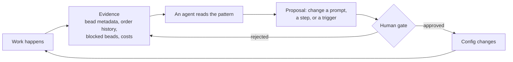

# W6 · Advanced Concepts

**Workshop · 60 minutes · Day 2**

## Contents

- [Objective](#objective)
- [Prereqs](#prereqs)
- [Part 1: Self-improvement loops](#part-1-self-improvement-loops)
  - [Improving the config, not the artifact](#improving-the-config-not-the-artifact)
  - [The four signals your factory already writes](#the-four-signals-your-factory-already-writes)
  - [Why the gate is the whole idea](#why-the-gate-is-the-whole-idea)
  - [Try it: read one signal](#try-it-read-one-signal)
- [Part 2: Wiki knowledge management](#part-2-wiki-knowledge-management)
  - [The problem: every session starts from zero](#the-problem-every-session-starts-from-zero)
  - [What belongs in a wiki and what does not](#what-belongs-in-a-wiki-and-what-does-not)
  - [Making agents read it and write it](#making-agents-read-it-and-write-it)
  - [Try it: write one page](#try-it-write-one-page)
- [Reflect](#reflect)
- [Verification](#verification)
- [Troubleshooting](#troubleshooting)
- [What's next](#whats-next)

## Objective

Two ideas that only become interesting once a factory has been running for a while, and both are about the factory getting better rather than the code getting written. By the end you can name the signals your own factory is already emitting, and you have written one durable page that a future agent will read.

## Prereqs

- [L3](./L3-L5-feature-labs.md) complete: at least one option installed in your own rig, so the factory has produced some evidence about itself.
- Your capability map to hand.

## Part 1: Self-improvement loops

### Improving the config, not the artifact

Every loop you have seen so far improves an **artifact**. A review loop improves a diff. A scoring loop iterates until the diff scores well. Both are useful, and both leave the factory exactly as they found it. Run the same bad prompt through them a hundred times and it stays a bad prompt.

A self-improvement loop changes the target. The thing being improved is the **configuration** — an agent's prompt, a formula's steps, an order's trigger — and the evidence is what the factory already wrote down about its own behaviour.

That is a small change in wording and a large change in consequence. A factory that improves artifacts gets you through today's backlog. **A factory that improves its configuration gets better at tomorrow's**, and the difference compounds.



### The four signals your factory already writes

You do not need new instrumentation. Your factory has been writing evidence about itself since W3.

| Signal | The question it answers |
| --- | --- |
| Blocked beads and their reasons | What does the factory keep rejecting, and therefore how does your team write work? |
| Bead metadata from review lanes | Which judgements keep going the same way? |
| `gc order history` | What fired, and what has never fired at all? |
| `gc costs` | Where does the money go, and is it going where the value is? |

The one to pick is the one with the most **repetition** in it. A single bad verdict is noise. The same rejection four times is a finding, and a finding is what a config change should be built on.

### Why the gate is the whole idea

Be clear-eyed about this before you build one: **a proposal is not a change**. The entire reason a self-improvement loop is safe to run is that a human approves the diff.

An agent that can silently rewrite its own instructions is not a self-improving factory, it is an unreviewable one. The failure is not dramatic — nothing explodes — it is that six weeks later nobody can say why an agent behaves the way it does, and the git history of the config has an agent's name on every commit.

So the loop has four parts and the fourth is not optional: read a signal, find a pattern, **propose** a change, and put the proposal in front of a person. In practice the proposal is a pull request against the pack, which is a shape you already have.

### Try it: read one signal

**Copy and paste**

```bash
cd "$MY_RIG_PATH"
bd list --status blocked --json | jq -r '.[] | "\(.id)  \(.metadata.blocker_reason // "")"'
cd "$FACTORY_PATH"
gc order history
gc costs 2>/dev/null | head -20
```

Pick the signal with the most repetition and write one sentence: *the factory keeps doing X, which suggests changing Y in the Z layer*. That sentence is a capability-map row, and the [self-improvement loop option](../hardening/05-self-improvement-loop.md) is where you build the loop that produces sentences like it without you.

## Part 2: Wiki knowledge management

### The problem: every session starts from zero

Almost every agent in your factory is ephemeral. It spawns, does one thing, and exits. Nothing it learned survives.

That is the right design for work and the wrong design for knowledge. The third agent to hit the same undocumented quirk in your build system pays the same cost as the first, and there is no mechanism by which the second one's discovery reaches it. Prompts do not help: a prompt is what an agent is told before it starts, and this is something nobody knew until it happened.

A **team wiki** is the missing half. It is a git repository of durable findings that agents read at the start of a task and write to at the end.

The two habits matter more than the tool:

**Read before researching.** Before an agent starts an independent investigation, it checks whether the team already did that investigation. This is the cheaper half by a wide margin, because the alternative is re-deriving something that is already written down.

**Write at the boundary, not mid-flow.** At the end of a task, ask whether anything learned would save the next person time. If so, commit it. Doing this mid-task interrupts the work the insight came from.

### What belongs in a wiki and what does not

The distinction that keeps a wiki useful is **durability**, not importance.

| Belongs | Does not |
| --- | --- |
| A non-obvious failure mode and its workaround | Anything the code already says |
| An incident write-up: what broke, why, how it was found | A restatement of git history |
| A decision and the reasoning behind it | Status of work in flight |
| A synthesis someone would otherwise redo | Notes that only matter to one conversation |

The test worth applying: *would a colleague six months from now, hitting this, save time by reading it?* If the answer is no, it belongs on the bead instead, where it stays attached to the work it came from.

### Making agents read it and write it

Two mechanics turn a wiki from a directory nobody opens into part of the loop.

**A fragment in the prompt.** The read-and-contribute rule is the same for every agent, so it belongs in a `template-fragments/` file that each agent's prompt includes — exactly the mechanism from [W4](./W4-tour-the-factory.md). One edit changes the rule everywhere, and no two agents can drift into contradicting each other about it.

**An order for the sweep.** Reading is per-task and belongs in the prompt. Anything periodic — checking whether the wiki has gone stale, digesting the week's findings — has no bead behind it, so it is an order.

Notice that this is the same shape as part 1. Both halves of this session are the factory acting on itself, and both use the machinery you already toured.

### Try it: write one page

You have been in contact with a factory for a day and a half. Something in that has surprised you.

**Copy and paste**

```bash
mkdir -p "$MY_RIG_PATH/docs/current"
nano "$MY_RIG_PATH/docs/current/findings.md"
```

Write one finding, in this shape: what you expected, what happened, what you would tell the next person. Three sentences is a complete entry. Then commit it:

```bash
cd "$MY_RIG_PATH"
git add docs/current/findings.md
git commit -m "Record first factory findings"
```

In a real team this lives in a shared repository rather than inside one rig, so that every agent on every machine reads the same copy. A page committed only to your laptop is private note-taking; the point is the shared read.

## Reflect

Both halves of this session answer the same question: how does a factory get better rather than just get through?

Part 1 said: it reads what it already wrote about itself, proposes a config change, and a human approves it. Part 2 said: what one session learned has to outlive that session, or every session pays the same tuition.

Neither is exotic machinery. Both are an order, a fragment and a habit.

## Verification

```bash
cd "$FACTORY_PATH"
gc order history
gc costs 2>/dev/null | head -5
cd "$MY_RIG_PATH"
bd list --status blocked
test -f docs/current/findings.md && echo "findings: present"
```

**Expected output**

```text
some order history
a cost summary, or nothing if the command is unavailable in your build
your blocked beads, if any
findings: present
```

## Troubleshooting

- **`gc costs` prints nothing.** Not every build ships it, and a factory that has run for an hour may have nothing to report. Use one of the other three signals.
- **No blocked beads at all.** Either your factory has no gate in front of the implementer yet, or nothing has failed. The first is a capability-map row; the second means reach for order history instead.
- **You cannot think of a finding worth writing.** Look at what you had to ask the instructor. Every one of those is a page.

## What's next

[L4](./L3-L5-feature-labs.md) is the second feature slot: an option you have not used yet, or a change of your own.

« [previous: L3 Feature Lab](./L3-L5-feature-labs.md) | [next: L4 Feature Lab](./L3-L5-feature-labs.md) »
