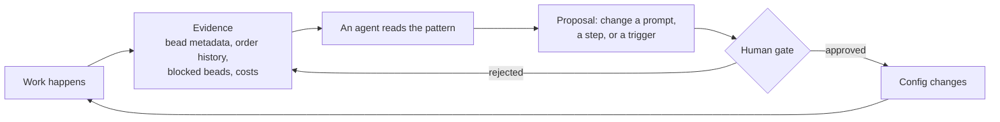
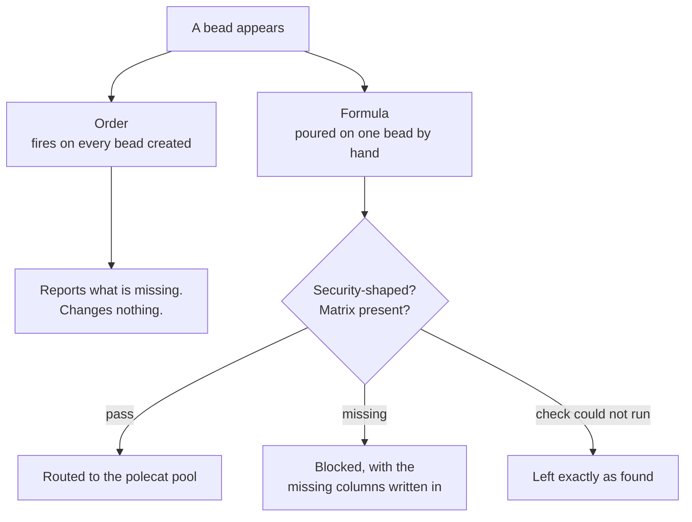

# W6 · Advanced Concepts

**Workshop · 60 minutes · Day 2**

## Contents

- [Objective](#objective)
- [Prereqs](#prereqs)
- [Part 1: Self-improvement loops](#part-1-self-improvement-loops)
  - [Improving the config, not the artifact](#improving-the-config-not-the-artifact)
  - [The four signals your factory already writes](#the-four-signals-your-factory-already-writes)
  - [Why the gate is the whole idea](#why-the-gate-is-the-whole-idea)
  - [Try it: read one signal](#try-it-read-one-signal)
  - [Install the loop as a pack](#install-the-loop-as-a-pack)
- [Part 2: Wiki knowledge management](#part-2-wiki-knowledge-management)
  - [The problem: every session starts from zero](#the-problem-every-session-starts-from-zero)
  - [What belongs in a wiki and what does not](#what-belongs-in-a-wiki-and-what-does-not)
  - [Making agents read it and write it](#making-agents-read-it-and-write-it)
  - [Try it: write one page](#try-it-write-one-page)
  - [Install the wiki as a pack](#install-the-wiki-as-a-pack)
- [Part 3: Security audit matrices](#part-3-security-audit-matrices)
  - [What a complete-looking description leaves out](#what-a-complete-looking-description-leaves-out)
  - [The enforcing half and the observing half](#the-enforcing-half-and-the-observing-half)
  - [Install the gate as a pack](#install-the-gate-as-a-pack)
- [The three packs side by side](#the-three-packs-side-by-side)
- [Reflect](#reflect)
- [Verification](#verification)
- [Troubleshooting](#troubleshooting)
- [What's next](#whats-next)

## Objective

Three ideas that only become interesting once a factory has been running for a while, and all three are about the factory getting better rather than the code getting written. Each one also ships as an optional pack, so you leave this session having read the idea and watched it run on your own factory.

## Prereqs

- A factory from [W3](./W3-run-your-factory.md): the base factory installed on a rig of your own. That is the whole prerequisite, and every command on this page runs against it. A slot already spent in [L3](./L3-L5-feature-labs.md) gives part 1 more history to read, which makes for a better demonstration.
- Your capability map to hand.
- `$SFI_PATH` and `$MY_RIG_PATH` set in your shell. [W2](./W2-cloud-box-and-preflight.md) and [W3](./W3-run-your-factory.md) append the first to a shell rc, [L1 step 1](./L1-plan-your-factory.md#1-register-your-repo-as-a-rig) the second, so both survive a new terminal. Every other path on this page is written out from them.

## Part 1: Self-improvement loops

### Improving the config, not the artifact

Every loop you have seen so far improves an **artifact**. A review loop improves a diff. A scoring loop iterates until the diff scores well. Both are useful, and both leave the factory exactly as they found it. Run the same bad prompt through them a hundred times and it stays a bad prompt.

A self-improvement loop changes the target. The thing being improved is the **configuration** — an agent's prompt, a formula's steps, an order's trigger — and the evidence is what the factory already wrote down about its own behaviour.

That is a small change in wording and a large change in consequence. A factory that improves artifacts gets you through today's backlog. **A factory that improves its configuration gets better at tomorrow's**, and the difference compounds.



### The four signals your factory already writes

You do not need new instrumentation. Your factory has been writing evidence about itself since W3.

| Signal | The question it answers |
| --- | --- |
| Blocked beads and their reasons | What does the factory keep rejecting, and therefore how does your team write work? |
| Bead metadata from review lanes | Which judgements keep going the same way? |
| `gc order history` | What fired, and what has never fired at all? |
| `gc costs` | Where does the money go, and is it going where the value is? |

The one to pick is the one with the most **repetition** in it. A single bad verdict is noise. The same rejection four times is a finding, and a finding is what a config change should be built on.

### Why the gate is the whole idea

Be clear-eyed about this before you build one: **a proposal is not a change**. The entire reason a self-improvement loop is safe to run is that a human approves the diff.

An agent that can silently rewrite its own instructions is not a self-improving factory, it is an unreviewable one. The failure is not dramatic — nothing explodes — it is that six weeks later nobody can say why an agent behaves the way it does, and the git history of the config has an agent's name on every commit.

So the loop has four parts and the fourth is not optional: read a signal, find a pattern, **propose** a change, and put the proposal in front of a person. In practice the proposal is a pull request against the pack, which is a shape you already have.

### Try it: read one signal

**Copy and paste**

```bash
cd "$MY_RIG_PATH"
bd list --status blocked --json | jq -r '.[] | "\(.id)  \(.metadata.blocker_reason // "")"'
cd "$SFI_PATH/factory1"
gc order history
gc costs 2>/dev/null | head -20
```

Pick the signal with the most repetition and write one sentence: *the factory keeps doing X, which suggests changing Y in the Z layer*. That sentence is a capability-map row, and the [self-improvement loop option](../hardening/05-self-improvement-loop.md) is where you build the loop that produces sentences like it without you.

### Install the loop as a pack

The lab is you running that loop by hand. `self-improvement` is the same loop on a schedule, cut down from the one the authors run on their own factory: theirs walks six audit categories through several hundred lines of Python, this reads a single signal and its check is 62 lines of shell.

**Copy and paste**

```bash
cd "$SFI_PATH/factory1"
gc import add "$SFI_PATH/sf-tutorial/artifacts/packs/self-improvement"
gc reload
gc order list
```

City scope, so no `--rig` flag: the pass reads the whole factory rather than one rig. The pack imports nothing and patches no agent, so it composes on top of the base factory and on top of anything you added in L3, and it comes back out cleanly.

The pass runs once a day. That is the right cadence and the wrong one when you are sitting in a lab block, so fire it by hand instead:

**Copy and paste**

```bash
gc order run daily-introspect
gc order history
bd list --status open
```

**Expected output**

```text
daily-introspect listed, with a formula action and a condition trigger
the order's fire recorded in history
the workflow's three steps, and any fix the pass proposed
```

Expect the pass to find nothing on a factory a few hours old, and expect it to say so. That is the pack working rather than the pack failing. [Its README](../artifacts/packs/self-improvement/README.md) covers the two knobs, how to give the pass something to find, and why the cadence is measured from the last completed pass rather than from the last time the order fired.

## Part 2: Wiki knowledge management

### The problem: every session starts from zero

Almost every agent in your factory is ephemeral. It spawns, does one thing, and exits. Nothing it learned survives.

That is the right design for work and the wrong design for knowledge. The third agent to hit the same undocumented quirk in your build system pays the same cost as the first, and there is no mechanism by which the second one's discovery reaches it. Prompts do not help: a prompt is what an agent is told before it starts, and this is something nobody knew until it happened.

A **team wiki** is the missing half. It is a git repository of durable findings that agents read at the start of a task and write to at the end.

The two habits matter more than the tool:

**Read before researching.** Before an agent starts an independent investigation, it checks whether the team already did that investigation. This is the cheaper half by a wide margin, because the alternative is re-deriving something that is already written down.

**Write at the boundary, not mid-flow.** At the end of a task, ask whether anything learned would save the next person time. If so, commit it. Doing this mid-task interrupts the work the insight came from.

### What belongs in a wiki and what does not

The distinction that keeps a wiki useful is **durability**, not importance.

| Belongs | Does not |
| --- | --- |
| A non-obvious failure mode and its workaround | Anything the code already says |
| An incident write-up: what broke, why, how it was found | A restatement of git history |
| A decision and the reasoning behind it | Status of work in flight |
| A synthesis someone would otherwise redo | Notes that only matter to one conversation |

The test worth applying: *would a colleague six months from now, hitting this, save time by reading it?* If the answer is no, it belongs on the bead instead, where it stays attached to the work it came from.

### Making agents read it and write it

Two mechanics turn a wiki from a directory nobody opens into part of the loop.

**A fragment in the prompt.** The read-and-contribute rule is the same for every agent, so it belongs in a `template-fragments/` file that each agent's prompt includes — exactly the mechanism from [W4](./W4-tour-the-factory.md). One edit changes the rule everywhere, and no two agents can drift into contradicting each other about it.

**An order for the sweep.** Reading is per-task and belongs in the prompt. Anything periodic — checking whether the wiki has gone stale, digesting the week's findings — has no bead behind it, so it is an order.

Notice that this is the same shape as part 1. Both halves of this session are the factory acting on itself, and both use the machinery you already toured.

### Try it: write one page

You have been in contact with a factory for a day and a half. Something in that has surprised you.

**Copy and paste**

```bash
mkdir -p "$MY_RIG_PATH/docs/current"
nano "$MY_RIG_PATH/docs/current/findings.md"
```

Write one finding, in this shape: what you expected, what happened, what you would tell the next person. Three sentences is a complete entry. Then commit it:

```bash
cd "$MY_RIG_PATH"
git add docs/current/findings.md
git commit -m "Record first factory findings"
```

In a real team this lives in a shared repository rather than inside one rig, so that every agent on every machine reads the same copy. A page committed only to your laptop is private note-taking; the point is the shared read.

### Install the wiki as a pack

Those two habits are the design. `internal-wiki` is the working version, and it ships both mechanics this session just named: the fragment that gives two agents the same reading habit, and an order that counts whether anybody is actually reading.

**Copy and paste**

```bash
cd "$SFI_PATH/factory1"
gc import add --rig <your-rig-name> "$SFI_PATH/sf-tutorial/artifacts/packs/internal-wiki"
gc reload
```

Rig scope this time, because the pack patches the rig's own agents rather than adding one of its own. The wiki itself lives at `team-wiki` inside the city and is created on first use.

Then play both agents yourself, one writing a finding down and the other checking before it researches. Nothing gets exported first. The helper works out which city to hang the wiki off from the directory you run it in, which is why the block changes directory before it calls the pack path.

**Copy and paste**

```bash
cd "$SFI_PATH/factory1"
"$SFI_PATH/sf-tutorial/artifacts/packs/internal-wiki/assets/scripts/wiki.sh" setup

./wiki.sh write operations/worktree-stale-lock.md <<'PAGE'
# A stale lock file survives a crashed worktree setup

Expected the next run to clean up after itself. It did not: the lock file
outlives the process that wrote it, so every later run fails the same way.
Delete the lock before re-running, and check for one first when setup hangs.
PAGE

./wiki.sh search "stale lock"
gc order run wiki-balance
```

**Expected output**

```text
the page written and committed for you
the search finding it
a read-to-write balance, also appended to WIKI_LOG.md in the city root
```

`setup` leaves a symlink at `<city>/wiki.sh`, which is why every line after the first one reaches the helper as `./wiki.sh`. The half you cannot watch inside a minute is the agents doing this unprompted: sling any bead after installing, and `wiki-access.jsonl` starts filling with lines whose agent is not you. [The README](../artifacts/packs/internal-wiki/README.md) covers pointing the wiki at a real shared repository, which is what the whole idea is for once the pack has earned its place.

## Part 3: Security audit matrices

### What a complete-looking description leaves out

The first two parts have the factory acting on its own configuration and its own memory. The third acts on the work, before anybody starts building it.

"Add row-level security to the reports table" sounds like a full instruction. It names the change, the mechanism and the table, and a reasonable person would start coding from it. What it leaves out is which *other* resources the change touches. Exports read the same rows. So does the admin dashboard, and the nightly job that builds the weekly digest.

Those gaps surface anyway. They surface later, in the review thread, one round-trip each, with the code already written against the incomplete version. The rows were always going to be needed. Writing them before the code is what makes them cheap.

An **audit matrix** is the fix, and it is a table in the bead's description:

| Resource | Rule | Threat | Covered |
| --- | --- | --- | --- |
| reports | tenant_id policy | cross-tenant read | yes |
| exports | none yet | cross-tenant read | no, follow-up bead |

The second row is the one to look at. A resource recorded as uncovered is a decision somebody made and can be argued with. A resource left out of the table is indistinguishable from one nobody thought of, and that second state is what this idea exists to make visible.

### The enforcing half and the observing half



Two mechanisms ask one question, and running both is the point. The formula is the enforcing half: it changes a bead's status, and it only ever runs on a bead somebody aimed it at. The order is the observing half: it changes nothing and it sees everything. A gate you have to remember to invoke is a gate that gets skipped on the busy day, which is the day you most wanted it.

The third branch out of that decision is worth as much as the other two. When the check cannot run at all, the bead is left exactly as it was found. Reading "the tracker was unreachable" as "this bead needs a matrix" blocks work for a reason that is not true, and sends whoever reads the message looking for a security question that was never in their bead.

### Install the gate as a pack

**Copy and paste**

```bash
cd "$SFI_PATH/factory1"
gc import add --rig <your-rig-name> "$SFI_PATH/sf-tutorial/artifacts/packs/security-audit-matrix"
gc reload
gc formula list
```

Rig scope, and it sits directly on the base factory. Now write a bead that describes security work and leaves the table out, then pour the gate on it:

**Copy and paste**

```bash
cd "$MY_RIG_PATH"
bd create --title "Add row-level security to the reports table" --type task --priority 2 \
  -d "Scope every read of the reports table to the caller's tenant."
cd "$SFI_PATH/factory1"
gc sling <your-rig-name>/architect-rig.architect <the-new-bead-id> --on mol-audit-matrix-gate
```

**Expected output**

```text
mol-audit-matrix-gate listed among your formulas
the bead comes back blocked, carrying audit_matrix_feedback naming the four columns
```

The architect is what pours it, because this pack ships no agent of its own and the architect is the base factory's reader-and-judge. The polecat is the wrong choice for the same reason: it is the agent this gate exists to hold back.

Add the table to the description, set the bead back to `open`, and pour the formula again. This time it routes the bead to the polecat pool and the work carries on. To watch the observing half instead, without creating anything:

```bash
gc order run audit-matrix-scan
gc order history
```

[The README](../artifacts/packs/security-audit-matrix/README.md) has the detector's two vocabulary lists and why they are kept separate. That split is the part worth taking with you. Merge them and a real bug comes back: a gate matching every phrase as a substring fires on any description containing the word `URLs`, because `URLs` contains `RLS`. Each false fire costs a round-trip for a matrix nothing in the bead needed, and a gate that fires on everything is one people learn to wave through.

## The three packs side by side

All three install on the base factory alone. None of them requires another, you can take them in any order, and each comes back out with a single `gc import remove`.

| Pack | Scope | What it adds | Watch it work with |
| --- | --- | --- | --- |
| [`self-improvement`](../artifacts/packs/self-improvement/README.md) | City | A daily pass over one factory signal, capped at three proposals | `gc order run daily-introspect` |
| [`internal-wiki`](../artifacts/packs/internal-wiki/README.md) | Rig | A prompt fragment on two agents, plus an hourly read-to-write count | `gc order run wiki-balance` |
| [`security-audit-matrix`](../artifacts/packs/security-audit-matrix/README.md) | Rig | A gate formula you pour on a bead, plus a scan on every bead created | `gc order run audit-matrix-scan` |

Each one is a simplified version of something the authors run on their own factory, cut to what fits in a lab block. Every README says what its simplification cost, which is the section to read before you decide the pack is production-ready: a demonstration that hides its own shortcuts teaches the wrong lesson about how much the real thing takes.

## Reflect

Three parts, one question: how does a factory get better rather than just get through?

Part 1 said it reads what it already wrote about itself, proposes a config change, and a human approves it. Part 2 said what one session learned has to outlive that session, or every session pays the same tuition. Part 3 said the cheapest moment to catch a missing requirement is before the code exists.

None of it is exotic machinery. Each one is an order, a fragment or a formula, and you toured all three in [W4](./W4-tour-the-factory.md).

## Verification

```bash
cd "$SFI_PATH/factory1"
gc order list
gc order history
cd "$MY_RIG_PATH"
bd list --status blocked
test -f docs/current/findings.md && echo "findings: present"
```

**Expected output**

```text
the base factory's two orders, plus one for each pack you installed
what has fired so far
your blocked beads, if any
findings: present
```

## Troubleshooting

- **`gc order list` does not show a pack's order.** The import went to the wrong scope. `self-improvement` is city-scoped, so it takes no `--rig`; the other two are rig-scoped and need it. Check with `gc import list` and `gc import list --rig <your-rig-name>`, then re-run `gc reload`.
- **`./wiki.sh` is not found, and `setup` said it created nothing.** Those are one failure, not two. `setup` reads the city off the directory you run it in, and run anywhere else it writes neither the wiki nor the symlink while still exiting 0. That is why the block above changes directory first. `cd` to your city and re-run it. Once the symlink exists, `ls -l wiki.sh` shows which pack directory it points into.
- **`gc costs` prints nothing.** Not every build ships it, and a factory that has run for an hour may have nothing to report. Use one of the other three signals.
- **No blocked beads at all.** Either your factory has no gate in front of the implementer yet, or nothing has failed. The first is a capability-map row; the second means reach for order history instead.
- **You cannot think of a finding worth writing.** Look at what you had to ask the instructor. Every one of those is a page.

## What's next

[L4](./L3-L5-feature-labs.md) is the second feature slot: an option you have not used yet, or a change of your own.

« [previous: L3 Feature Lab](./L3-L5-feature-labs.md) | [next: L4 Feature Lab](./L3-L5-feature-labs.md) »
