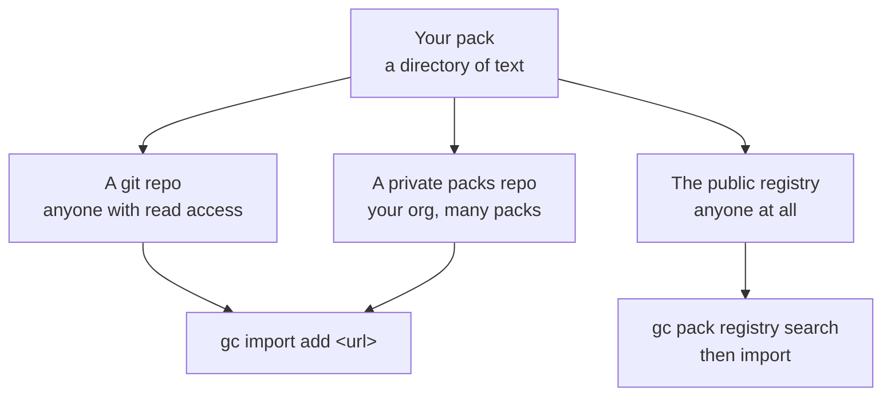

# W7 · Sharing Your Factory

**Workshop · 45 minutes · Day 2**

## Contents

- [Objective](#objective)
- [Prereqs](#prereqs)
- [What actually travels](#what-actually-travels)
- [Four audiences, four different jobs](#four-audiences-four-different-jobs)
- [What has to be scrubbed](#what-has-to-be-scrubbed)
- [Four ways to distribute a pack](#four-ways-to-distribute-a-pack)
  - [A git repository](#a-git-repository)
  - [A private packs repo](#a-private-packs-repo)
  - [The public registry](#the-public-registry)
  - [Staying in sync with upstream](#staying-in-sync-with-upstream)
- [Installation wizards](#installation-wizards)
- [What a second person needs to run it](#what-a-second-person-needs-to-run-it)
- [Deliverable](#deliverable)
- [What's next](#whats-next)

## Objective

Leave with a decision about who gets your factory, the mechanism you will use to hand it to them, and a short list of what you have to do before they can run it.

## Prereqs

Two days of it. Nothing to install.

## What actually travels

The instinct is to hand someone your factory directory. It is the wrong unit, and knowing why makes every other decision in this block easy.

Your working setup is four things with very different portability:

| Layer | Travels? | Why |
| --- | --- | --- |
| **Packs** — agents, formulas, orders | Yes, cleanly | Text, version-controlled, no machine state. This is the factory. |
| **City config** — `city.toml`, imports | Mostly | Portable except the absolute paths, which are per-machine by design. |
| **Rig registration** — which repos, where | No | Points at paths on your disk and repos the recipient may not have. |
| **Runtime state** — the bead store, sessions, logs | No, and you would not want it to | Your work queue and your history. Someone else's factory has its own. |

So the answer to "how do I share this" is almost always: **share the packs, document the config, and let them register their own rigs.** The thing you built over two days is a directory of text files, and that is good news.

The corollary matters just as much. If your factory only works because of something on your machine that is not in a pack, that is not a sharing problem, it is a reproducibility problem, and it will bite you on a new laptop long before it bites a colleague.

## Four audiences, four different jobs

"Sharing" means four quite different tasks depending on who is receiving it.

**Yourself, later.** The one everybody skips and everybody needs. The failure is not losing files, it is opening a formula in six weeks and not knowing why a step exists. The fix is small: a `README.md` next to your packs saying what each one is for and what it assumes. Do this one even if you do nothing else in this block.

**Your team.** Now reproducibility is the whole job. Pin your toolchain the way [`deps.sh`](../bootstrap/deps.sh) does, write down the prerequisites, and have exactly one person other than you run it from scratch on a clean machine before you tell everyone it works. That last step is not optional, and this curriculum learned it the hard way: an earlier version was authored against an older `gc` and a newer one rejected config that used to be accepted, which broke the setup chain partway through a live session.

**Your organisation, as a proposal.** The audience is people deciding whether to allow this, and they are not asking whether it works. They are asking which decisions a model is allowed to make. The gates in your factory are the answer, in their language: an unresolved blocking check prevents work from being marked ready, consequential decisions have a deterministic gate or a named human, and the system fails visibly when evidence is missing. Show the gate that rejected something, not the pull request that merged.

**Publicly.** Highest scrub cost, and the one where a mistake is permanent. See below.

## What has to be scrubbed

Work through this before anything leaves your control. The first two are obvious and the last three are the ones that actually get people.

- **Credentials.** Tokens, keys, `.env` files. Check the history, not just the working tree; a rotated key that is still in a commit is still a leak.
- **Internal URLs and hostnames.** Dashboards, staging endpoints, ticket links, anything behind your VPN.
- **Your backlog.** The bead store is not part of a pack, but exported issue files sometimes come along. Your beads describe unshipped work in your own words.
- **Prompts that quote internal context.** This is the sneaky one. Agent prompts get good precisely by absorbing specifics — a customer name, an incident, an architectural embarrassment, a colleague's judgement about a subsystem. Read every prompt you wrote in the last two days as though a competitor were reading it, because a prompt is documentation you forgot you were writing.
- **Names and identifiers.** `CODEOWNERS`, reviewer names, anything naming a person who did not agree to be named. And check the repository's own visibility before you decide any of this: the calculus for a public repo is not the calculus for a private one, and confirming which you are pushing to takes five seconds.

A blunt rule that resolves most cases: **if you would not put it in a public README, it does not belong in a prompt template you are about to share.**

## Four ways to distribute a pack

Once you have decided a pack should travel, there are four mechanisms and they differ in who can reach the pack and who controls its version. Start at the top and move down only when you need to.



### A git repository

The default, and enough for most teams. A pack is a directory, so any git host serves it. `gc import add` takes a repository subpath directly:

```bash
gc import add https://github.com/<org>/<repo>/tree/main/packs/<pack>
gc import add https://github.com/<org>/<repo>/tree/main/packs/<pack> --version '^1.2.0'
```

The important part is the second command. **A remote import is pinned**, either to a semver constraint or to `sha:<commit>`, and the pin is recorded in `packs.lock`. That is what makes a shared pack reproducible rather than a moving target: a colleague who imports it today and a colleague who imports it in March get the same bytes unless someone upgrades deliberately.

```bash
gc pack list          # sources, refs, cache status, locked commits
gc import status      # declared imports against what packs.lock pins
```

### A private packs repo

One repository, many packs, one place to look. This is the shape most organisations converge on, and it is worth adopting before you have your third pack rather than after.

```text
your-org/factory-packs/
  packs/
    review-standards/     # the gates your org requires
    house-style/          # a template-fragments pack everyone includes
    onboarding-rig/
```

Two things make it work better than scattered repos. Access control is per-repository, so one grant covers every pack your org ships. And a `template-fragments/` pack imported by everything is how a rule stays identical across teams — change the fragment, and the next reload changes every agent that includes it.

Private sources need credentials, which `gc import credential` manages so the token is not in your `pack.toml`.

### The public registry

For packs anyone should be able to find. The registry is a catalog rather than a host: it indexes packs so people can discover them by search instead of by being told a URL.

```bash
gc pack registry list                    # which registries this city knows
gc pack registry search <term>           # find a pack
gc pack registry show <pack>             # what it is, who publishes it
gc pack registry refresh                 # update the cached catalog
```

Publishing is a deliberate act with its own account:

```bash
gc pack registry login
gc pack registry whoami
gc pack registry publish
```

Everything in the scrub list above applies here with no take-backs. A pack you publish is a pack strangers read.

### Staying in sync with upstream

A shared pack is only useful if updates reach the people using it, and the pin that made it reproducible is exactly what stops updates arriving on their own. That tension is deliberate: you choose when to move.

```bash
gc pack fetch            # update the local cache from each source
gc import upgrade        # move imports to the newest version their constraint allows
gc import upgrade <name> # just one
gc import status         # what changed, before you reload
```

A `^1.2.0` constraint means `gc import upgrade` picks up compatible releases and nothing else. A `sha:` pin means upgrade does nothing until you change the pin, which is what you want for a pack whose behaviour you have tested against.

Read `gc import status` before `gc reload`. The upgrade rewrites `packs.lock`, and a factory whose agents changed under it without anyone reading the diff is the situation the pins existed to prevent.

## Installation wizards

There is a gap between "the pack is available" and "a colleague has it running", and the gap is where most sharing fails. Three things close it, in increasing order of effort.

**`gc init` is already a wizard.** It asks for a template and a provider and writes a working city. For a non-interactive path, or for a script you hand someone:

```bash
gc init --template minimal --default-provider claude ~/their-city
```

**`gc init --from` copies a city you have already shaped.** Point it at an example city directory and it becomes the starting shape rather than the stock template. This is the closest thing to "here is my factory, run it", and it is why keeping your city's config tidy pays off.

**A bootstrap script is the honest version.** Look at what this tutorial ships: [`deps.sh`](../bootstrap/deps.sh) pins the toolchain, [`preflight.sh`](../bootstrap/preflight.sh) says pass or fail in one line, and [`bootstrap.sh`](../bootstrap/bootstrap.sh) builds the whole thing from nothing. That trio is a reasonable target for any factory you expect more than two people to run.

The test of a wizard is not that it works for you. It is that someone who has never seen your factory reaches a working state without asking you a question, and the only way to know is to watch one person try.

## What a second person needs to run it

Four things, and you can write them in ten minutes:

1. **Prerequisites, pinned.** The tools and the exact versions. [`deps.sh`](../bootstrap/deps.sh) is the shape to copy: one script, checksummed downloads, versions in one place.
2. **A pass-or-fail check.** [`preflight.sh`](../bootstrap/preflight.sh) is the shape. The point is a single line at the end that says whether they are ready, so their first failure is not at step nine.
3. **The install order.** Which packs, at which scope, in what order. Anyone who has installed a pack at city scope that needed rig scope knows why this line exists.
4. **What it does and does not do.** The gates you built, and the decisions you deliberately kept a human in. Under-promising here is what makes the thing credible.

That list is also a decent audit of your own setup. Anything you cannot write down is something that only works because you know a thing you have not recorded.

## Deliverable

Two sentences, written down before you leave:

> I am sharing my factory with **\<yourself later | my team | my org | publicly\>**, and before that can happen I need to **\<the one thing at the top of the scrub list\>**.

If you have five spare minutes, write the `README.md` for the "yourself, later" case. It is the audience you are guaranteed to have.

## What's next

[L5](./L3-L5-feature-labs.md) is the last feature slot, and then you are done.

You will leave with a factory pointed at your own project, gates you can defend, channels you chose deliberately, and a written list of what to build next.

The [capability map](./L2-capability-map.md) is the thing to keep. It has rows on it you did not get to, and it is the only artifact here that knows what your factory cannot do yet.

The [options](./L3-L5-feature-labs.md#the-six-options) you did not pick are the obvious next session. Every one of them installs on the base factory alone, so you can take them in any order, at your own pace, on your own rig.

« [previous: L4 Feature Lab](./L3-L5-feature-labs.md) | [next: L5 Feature Lab](./L3-L5-feature-labs.md) »
